```mermaid
%%{init: {'theme':'base','flowchart': {'defaultRenderer':'elk','nodeSpacing': 36,'rankSpacing': 56,'htmlLabels': true}} }%%
flowchart LR
  subgraph MARKETING___CMS["MARKETING / CMS"]
    cms_banner["<b>cms_banner</b><br/>────────<br/><font color='#38bdf8'>banner_code</font><br/><font color='#38bdf8'>banner_title</font><br/><font color='#38bdf8'>placement_code</font><br/><font color='#fb923c'>is_active</font><br/><font color='#38bdf8'>banner_body_text</font><br/><font color='#a16207'>ends_at</font><br/><font color='#a16207'>starts_at</font><br/><font color='#38bdf8'>target_url</font>"]
    cms_city_page["<b>cms_city_page</b><br/>────────<br/><font color='#38bdf8'>city_page_title</font><br/><font color='#fb923c'>is_published</font><br/><font color='#a16207'>published_at</font><br/><font color='#38bdf8'>body_markdown</font><br/><font color='#38bdf8'>hero_text</font>"]
    cms_page["<b>cms_page</b><br/>────────<br/><font color='#38bdf8'>page_status_code</font><br/><font color='#38bdf8'>page_code</font><br/><font color='#38bdf8'>page_title</font><br/><font color='#a16207'>published_at</font><br/><font color='#38bdf8'>body_markdown</font>"]
    cms_post["<b>cms_post</b><br/>────────<br/><font color='#38bdf8'>post_status_code</font><br/><font color='#38bdf8'>post_slug</font><br/><font color='#38bdf8'>post_title</font><br/><font color='#a16207'>published_at</font><br/><font color='#38bdf8'>body_markdown</font><br/><font color='#38bdf8'>excerpt_text</font>"]
    cms_restaurant_feature["<b>cms_restaurant_feature</b><br/>────────<br/><font color='#38bdf8'>feature_title</font><br/><font color='#fb923c'>is_published</font><br/><font color='#a16207'>published_at</font><br/><font color='#38bdf8'>feature_body_markdown</font>"]
    cms_seo_metadata["<b>cms_seo_metadata</b><br/>────────<br/><font color='#38bdf8'>entity_type_code</font><br/><font color='#38bdf8'>seo_title</font><br/><font color='#38bdf8'>canonical_url</font><br/><font color='#a78bfa'>entity_pk</font><br/><font color='#38bdf8'>seo_description</font>"]
    marketing_partner_lead["<b>marketing_partner_lead</b><br/>────────<br/><font color='#38bdf8'>qualification_status_code</font><br/><font color='#38bdf8'>contact_name</font><br/><font color='#38bdf8'>restaurant_name</font><br/><font color='#38bdf8'>source_campaign_code</font><br/><font color='#38bdf8'>source_page_code</font><br/><font color='#fb923c'>consent_captured_flag</font><br/><font color='#38bdf8'>city_text</font><br/><font color='#38bdf8'>cuisine_text</font>"]
    marketing_waitlist_lead["<b>marketing_waitlist_lead</b><br/>────────<br/><font color='#38bdf8'>lead_type_code</font><br/><font color='#38bdf8'>full_name</font><br/><font color='#38bdf8'>source_campaign_code</font><br/><font color='#38bdf8'>source_page_code</font><br/><font color='#fb923c'>consent_captured_flag</font><br/><font color='#38bdf8'>city_text</font><br/><font color='#38bdf8'>email_address</font><br/><font color='#38bdf8'>notes</font>"]
    notification_delivery_attempt["<b>notification_delivery_attempt</b><br/>────────<br/><font color='#38bdf8'>attempt_status_code</font><br/><font color='#4ade80'>attempt_number</font><br/><font color='#38bdf8'>error_code</font><br/><font color='#38bdf8'>provider_code</font><br/><font color='#a16207'>attempted_at</font><br/><font color='#38bdf8'>error_text</font><br/><font color='#38bdf8'>provider_message_ref</font>"]
    notification_device["<b>notification_device</b><br/>────────<br/><font color='#38bdf8'>device_platform_code</font><br/><font color='#fb923c'>is_active</font><br/><font color='#38bdf8'>device_label</font><br/><font color='#a16207'>last_seen_at</font><br/><font color='#38bdf8'>push_token</font>"]
    notification_outbox["<b>notification_outbox</b><br/>────────<br/><font color='#38bdf8'>business_context_type_code</font><br/><font color='#38bdf8'>send_status_code</font><br/><font color='#38bdf8'>channel_code</font><br/><font color='#a16207'>scheduled_at</font><br/><font color='#38bdf8'>resolved_destination_text</font><br/><font color='#a16207'>sent_at</font>"]
    notification_template["<b>notification_template</b><br/>────────<br/><font color='#38bdf8'>channel_code</font><br/><font color='#38bdf8'>locale_code</font><br/><font color='#38bdf8'>template_code</font><br/><font color='#fb923c'>is_active</font><br/><font color='#38bdf8'>body_template</font><br/><font color='#38bdf8'>provider_template_ref</font><br/><font color='#38bdf8'>subject_template</font>"]
  end
  subgraph External_refs___AUTH___IAM["External refs · AUTH / IAM"]
    iam_profile["<b>iam_profile</b><br/>────────<br/><font color='#38bdf8'>display_name</font><br/><font color='#fb923c'>is_consumer</font><br/><font color='#fb923c'>is_platform_user</font><br/><font color='#fb923c'>is_restaurant_user</font><br/><font color='#38bdf8'>email_address</font><br/><font color='#38bdf8'>phone_e164</font><br/><font color='#a16207'>last_seen_at</font>"]
  end
  subgraph External_refs___CONSUMER["External refs · CONSUMER"]
    consumer_profile["<b>consumer_profile</b><br/>────────<br/><font color='#38bdf8'>preferred_language_code</font><br/><font color='#38bdf8'>first_name</font><br/><font color='#38bdf8'>last_name</font><br/><font color='#38bdf8'>marketing_source_code</font>"]
  end
  subgraph External_refs___DROP___CATALOG["External refs · DROP / CATALOG"]
    storage_object["<b>storage_object</b><br/>────────<br/><font color='#38bdf8'>bucket_name</font><br/><font color='#38bdf8'>mime_type</font><br/><font color='#38bdf8'>checksum_sha256_hex</font><br/><font color='#38bdf8'>object_path</font><br/><font color='#38bdf8'>original_filename</font><br/><font color='#4ade80'>size_bytes</font>"]
  end
  subgraph External_refs___GEO["External refs · GEO"]
    geo_city["<b>geo_city</b><br/>────────<br/><font color='#38bdf8'>city_code</font><br/><font color='#38bdf8'>city_name</font><br/><font color='#38bdf8'>country_code</font><br/><font color='#38bdf8'>currency_code</font><br/><font color='#38bdf8'>state_name</font><br/><font color='#38bdf8'>timezone_name</font><br/><font color='#fb923c'>is_active</font>"]
  end
  subgraph External_refs___RESTAURANT["External refs · RESTAURANT"]
    restaurant_restaurant["<b>restaurant_restaurant</b><br/>────────<br/><font color='#38bdf8'>restaurant_status_code</font><br/><font color='#38bdf8'>legal_entity_name</font><br/><font color='#38bdf8'>restaurant_name</font><br/><font color='#38bdf8'>restaurant_slug</font><br/><font color='#38bdf8'>primary_contact_email</font><br/><font color='#38bdf8'>primary_contact_phone_e164</font><br/><font color='#38bdf8'>pickup_instructions</font>"]
  end
  subgraph External_refs___SUPPORT___INCIDENT["External refs · SUPPORT / INCIDENT"]
    support_ticket["<b>support_ticket</b><br/>────────<br/><font color='#a16207'>sla_due_at</font><br/><font color='#38bdf8'>description_text</font><br/><font color='#38bdf8'>requester_idempotency_key</font><br/><font color='#a16207'>resolved_at</font><br/><font color='#38bdf8'>subject_text</font>"]
  end
  geo_city -->|"[S] optional · default_city_fk"| iam_profile
  geo_city -->|"[S] optional · geo_city_fk"| marketing_waitlist_lead
  geo_city -->|"[S] optional · geo_city_fk"| marketing_partner_lead
  iam_profile -->|"[S] optional · assigned_to_profile_fk"| marketing_partner_lead
  iam_profile -->|"[C] owns · iam_profile_fk"| consumer_profile
  geo_city -->|"[R] has · geo_city_fk"| restaurant_restaurant
  iam_profile -->|"[S] optional · owner_profile_fk"| restaurant_restaurant
  iam_profile -->|"[S] optional · uploaded_by_profile_fk"| storage_object
  notification_template -->|"[S] optional · notification_template_fk"| notification_outbox
  iam_profile -->|"[S] optional · recipient_profile_fk"| notification_outbox
  notification_outbox -->|"[C] owns · notification_outbox_fk"| notification_delivery_attempt
  iam_profile -->|"[C] owns · iam_profile_fk"| notification_device
  iam_profile -->|"[S] optional · requester_profile_fk"| support_ticket
  restaurant_restaurant -->|"[S] optional · restaurant_fk"| support_ticket
  marketing_partner_lead -->|"[S] optional · marketing_partner_lead_fk"| support_ticket
  iam_profile -->|"[S] optional · assigned_to_profile_fk"| support_ticket
  iam_profile -->|"[S] optional · created_by_profile_fk"| cms_page
  geo_city -->|"[C] owns · geo_city_fk"| cms_city_page
  iam_profile -->|"[S] optional · author_profile_fk"| cms_post
  restaurant_restaurant -->|"[C] owns · restaurant_fk"| cms_restaurant_feature
  storage_object -->|"[S] optional · og_image_storage_object_fk"| cms_seo_metadata
  consumer_profile -->|"[S] optional · converted_consumer_profile_fk"| marketing_waitlist_lead
  restaurant_restaurant -->|"[S] optional · converted_restaurant_fk"| marketing_partner_lead
  support_ticket -->|"[S] optional · converted_support_ticket_fk"| marketing_partner_lead
  class iam_profile auth
  class consumer_profile con
  class restaurant_restaurant res
  class storage_object cat
  class geo_city geo
  class notification_outbox,notification_template,marketing_partner_lead,notification_delivery_attempt,notification_device,cms_seo_metadata,cms_banner,marketing_waitlist_lead,cms_page,cms_post,cms_restaurant_feature,cms_city_page mkt
  class support_ticket sup
  classDef auth fill:#eef2ff,stroke:#818cf8,stroke-width:1.5px,color:#111827;
  classDef con fill:#f5f3ff,stroke:#a78bfa,stroke-width:1.5px,color:#111827;
  classDef ord fill:#fdf4ff,stroke:#e879f9,stroke-width:1.5px,color:#111827;
  classDef res fill:#fff7ed,stroke:#fb923c,stroke-width:1.5px,color:#111827;
  classDef fin fill:#f0fdf4,stroke:#4ade80,stroke-width:1.5px,color:#111827;
  classDef cat fill:#f0f9ff,stroke:#38bdf8,stroke-width:1.5px,color:#111827;
  classDef geo fill:#f0fdfa,stroke:#2dd4bf,stroke-width:1.5px,color:#111827;
  classDef mkt fill:#fefce8,stroke:#facc15,stroke-width:1.5px,color:#111827;
  classDef sup fill:#fff1f2,stroke:#fb7185,stroke-width:1.5px,color:#111827;
  classDef shr fill:#f3f4f6,stroke:#9ca3af,stroke-width:1.5px,color:#111827;
  classDef legend fill:#ffffff,stroke:#111827,stroke-width:1px,color:#111827;
  linkStyle 0 stroke:#9ca3af,stroke-width:1.5px,stroke-dasharray:5 5;
  linkStyle 1 stroke:#9ca3af,stroke-width:1.5px,stroke-dasharray:5 5;
  linkStyle 2 stroke:#9ca3af,stroke-width:1.5px,stroke-dasharray:5 5;
  linkStyle 3 stroke:#9ca3af,stroke-width:1.5px,stroke-dasharray:5 5;
  linkStyle 4 stroke:#f87171,stroke-width:3px;
  linkStyle 5 stroke:#818cf8,stroke-width:2px;
  linkStyle 6 stroke:#9ca3af,stroke-width:1.5px,stroke-dasharray:5 5;
  linkStyle 7 stroke:#9ca3af,stroke-width:1.5px,stroke-dasharray:5 5;
  linkStyle 8 stroke:#9ca3af,stroke-width:1.5px,stroke-dasharray:5 5;
  linkStyle 9 stroke:#9ca3af,stroke-width:1.5px,stroke-dasharray:5 5;
  linkStyle 10 stroke:#f87171,stroke-width:3px;
  linkStyle 11 stroke:#f87171,stroke-width:3px;
  linkStyle 12 stroke:#9ca3af,stroke-width:1.5px,stroke-dasharray:5 5;
  linkStyle 13 stroke:#9ca3af,stroke-width:1.5px,stroke-dasharray:5 5;
  linkStyle 14 stroke:#9ca3af,stroke-width:1.5px,stroke-dasharray:5 5;
  linkStyle 15 stroke:#9ca3af,stroke-width:1.5px,stroke-dasharray:5 5;
  linkStyle 16 stroke:#9ca3af,stroke-width:1.5px,stroke-dasharray:5 5;
  linkStyle 17 stroke:#f87171,stroke-width:3px;
  linkStyle 18 stroke:#9ca3af,stroke-width:1.5px,stroke-dasharray:5 5;
  linkStyle 19 stroke:#f87171,stroke-width:3px;
  linkStyle 20 stroke:#9ca3af,stroke-width:1.5px,stroke-dasharray:5 5;
  linkStyle 21 stroke:#9ca3af,stroke-width:1.5px,stroke-dasharray:5 5;
  linkStyle 22 stroke:#9ca3af,stroke-width:1.5px,stroke-dasharray:5 5;
  linkStyle 23 stroke:#9ca3af,stroke-width:1.5px,stroke-dasharray:5 5;
```

```mermaid
%%{init: {'theme':'base','flowchart': {'defaultRenderer':'elk','nodeSpacing': 36,'rankSpacing': 56,'htmlLabels': true}} }%%
flowchart LR
  subgraph SUPPORT___INCIDENT["SUPPORT / INCIDENT"]
    incident_event["<b>incident_event</b><br/>────────<br/><font color='#38bdf8'>event_type_code</font><br/><font color='#38bdf8'>comment_text</font><br/><font color='#a16207'>recorded_at</font>"]
    incident_incident["<b>incident_incident</b><br/>────────<br/><font color='#38bdf8'>description_text</font><br/><font color='#a16207'>occurred_at</font><br/><font color='#a16207'>resolved_at</font><br/><font color='#38bdf8'>title_text</font>"]
    support_ticket["<b>support_ticket</b><br/>────────<br/><font color='#a16207'>sla_due_at</font><br/><font color='#38bdf8'>description_text</font><br/><font color='#38bdf8'>requester_idempotency_key</font><br/><font color='#a16207'>resolved_at</font><br/><font color='#38bdf8'>subject_text</font>"]
    support_ticket_event["<b>support_ticket_event</b><br/>────────<br/><font color='#38bdf8'>event_type_code</font><br/><font color='#fb923c'>is_internal_note</font><br/><font color='#38bdf8'>comment_text</font><br/><font color='#a16207'>recorded_at</font>"]
  end
  subgraph External_refs___AUTH___IAM["External refs · AUTH / IAM"]
    iam_profile["<b>iam_profile</b><br/>────────<br/><font color='#38bdf8'>display_name</font><br/><font color='#fb923c'>is_consumer</font><br/><font color='#fb923c'>is_platform_user</font><br/><font color='#fb923c'>is_restaurant_user</font><br/><font color='#38bdf8'>email_address</font><br/><font color='#38bdf8'>phone_e164</font><br/><font color='#a16207'>last_seen_at</font>"]
  end
  subgraph External_refs___MARKETING___CMS["External refs · MARKETING / CMS"]
    marketing_partner_lead["<b>marketing_partner_lead</b><br/>────────<br/><font color='#38bdf8'>qualification_status_code</font><br/><font color='#38bdf8'>contact_name</font><br/><font color='#38bdf8'>restaurant_name</font><br/><font color='#38bdf8'>source_campaign_code</font><br/><font color='#38bdf8'>source_page_code</font><br/><font color='#fb923c'>consent_captured_flag</font><br/><font color='#38bdf8'>city_text</font><br/><font color='#38bdf8'>cuisine_text</font>"]
  end
  subgraph External_refs___ORDER___PAYMENT["External refs · ORDER / PAYMENT"]
    order_order["<b>order_order</b><br/>────────<br/><font color='#38bdf8'>order_status_code</font><br/><font color='#38bdf8'>payment_status_code</font><br/><font color='#38bdf8'>currency_code</font><br/><font color='#38bdf8'>order_number</font><br/><font color='#facc15'>discount_paise</font><br/><font color='#facc15'>subtotal_paise</font><br/><font color='#facc15'>tax_paise</font><br/><font color='#facc15'>total_paise</font>"]
  end
  subgraph External_refs___RESTAURANT["External refs · RESTAURANT"]
    restaurant_restaurant["<b>restaurant_restaurant</b><br/>────────<br/><font color='#38bdf8'>restaurant_status_code</font><br/><font color='#38bdf8'>legal_entity_name</font><br/><font color='#38bdf8'>restaurant_name</font><br/><font color='#38bdf8'>restaurant_slug</font><br/><font color='#38bdf8'>primary_contact_email</font><br/><font color='#38bdf8'>primary_contact_phone_e164</font><br/><font color='#38bdf8'>pickup_instructions</font>"]
  end
  subgraph External_refs___SHARED___OPS["External refs · SHARED / OPS"]
    master_incident_severity["<b>master_incident_severity</b><br/>────────<br/><font color='#38bdf8'>severity_code</font><br/><font color='#38bdf8'>severity_name</font><br/><font color='#38bdf8'>description</font><br/><font color='#4ade80'>sort_order</font>"]
    master_incident_status["<b>master_incident_status</b><br/>────────<br/><font color='#38bdf8'>status_code</font><br/><font color='#38bdf8'>status_name</font><br/><font color='#fb923c'>is_terminal</font><br/><font color='#38bdf8'>description</font><br/><font color='#4ade80'>sort_order</font>"]
    master_incident_type["<b>master_incident_type</b><br/>────────<br/><font color='#38bdf8'>type_code</font><br/><font color='#38bdf8'>type_name</font><br/><font color='#fb923c'>is_active</font><br/><font color='#38bdf8'>description</font>"]
    master_support_ticket_priority["<b>master_support_ticket_priority</b><br/>────────<br/><font color='#38bdf8'>priority_code</font><br/><font color='#38bdf8'>priority_name</font><br/><font color='#38bdf8'>description</font><br/><font color='#4ade80'>sla_first_response_minutes</font><br/><font color='#4ade80'>sort_order</font>"]
    master_support_ticket_status["<b>master_support_ticket_status</b><br/>────────<br/><font color='#38bdf8'>status_code</font><br/><font color='#38bdf8'>status_name</font><br/><font color='#fb923c'>is_terminal</font><br/><font color='#38bdf8'>description</font><br/><font color='#4ade80'>sort_order</font>"]
    master_support_ticket_type["<b>master_support_ticket_type</b><br/>────────<br/><font color='#38bdf8'>type_code</font><br/><font color='#38bdf8'>type_name</font><br/><font color='#fb923c'>is_active</font><br/><font color='#38bdf8'>description</font>"]
  end
  iam_profile -->|"[S] optional · assigned_to_profile_fk"| marketing_partner_lead
  iam_profile -->|"[S] optional · owner_profile_fk"| restaurant_restaurant
  restaurant_restaurant -->|"[R] has · restaurant_fk"| order_order
  iam_profile -->|"[S] optional · requester_profile_fk"| support_ticket
  restaurant_restaurant -->|"[S] optional · restaurant_fk"| support_ticket
  order_order -->|"[S] optional · order_fk"| support_ticket
  marketing_partner_lead -->|"[S] optional · marketing_partner_lead_fk"| support_ticket
  master_support_ticket_type -->|"[R] has · master_support_ticket_type_fk"| support_ticket
  master_support_ticket_status -->|"[R] has · master_support_ticket_status_fk"| support_ticket
  master_support_ticket_priority -->|"[R] has · master_support_ticket_priority_fk"| support_ticket
  iam_profile -->|"[S] optional · assigned_to_profile_fk"| support_ticket
  support_ticket -->|"[C] owns · support_ticket_fk"| support_ticket_event
  master_support_ticket_status -->|"[S] optional · from_status_fk"| support_ticket_event
  master_support_ticket_status -->|"[S] optional · to_status_fk"| support_ticket_event
  iam_profile -->|"[S] optional · actor_profile_fk"| support_ticket_event
  restaurant_restaurant -->|"[S] optional · restaurant_fk"| incident_incident
  order_order -->|"[S] optional · order_fk"| incident_incident
  support_ticket -->|"[S] optional · support_ticket_fk"| incident_incident
  master_incident_type -->|"[R] has · master_incident_type_fk"| incident_incident
  master_incident_status -->|"[R] has · master_incident_status_fk"| incident_incident
  master_incident_severity -->|"[R] has · master_incident_severity_fk"| incident_incident
  iam_profile -->|"[S] optional · assigned_to_profile_fk"| incident_incident
  iam_profile -->|"[S] optional · reported_by_profile_fk"| incident_incident
  incident_incident -->|"[C] owns · incident_fk"| incident_event
  master_incident_status -->|"[S] optional · from_status_fk"| incident_event
  master_incident_status -->|"[S] optional · to_status_fk"| incident_event
  iam_profile -->|"[S] optional · actor_profile_fk"| incident_event
  restaurant_restaurant -->|"[S] optional · converted_restaurant_fk"| marketing_partner_lead
  support_ticket -->|"[S] optional · converted_support_ticket_fk"| marketing_partner_lead
  class iam_profile auth
  class order_order ord
  class restaurant_restaurant res
  class marketing_partner_lead mkt
  class incident_event,support_ticket,support_ticket_event,incident_incident sup
  class master_support_ticket_type,master_incident_severity,master_incident_status,master_support_ticket_priority,master_incident_type,master_support_ticket_status shr
  classDef auth fill:#eef2ff,stroke:#818cf8,stroke-width:1.5px,color:#111827;
  classDef con fill:#f5f3ff,stroke:#a78bfa,stroke-width:1.5px,color:#111827;
  classDef ord fill:#fdf4ff,stroke:#e879f9,stroke-width:1.5px,color:#111827;
  classDef res fill:#fff7ed,stroke:#fb923c,stroke-width:1.5px,color:#111827;
  classDef fin fill:#f0fdf4,stroke:#4ade80,stroke-width:1.5px,color:#111827;
  classDef cat fill:#f0f9ff,stroke:#38bdf8,stroke-width:1.5px,color:#111827;
  classDef geo fill:#f0fdfa,stroke:#2dd4bf,stroke-width:1.5px,color:#111827;
  classDef mkt fill:#fefce8,stroke:#facc15,stroke-width:1.5px,color:#111827;
  classDef sup fill:#fff1f2,stroke:#fb7185,stroke-width:1.5px,color:#111827;
  classDef shr fill:#f3f4f6,stroke:#9ca3af,stroke-width:1.5px,color:#111827;
  classDef legend fill:#ffffff,stroke:#111827,stroke-width:1px,color:#111827;
  linkStyle 0 stroke:#9ca3af,stroke-width:1.5px,stroke-dasharray:5 5;
  linkStyle 1 stroke:#9ca3af,stroke-width:1.5px,stroke-dasharray:5 5;
  linkStyle 2 stroke:#818cf8,stroke-width:2px;
  linkStyle 3 stroke:#9ca3af,stroke-width:1.5px,stroke-dasharray:5 5;
  linkStyle 4 stroke:#9ca3af,stroke-width:1.5px,stroke-dasharray:5 5;
  linkStyle 5 stroke:#9ca3af,stroke-width:1.5px,stroke-dasharray:5 5;
  linkStyle 6 stroke:#9ca3af,stroke-width:1.5px,stroke-dasharray:5 5;
  linkStyle 7 stroke:#818cf8,stroke-width:2px;
  linkStyle 8 stroke:#818cf8,stroke-width:2px;
  linkStyle 9 stroke:#818cf8,stroke-width:2px;
  linkStyle 10 stroke:#9ca3af,stroke-width:1.5px,stroke-dasharray:5 5;
  linkStyle 11 stroke:#f87171,stroke-width:3px;
  linkStyle 12 stroke:#9ca3af,stroke-width:1.5px,stroke-dasharray:5 5;
  linkStyle 13 stroke:#9ca3af,stroke-width:1.5px,stroke-dasharray:5 5;
  linkStyle 14 stroke:#9ca3af,stroke-width:1.5px,stroke-dasharray:5 5;
  linkStyle 15 stroke:#9ca3af,stroke-width:1.5px,stroke-dasharray:5 5;
  linkStyle 16 stroke:#9ca3af,stroke-width:1.5px,stroke-dasharray:5 5;
  linkStyle 17 stroke:#9ca3af,stroke-width:1.5px,stroke-dasharray:5 5;
  linkStyle 18 stroke:#818cf8,stroke-width:2px;
  linkStyle 19 stroke:#818cf8,stroke-width:2px;
  linkStyle 20 stroke:#818cf8,stroke-width:2px;
  linkStyle 21 stroke:#9ca3af,stroke-width:1.5px,stroke-dasharray:5 5;
  linkStyle 22 stroke:#9ca3af,stroke-width:1.5px,stroke-dasharray:5 5;
  linkStyle 23 stroke:#f87171,stroke-width:3px;
  linkStyle 24 stroke:#9ca3af,stroke-width:1.5px,stroke-dasharray:5 5;
  linkStyle 25 stroke:#9ca3af,stroke-width:1.5px,stroke-dasharray:5 5;
  linkStyle 26 stroke:#9ca3af,stroke-width:1.5px,stroke-dasharray:5 5;
  linkStyle 27 stroke:#9ca3af,stroke-width:1.5px,stroke-dasharray:5 5;
  linkStyle 28 stroke:#9ca3af,stroke-width:1.5px,stroke-dasharray:5 5;
```

# goZaika ER Diagram Pack — light version

This is a cleaner second-pass version with **lighter entity internals**:
- foreign-key columns removed from table bodies (relationships already show them)
- PK and audit fields omitted
- snapshot / payload / computed fields omitted
- max ~8 business-significant fields per table

## Unified overview

```mermaid
%%{init: {'theme':'base','flowchart': {'defaultRenderer':'elk','nodeSpacing': 42,'rankSpacing': 62,'htmlLabels': true}} }%%
flowchart LR
  CTX_AUTH___IAM["<b>AUTH / IAM</b>"]
  CTX_CONSUMER["<b>CONSUMER</b>"]
  CTX_ORDER___PAYMENT["<b>ORDER / PAYMENT</b>"]
  CTX_RESTAURANT["<b>RESTAURANT</b>"]
  CTX_FINANCE["<b>FINANCE</b>"]
  CTX_DROP___CATALOG["<b>DROP / CATALOG</b>"]
  CTX_GEO["<b>GEO</b>"]
  CTX_MARKETING___CMS["<b>MARKETING / CMS</b>"]
  CTX_SUPPORT___INCIDENT["<b>SUPPORT / INCIDENT</b>"]
  CTX_SHARED___OPS["<b>SHARED / OPS</b>"]
  CTX_AUTH___IAM -->|"[C] 2 owns"| CTX_CONSUMER
  CTX_AUTH___IAM -->|"[R] 1 has"| CTX_CONSUMER
  CTX_AUTH___IAM -->|"[S] 2 optional"| CTX_CONSUMER
  CTX_AUTH___IAM -->|"[S] 8 optional"| CTX_DROP___CATALOG
  CTX_AUTH___IAM -->|"[S] 1 optional"| CTX_FINANCE
  CTX_AUTH___IAM -->|"[C] 1 owns"| CTX_MARKETING___CMS
  CTX_AUTH___IAM -->|"[S] 4 optional"| CTX_MARKETING___CMS
  CTX_AUTH___IAM -->|"[S] 3 optional"| CTX_ORDER___PAYMENT
  CTX_AUTH___IAM -->|"[C] 1 owns"| CTX_RESTAURANT
  CTX_AUTH___IAM -->|"[S] 8 optional"| CTX_RESTAURANT
  CTX_AUTH___IAM -->|"[S] 5 optional"| CTX_SHARED___OPS
  CTX_AUTH___IAM -->|"[S] 6 optional"| CTX_SUPPORT___INCIDENT
  CTX_CONSUMER -->|"[C] 1 owns"| CTX_DROP___CATALOG
  CTX_CONSUMER -->|"[S] 1 optional"| CTX_MARKETING___CMS
  CTX_CONSUMER -->|"[C] 2 owns"| CTX_ORDER___PAYMENT
  CTX_CONSUMER -->|"[R] 2 has"| CTX_ORDER___PAYMENT
  CTX_CONSUMER -->|"[C] 1 owns"| CTX_RESTAURANT
  CTX_DROP___CATALOG -->|"[S] 1 optional"| CTX_FINANCE
  CTX_DROP___CATALOG -->|"[S] 1 optional"| CTX_MARKETING___CMS
  CTX_DROP___CATALOG -->|"[R] 4 has"| CTX_ORDER___PAYMENT
  CTX_DROP___CATALOG -->|"[S] 1 optional"| CTX_ORDER___PAYMENT
  CTX_DROP___CATALOG -->|"[R] 1 has"| CTX_RESTAURANT
  CTX_DROP___CATALOG -->|"[S] 3 optional"| CTX_RESTAURANT
  CTX_DROP___CATALOG -->|"[S] 1 optional"| CTX_SHARED___OPS
  CTX_GEO -->|"[S] 1 optional"| CTX_AUTH___IAM
  CTX_GEO -->|"[R] 1 has"| CTX_CONSUMER
  CTX_GEO -->|"[R] 1 has"| CTX_DROP___CATALOG
  CTX_GEO -->|"[S] 1 optional"| CTX_DROP___CATALOG
  CTX_GEO -->|"[C] 1 owns"| CTX_MARKETING___CMS
  CTX_GEO -->|"[S] 2 optional"| CTX_MARKETING___CMS
  CTX_GEO -->|"[R] 1 has"| CTX_RESTAURANT
  CTX_GEO -->|"[S] 2 optional"| CTX_RESTAURANT
  CTX_MARKETING___CMS -->|"[S] 1 optional"| CTX_SUPPORT___INCIDENT
  CTX_ORDER___PAYMENT -->|"[S] 2 optional"| CTX_DROP___CATALOG
  CTX_ORDER___PAYMENT -->|"[S] 2 optional"| CTX_FINANCE
  CTX_ORDER___PAYMENT -->|"[C] 1 owns"| CTX_RESTAURANT
  CTX_ORDER___PAYMENT -->|"[S] 2 optional"| CTX_SUPPORT___INCIDENT
  CTX_RESTAURANT -->|"[C] 1 owns"| CTX_CONSUMER
  CTX_RESTAURANT -->|"[C] 3 owns"| CTX_DROP___CATALOG
  CTX_RESTAURANT -->|"[R] 3 has"| CTX_FINANCE
  CTX_RESTAURANT -->|"[C] 1 owns"| CTX_MARKETING___CMS
  CTX_RESTAURANT -->|"[S] 1 optional"| CTX_MARKETING___CMS
  CTX_RESTAURANT -->|"[R] 2 has"| CTX_ORDER___PAYMENT
  CTX_RESTAURANT -->|"[S] 2 optional"| CTX_SUPPORT___INCIDENT
  CTX_SHARED___OPS -->|"[R] 1 has"| CTX_AUTH___IAM
  CTX_SHARED___OPS -->|"[R] 1 has"| CTX_CONSUMER
  CTX_SHARED___OPS -->|"[R] 3 has"| CTX_DROP___CATALOG
  CTX_SHARED___OPS -->|"[R] 4 has"| CTX_RESTAURANT
  CTX_SHARED___OPS -->|"[R] 6 has"| CTX_SUPPORT___INCIDENT
  CTX_SHARED___OPS -->|"[S] 4 optional"| CTX_SUPPORT___INCIDENT
  CTX_SUPPORT___INCIDENT -->|"[S] 1 optional"| CTX_MARKETING___CMS
  LEGEND["<b>Legend</b><br/>[C] Cascade — red solid 3pt<br/>[R] Restrict — indigo solid 2pt<br/>[S] Set Null — gray dashed 1.5pt<br/>[L] Logical — teal solid 1.5pt<br/><br/>Text colors → violet uuid, blue string, green integer,<br/>orange boolean, brown datetime, gold money, cyan json"]
  class LEGEND legend
  class CTX_AUTH___IAM auth
  class CTX_CONSUMER con
  class CTX_ORDER___PAYMENT ord
  class CTX_RESTAURANT res
  class CTX_FINANCE fin
  class CTX_DROP___CATALOG cat
  class CTX_GEO geo
  class CTX_MARKETING___CMS mkt
  class CTX_SUPPORT___INCIDENT sup
  class CTX_SHARED___OPS shr
  classDef auth fill:#eef2ff,stroke:#818cf8,stroke-width:1.5px,color:#111827;
  classDef con fill:#f5f3ff,stroke:#a78bfa,stroke-width:1.5px,color:#111827;
  classDef ord fill:#fdf4ff,stroke:#e879f9,stroke-width:1.5px,color:#111827;
  classDef res fill:#fff7ed,stroke:#fb923c,stroke-width:1.5px,color:#111827;
  classDef fin fill:#f0fdf4,stroke:#4ade80,stroke-width:1.5px,color:#111827;
  classDef cat fill:#f0f9ff,stroke:#38bdf8,stroke-width:1.5px,color:#111827;
  classDef geo fill:#f0fdfa,stroke:#2dd4bf,stroke-width:1.5px,color:#111827;
  classDef mkt fill:#fefce8,stroke:#facc15,stroke-width:1.5px,color:#111827;
  classDef sup fill:#fff1f2,stroke:#fb7185,stroke-width:1.5px,color:#111827;
  classDef shr fill:#f3f4f6,stroke:#9ca3af,stroke-width:1.5px,color:#111827;
  classDef legend fill:#ffffff,stroke:#111827,stroke-width:1px,color:#111827;
  linkStyle 0 stroke:#f87171,stroke-width:3px;
  linkStyle 1 stroke:#818cf8,stroke-width:2px;
  linkStyle 2 stroke:#9ca3af,stroke-width:1.5px,stroke-dasharray:5 5;
  linkStyle 3 stroke:#9ca3af,stroke-width:1.5px,stroke-dasharray:5 5;
  linkStyle 4 stroke:#9ca3af,stroke-width:1.5px,stroke-dasharray:5 5;
  linkStyle 5 stroke:#f87171,stroke-width:3px;
  linkStyle 6 stroke:#9ca3af,stroke-width:1.5px,stroke-dasharray:5 5;
  linkStyle 7 stroke:#9ca3af,stroke-width:1.5px,stroke-dasharray:5 5;
  linkStyle 8 stroke:#f87171,stroke-width:3px;
  linkStyle 9 stroke:#9ca3af,stroke-width:1.5px,stroke-dasharray:5 5;
  linkStyle 10 stroke:#9ca3af,stroke-width:1.5px,stroke-dasharray:5 5;
  linkStyle 11 stroke:#9ca3af,stroke-width:1.5px,stroke-dasharray:5 5;
  linkStyle 12 stroke:#f87171,stroke-width:3px;
  linkStyle 13 stroke:#9ca3af,stroke-width:1.5px,stroke-dasharray:5 5;
  linkStyle 14 stroke:#f87171,stroke-width:3px;
  linkStyle 15 stroke:#818cf8,stroke-width:2px;
  linkStyle 16 stroke:#f87171,stroke-width:3px;
  linkStyle 17 stroke:#9ca3af,stroke-width:1.5px,stroke-dasharray:5 5;
  linkStyle 18 stroke:#9ca3af,stroke-width:1.5px,stroke-dasharray:5 5;
  linkStyle 19 stroke:#818cf8,stroke-width:2px;
  linkStyle 20 stroke:#9ca3af,stroke-width:1.5px,stroke-dasharray:5 5;
  linkStyle 21 stroke:#818cf8,stroke-width:2px;
  linkStyle 22 stroke:#9ca3af,stroke-width:1.5px,stroke-dasharray:5 5;
  linkStyle 23 stroke:#9ca3af,stroke-width:1.5px,stroke-dasharray:5 5;
  linkStyle 24 stroke:#9ca3af,stroke-width:1.5px,stroke-dasharray:5 5;
  linkStyle 25 stroke:#818cf8,stroke-width:2px;
  linkStyle 26 stroke:#818cf8,stroke-width:2px;
  linkStyle 27 stroke:#9ca3af,stroke-width:1.5px,stroke-dasharray:5 5;
  linkStyle 28 stroke:#f87171,stroke-width:3px;
  linkStyle 29 stroke:#9ca3af,stroke-width:1.5px,stroke-dasharray:5 5;
  linkStyle 30 stroke:#818cf8,stroke-width:2px;
  linkStyle 31 stroke:#9ca3af,stroke-width:1.5px,stroke-dasharray:5 5;
  linkStyle 32 stroke:#9ca3af,stroke-width:1.5px,stroke-dasharray:5 5;
  linkStyle 33 stroke:#9ca3af,stroke-width:1.5px,stroke-dasharray:5 5;
  linkStyle 34 stroke:#9ca3af,stroke-width:1.5px,stroke-dasharray:5 5;
  linkStyle 35 stroke:#f87171,stroke-width:3px;
  linkStyle 36 stroke:#9ca3af,stroke-width:1.5px,stroke-dasharray:5 5;
  linkStyle 37 stroke:#f87171,stroke-width:3px;
  linkStyle 38 stroke:#f87171,stroke-width:3px;
  linkStyle 39 stroke:#818cf8,stroke-width:2px;
  linkStyle 40 stroke:#f87171,stroke-width:3px;
  linkStyle 41 stroke:#9ca3af,stroke-width:1.5px,stroke-dasharray:5 5;
  linkStyle 42 stroke:#818cf8,stroke-width:2px;
  linkStyle 43 stroke:#9ca3af,stroke-width:1.5px,stroke-dasharray:5 5;
  linkStyle 44 stroke:#818cf8,stroke-width:2px;
  linkStyle 45 stroke:#818cf8,stroke-width:2px;
  linkStyle 46 stroke:#818cf8,stroke-width:2px;
  linkStyle 47 stroke:#818cf8,stroke-width:2px;
  linkStyle 48 stroke:#818cf8,stroke-width:2px;
  linkStyle 49 stroke:#9ca3af,stroke-width:1.5px,stroke-dasharray:5 5;
  linkStyle 50 stroke:#9ca3af,stroke-width:1.5px,stroke-dasharray:5 5;
```



<details>
<summary>Auth / IAM Context</summary>

```mermaid
%%{init: {'theme':'base','flowchart': {'defaultRenderer':'elk','nodeSpacing': 36,'rankSpacing': 56,'htmlLabels': true}} }%%
flowchart LR
  subgraph AUTH___IAM["AUTH / IAM"]
    auth_users["<b>auth.users</b><br/>────────<br/><font color='#38bdf8'>email</font><br/><font color='#38bdf8'>phone</font><br/><font color='#a78bfa'>id</font>"]
    iam_platform_membership["<b>iam_platform_membership</b><br/>────────<br/><font color='#fb923c'>is_active</font>"]
    iam_platform_role["<b>iam_platform_role</b><br/>────────<br/><font color='#38bdf8'>role_code</font><br/><font color='#38bdf8'>role_name</font><br/><font color='#38bdf8'>description</font>"]
    iam_platform_role_scope["<b>iam_platform_role_scope</b><br/>────────"]
    iam_profile["<b>iam_profile</b><br/>────────<br/><font color='#38bdf8'>display_name</font><br/><font color='#fb923c'>is_consumer</font><br/><font color='#fb923c'>is_platform_user</font><br/><font color='#fb923c'>is_restaurant_user</font><br/><font color='#38bdf8'>email_address</font><br/><font color='#38bdf8'>phone_e164</font><br/><font color='#a16207'>last_seen_at</font>"]
  end
  subgraph External_refs___CONSUMER["External refs · CONSUMER"]
    consumer_profile["<b>consumer_profile</b><br/>────────<br/><font color='#38bdf8'>preferred_language_code</font><br/><font color='#38bdf8'>first_name</font><br/><font color='#38bdf8'>last_name</font><br/><font color='#38bdf8'>marketing_source_code</font>"]
    privacy_consent_event["<b>privacy_consent_event</b><br/>────────<br/><font color='#38bdf8'>capture_source_code</font><br/><font color='#38bdf8'>consent_state_code</font><br/><font color='#38bdf8'>policy_version</font><br/><font color='#a16207'>recorded_at</font>"]
    privacy_erasure_request["<b>privacy_erasure_request</b><br/>────────<br/><font color='#38bdf8'>erasure_status_code</font><br/><font color='#a16207'>executed_at</font><br/><font color='#38bdf8'>rejected_reason</font><br/><font color='#a16207'>requested_at</font><br/><font color='#38bdf8'>requested_reason</font><br/><font color='#a16207'>reviewed_at</font>"]
  end
  subgraph External_refs___FINANCE["External refs · FINANCE"]
    finance_settlement_run["<b>finance_settlement_run</b><br/>────────<br/><font color='#38bdf8'>settlement_status_code</font><br/><font color='#facc15'>commission_paise</font><br/><font color='#facc15'>gross_sales_paise</font><br/><font color='#facc15'>net_payout_paise</font><br/><font color='#facc15'>refund_paise</font><br/><font color='#facc15'>tax_paise</font><br/><font color='#a16207'>period_end_at</font><br/><font color='#a16207'>period_start_at</font>"]
  end
  subgraph External_refs___GEO["External refs · GEO"]
    geo_city["<b>geo_city</b><br/>────────<br/><font color='#38bdf8'>city_code</font><br/><font color='#38bdf8'>city_name</font><br/><font color='#38bdf8'>country_code</font><br/><font color='#38bdf8'>currency_code</font><br/><font color='#38bdf8'>state_name</font><br/><font color='#38bdf8'>timezone_name</font><br/><font color='#fb923c'>is_active</font>"]
  end
  subgraph External_refs___MARKETING___CMS["External refs · MARKETING / CMS"]
    cms_page["<b>cms_page</b><br/>────────<br/><font color='#38bdf8'>page_status_code</font><br/><font color='#38bdf8'>page_code</font><br/><font color='#38bdf8'>page_title</font><br/><font color='#a16207'>published_at</font><br/><font color='#38bdf8'>body_markdown</font>"]
    cms_post["<b>cms_post</b><br/>────────<br/><font color='#38bdf8'>post_status_code</font><br/><font color='#38bdf8'>post_slug</font><br/><font color='#38bdf8'>post_title</font><br/><font color='#a16207'>published_at</font><br/><font color='#38bdf8'>body_markdown</font><br/><font color='#38bdf8'>excerpt_text</font>"]
    marketing_partner_lead["<b>marketing_partner_lead</b><br/>────────<br/><font color='#38bdf8'>qualification_status_code</font><br/><font color='#38bdf8'>contact_name</font><br/><font color='#38bdf8'>restaurant_name</font><br/><font color='#38bdf8'>source_campaign_code</font><br/><font color='#38bdf8'>source_page_code</font><br/><font color='#fb923c'>consent_captured_flag</font><br/><font color='#38bdf8'>city_text</font><br/><font color='#38bdf8'>cuisine_text</font>"]
    notification_device["<b>notification_device</b><br/>────────<br/><font color='#38bdf8'>device_platform_code</font><br/><font color='#fb923c'>is_active</font><br/><font color='#38bdf8'>device_label</font><br/><font color='#a16207'>last_seen_at</font><br/><font color='#38bdf8'>push_token</font>"]
    notification_outbox["<b>notification_outbox</b><br/>────────<br/><font color='#38bdf8'>business_context_type_code</font><br/><font color='#38bdf8'>send_status_code</font><br/><font color='#38bdf8'>channel_code</font><br/><font color='#a16207'>scheduled_at</font><br/><font color='#38bdf8'>resolved_destination_text</font><br/><font color='#a16207'>sent_at</font>"]
  end
  subgraph External_refs___ORDER___PAYMENT["External refs · ORDER / PAYMENT"]
    order_pickup_verification_event["<b>order_pickup_verification_event</b><br/>────────<br/><font color='#38bdf8'>verification_method_code</font><br/><font color='#38bdf8'>verification_result_code</font><br/><font color='#38bdf8'>device_label</font><br/><font color='#38bdf8'>failure_reason_text</font><br/><font color='#38bdf8'>idempotency_key</font><br/><font color='#a16207'>recorded_at</font>"]
    order_status_transition["<b>order_status_transition</b><br/>────────<br/><font color='#38bdf8'>from_status_code</font><br/><font color='#38bdf8'>to_status_code</font><br/><font color='#38bdf8'>transition_reason_code</font><br/><font color='#a16207'>recorded_at</font>"]
    payment_refund["<b>payment_refund</b><br/>────────<br/><font color='#38bdf8'>refund_status_code</font><br/><font color='#38bdf8'>provider_code</font><br/><font color='#38bdf8'>refund_reason_code</font><br/><font color='#facc15'>amount_paise</font><br/><font color='#38bdf8'>idempotency_key</font><br/><font color='#a16207'>processed_at</font><br/><font color='#38bdf8'>provider_refund_ref</font><br/><font color='#a16207'>requested_at</font>"]
  end
  subgraph External_refs___RESTAURANT["External refs · RESTAURANT"]
    restaurant_commission_override["<b>restaurant_commission_override</b><br/>────────<br/><font color='#facc15'>override_commission_bps</font><br/><font color='#facc15'>override_platform_fee_paise</font><br/><font color='#a16207'>effective_from_at</font><br/><font color='#a16207'>effective_until_at</font><br/><font color='#38bdf8'>reason_text</font>"]
    restaurant_compliance["<b>restaurant_compliance</b><br/>────────<br/><font color='#38bdf8'>compliance_status_code</font><br/><font color='#38bdf8'>fssai_license_number</font><br/><font color='#38bdf8'>pan_number</font><br/><font color='#a16207'>fssai_license_expiry_date</font><br/><font color='#38bdf8'>gstin</font><br/><font color='#a16207'>last_reviewed_at</font>"]
    restaurant_document["<b>restaurant_document</b><br/>────────<br/><font color='#38bdf8'>document_number</font><br/><font color='#a16207'>expires_at</font><br/><font color='#a16207'>issued_at</font><br/><font color='#38bdf8'>rejection_reason</font><br/><font color='#a16207'>reviewed_at</font>"]
    restaurant_onboarding_task["<b>restaurant_onboarding_task</b><br/>────────<br/><font color='#38bdf8'>task_status_code</font><br/><font color='#38bdf8'>task_code</font><br/><font color='#38bdf8'>task_name</font><br/><font color='#a16207'>due_at</font><br/><font color='#a16207'>completed_at</font>"]
    restaurant_restaurant["<b>restaurant_restaurant</b><br/>────────<br/><font color='#38bdf8'>restaurant_status_code</font><br/><font color='#38bdf8'>legal_entity_name</font><br/><font color='#38bdf8'>restaurant_name</font><br/><font color='#38bdf8'>restaurant_slug</font><br/><font color='#38bdf8'>primary_contact_email</font><br/><font color='#38bdf8'>primary_contact_phone_e164</font><br/><font color='#38bdf8'>pickup_instructions</font>"]
    restaurant_team_membership["<b>restaurant_team_membership</b><br/>────────<br/><font color='#fb923c'>is_active</font><br/><font color='#fb923c'>is_default</font><br/><font color='#a16207'>joined_at</font>"]
    review_review["<b>review_review</b><br/>────────<br/><font color='#38bdf8'>moderation_status_code</font><br/><font color='#fb923c'>is_public</font><br/><font color='#a16207'>moderated_at</font><br/><font color='#4ade80'>rating_value</font><br/><font color='#38bdf8'>review_text</font>"]
  end
  subgraph External_refs___SHARED___OPS["External refs · SHARED / OPS"]
    admin_data_correction["<b>admin_data_correction</b><br/>────────<br/><font color='#38bdf8'>correction_status_code</font><br/><font color='#38bdf8'>correction_type_code</font><br/><font color='#38bdf8'>target_entity_type_code</font><br/><font color='#a16207'>approved_at</font><br/><font color='#a16207'>executed_at</font><br/><font color='#38bdf8'>reason_text</font><br/><font color='#a16207'>requested_at</font><br/><font color='#a78bfa'>target_entity_pk</font>"]
    admin_export_job["<b>admin_export_job</b><br/>────────<br/><font color='#38bdf8'>export_status_code</font><br/><font color='#38bdf8'>export_type_code</font><br/><font color='#a16207'>completed_at</font><br/><font color='#38bdf8'>error_text</font><br/><font color='#38bdf8'>idempotency_key</font><br/><font color='#a16207'>requested_at</font>"]
    audit_log["<b>audit_log</b><br/>────────<br/><font color='#38bdf8'>target_entity_type_code</font><br/><font color='#38bdf8'>action_code</font><br/><font color='#38bdf8'>actor_role_code</font><br/><font color='#38bdf8'>ip_address</font><br/><font color='#a78bfa'>target_entity_pk</font><br/><font color='#38bdf8'>user_agent</font>"]
    master_scope["<b>master_scope</b><br/>────────<br/><font color='#38bdf8'>scope_code</font><br/><font color='#38bdf8'>scope_name</font><br/><font color='#fb923c'>is_active</font><br/><font color='#a16207'>applies_to</font><br/><font color='#38bdf8'>description</font><br/><font color='#4ade80'>sort_order</font>"]
  end
  subgraph External_refs___SUPPORT___INCIDENT["External refs · SUPPORT / INCIDENT"]
    incident_event["<b>incident_event</b><br/>────────<br/><font color='#38bdf8'>event_type_code</font><br/><font color='#38bdf8'>comment_text</font><br/><font color='#a16207'>recorded_at</font>"]
    incident_incident["<b>incident_incident</b><br/>────────<br/><font color='#38bdf8'>description_text</font><br/><font color='#a16207'>occurred_at</font><br/><font color='#a16207'>resolved_at</font><br/><font color='#38bdf8'>title_text</font>"]
    support_ticket["<b>support_ticket</b><br/>────────<br/><font color='#a16207'>sla_due_at</font><br/><font color='#38bdf8'>description_text</font><br/><font color='#38bdf8'>requester_idempotency_key</font><br/><font color='#a16207'>resolved_at</font><br/><font color='#38bdf8'>subject_text</font>"]
    support_ticket_event["<b>support_ticket_event</b><br/>────────<br/><font color='#38bdf8'>event_type_code</font><br/><font color='#fb923c'>is_internal_note</font><br/><font color='#38bdf8'>comment_text</font><br/><font color='#a16207'>recorded_at</font>"]
  end
  auth_users -->|"[R] has · auth_user_fk"| iam_profile
  geo_city -->|"[S] optional · default_city_fk"| iam_profile
  iam_profile -->|"[C] owns · iam_profile_fk"| iam_platform_membership
  iam_platform_role -->|"[R] has · iam_platform_role_fk"| iam_platform_membership
  iam_platform_role -->|"[C] owns · iam_platform_role_fk"| iam_platform_role_scope
  master_scope -->|"[R] has · master_scope_fk"| iam_platform_role_scope
  iam_profile -->|"[C] owns · iam_profile_fk"| restaurant_team_membership
  iam_profile -->|"[S] optional · invited_by_profile_fk"| restaurant_team_membership
  geo_city -->|"[S] optional · geo_city_fk"| marketing_partner_lead
  iam_profile -->|"[S] optional · assigned_to_profile_fk"| marketing_partner_lead
  iam_profile -->|"[C] owns · iam_profile_fk"| privacy_consent_event
  iam_profile -->|"[S] optional · recorded_by_profile_fk"| privacy_consent_event
  iam_profile -->|"[R] has · iam_profile_fk"| privacy_erasure_request
  iam_profile -->|"[S] optional · reviewed_by_profile_fk"| privacy_erasure_request
  iam_profile -->|"[C] owns · iam_profile_fk"| consumer_profile
  geo_city -->|"[R] has · geo_city_fk"| restaurant_restaurant
  iam_profile -->|"[S] optional · owner_profile_fk"| restaurant_restaurant
  restaurant_restaurant -->|"[C] owns · restaurant_fk"| restaurant_compliance
  iam_profile -->|"[S] optional · last_reviewed_by_profile_fk"| restaurant_compliance
  restaurant_restaurant -->|"[C] owns · restaurant_fk"| restaurant_document
  iam_profile -->|"[S] optional · uploaded_by_profile_fk"| restaurant_document
  iam_profile -->|"[S] optional · reviewed_by_profile_fk"| restaurant_document
  restaurant_restaurant -->|"[C] owns · restaurant_fk"| restaurant_commission_override
  iam_profile -->|"[S] optional · created_by_profile_fk"| restaurant_commission_override
  restaurant_restaurant -->|"[C] owns · restaurant_fk"| restaurant_onboarding_task
  iam_profile -->|"[S] optional · completed_by_profile_fk"| restaurant_onboarding_task
  iam_profile -->|"[S] optional · actor_profile_fk"| order_status_transition
  restaurant_restaurant -->|"[R] has · restaurant_fk"| order_pickup_verification_event
  iam_profile -->|"[S] optional · verifying_profile_fk"| order_pickup_verification_event
  iam_profile -->|"[S] optional · requested_by_profile_fk"| payment_refund
  restaurant_restaurant -->|"[R] has · restaurant_fk"| finance_settlement_run
  iam_profile -->|"[S] optional · locked_by_profile_fk"| finance_settlement_run
  iam_profile -->|"[S] optional · recipient_profile_fk"| notification_outbox
  iam_profile -->|"[C] owns · iam_profile_fk"| notification_device
  consumer_profile -->|"[C] owns · consumer_profile_fk"| review_review
  restaurant_restaurant -->|"[C] owns · restaurant_fk"| review_review
  iam_profile -->|"[S] optional · moderated_by_profile_fk"| review_review
  iam_profile -->|"[S] optional · requester_profile_fk"| support_ticket
  restaurant_restaurant -->|"[S] optional · restaurant_fk"| support_ticket
  marketing_partner_lead -->|"[S] optional · marketing_partner_lead_fk"| support_ticket
  iam_profile -->|"[S] optional · assigned_to_profile_fk"| support_ticket
  support_ticket -->|"[C] owns · support_ticket_fk"| support_ticket_event
  iam_profile -->|"[S] optional · actor_profile_fk"| support_ticket_event
  restaurant_restaurant -->|"[S] optional · restaurant_fk"| incident_incident
  support_ticket -->|"[S] optional · support_ticket_fk"| incident_incident
  iam_profile -->|"[S] optional · assigned_to_profile_fk"| incident_incident
  iam_profile -->|"[S] optional · reported_by_profile_fk"| incident_incident
  incident_incident -->|"[C] owns · incident_fk"| incident_event
  iam_profile -->|"[S] optional · actor_profile_fk"| incident_event
  iam_profile -->|"[S] optional · created_by_profile_fk"| cms_page
  iam_profile -->|"[S] optional · author_profile_fk"| cms_post
  iam_profile -->|"[S] optional · requested_by_profile_fk"| admin_export_job
  iam_profile -->|"[S] optional · requested_by_profile_fk"| admin_data_correction
  iam_profile -->|"[S] optional · approved_by_profile_fk"| admin_data_correction
  iam_profile -->|"[S] optional · executed_by_profile_fk"| admin_data_correction
  iam_profile -->|"[S] optional · actor_profile_fk"| audit_log
  restaurant_restaurant -->|"[C] owns · restaurant_fk"| restaurant_team_membership
  restaurant_restaurant -->|"[S] optional · converted_restaurant_fk"| marketing_partner_lead
  support_ticket -->|"[S] optional · converted_support_ticket_fk"| marketing_partner_lead
  class iam_platform_role,iam_platform_membership,iam_platform_role_scope,auth_users,iam_profile auth
  class privacy_erasure_request,consumer_profile,privacy_consent_event con
  class order_pickup_verification_event,payment_refund,order_status_transition ord
  class restaurant_onboarding_task,restaurant_document,restaurant_restaurant,restaurant_team_membership,restaurant_commission_override,restaurant_compliance,review_review res
  class finance_settlement_run fin
  class geo_city geo
  class notification_outbox,cms_page,cms_post,marketing_partner_lead,notification_device mkt
  class support_ticket,incident_incident,incident_event,support_ticket_event sup
  class audit_log,master_scope,admin_data_correction,admin_export_job shr
  classDef auth fill:#eef2ff,stroke:#818cf8,stroke-width:1.5px,color:#111827;
  classDef con fill:#f5f3ff,stroke:#a78bfa,stroke-width:1.5px,color:#111827;
  classDef ord fill:#fdf4ff,stroke:#e879f9,stroke-width:1.5px,color:#111827;
  classDef res fill:#fff7ed,stroke:#fb923c,stroke-width:1.5px,color:#111827;
  classDef fin fill:#f0fdf4,stroke:#4ade80,stroke-width:1.5px,color:#111827;
  classDef cat fill:#f0f9ff,stroke:#38bdf8,stroke-width:1.5px,color:#111827;
  classDef geo fill:#f0fdfa,stroke:#2dd4bf,stroke-width:1.5px,color:#111827;
  classDef mkt fill:#fefce8,stroke:#facc15,stroke-width:1.5px,color:#111827;
  classDef sup fill:#fff1f2,stroke:#fb7185,stroke-width:1.5px,color:#111827;
  classDef shr fill:#f3f4f6,stroke:#9ca3af,stroke-width:1.5px,color:#111827;
  classDef legend fill:#ffffff,stroke:#111827,stroke-width:1px,color:#111827;
  linkStyle 0 stroke:#818cf8,stroke-width:2px;
  linkStyle 1 stroke:#9ca3af,stroke-width:1.5px,stroke-dasharray:5 5;
  linkStyle 2 stroke:#f87171,stroke-width:3px;
  linkStyle 3 stroke:#818cf8,stroke-width:2px;
  linkStyle 4 stroke:#f87171,stroke-width:3px;
  linkStyle 5 stroke:#818cf8,stroke-width:2px;
  linkStyle 6 stroke:#f87171,stroke-width:3px;
  linkStyle 7 stroke:#9ca3af,stroke-width:1.5px,stroke-dasharray:5 5;
  linkStyle 8 stroke:#9ca3af,stroke-width:1.5px,stroke-dasharray:5 5;
  linkStyle 9 stroke:#9ca3af,stroke-width:1.5px,stroke-dasharray:5 5;
  linkStyle 10 stroke:#f87171,stroke-width:3px;
  linkStyle 11 stroke:#9ca3af,stroke-width:1.5px,stroke-dasharray:5 5;
  linkStyle 12 stroke:#818cf8,stroke-width:2px;
  linkStyle 13 stroke:#9ca3af,stroke-width:1.5px,stroke-dasharray:5 5;
  linkStyle 14 stroke:#f87171,stroke-width:3px;
  linkStyle 15 stroke:#818cf8,stroke-width:2px;
  linkStyle 16 stroke:#9ca3af,stroke-width:1.5px,stroke-dasharray:5 5;
  linkStyle 17 stroke:#f87171,stroke-width:3px;
  linkStyle 18 stroke:#9ca3af,stroke-width:1.5px,stroke-dasharray:5 5;
  linkStyle 19 stroke:#f87171,stroke-width:3px;
  linkStyle 20 stroke:#9ca3af,stroke-width:1.5px,stroke-dasharray:5 5;
  linkStyle 21 stroke:#9ca3af,stroke-width:1.5px,stroke-dasharray:5 5;
  linkStyle 22 stroke:#f87171,stroke-width:3px;
  linkStyle 23 stroke:#9ca3af,stroke-width:1.5px,stroke-dasharray:5 5;
  linkStyle 24 stroke:#f87171,stroke-width:3px;
  linkStyle 25 stroke:#9ca3af,stroke-width:1.5px,stroke-dasharray:5 5;
  linkStyle 26 stroke:#9ca3af,stroke-width:1.5px,stroke-dasharray:5 5;
  linkStyle 27 stroke:#818cf8,stroke-width:2px;
  linkStyle 28 stroke:#9ca3af,stroke-width:1.5px,stroke-dasharray:5 5;
  linkStyle 29 stroke:#9ca3af,stroke-width:1.5px,stroke-dasharray:5 5;
  linkStyle 30 stroke:#818cf8,stroke-width:2px;
  linkStyle 31 stroke:#9ca3af,stroke-width:1.5px,stroke-dasharray:5 5;
  linkStyle 32 stroke:#9ca3af,stroke-width:1.5px,stroke-dasharray:5 5;
  linkStyle 33 stroke:#f87171,stroke-width:3px;
  linkStyle 34 stroke:#f87171,stroke-width:3px;
  linkStyle 35 stroke:#f87171,stroke-width:3px;
  linkStyle 36 stroke:#9ca3af,stroke-width:1.5px,stroke-dasharray:5 5;
  linkStyle 37 stroke:#9ca3af,stroke-width:1.5px,stroke-dasharray:5 5;
  linkStyle 38 stroke:#9ca3af,stroke-width:1.5px,stroke-dasharray:5 5;
  linkStyle 39 stroke:#9ca3af,stroke-width:1.5px,stroke-dasharray:5 5;
  linkStyle 40 stroke:#9ca3af,stroke-width:1.5px,stroke-dasharray:5 5;
  linkStyle 41 stroke:#f87171,stroke-width:3px;
  linkStyle 42 stroke:#9ca3af,stroke-width:1.5px,stroke-dasharray:5 5;
  linkStyle 43 stroke:#9ca3af,stroke-width:1.5px,stroke-dasharray:5 5;
  linkStyle 44 stroke:#9ca3af,stroke-width:1.5px,stroke-dasharray:5 5;
  linkStyle 45 stroke:#9ca3af,stroke-width:1.5px,stroke-dasharray:5 5;
  linkStyle 46 stroke:#9ca3af,stroke-width:1.5px,stroke-dasharray:5 5;
  linkStyle 47 stroke:#f87171,stroke-width:3px;
  linkStyle 48 stroke:#9ca3af,stroke-width:1.5px,stroke-dasharray:5 5;
  linkStyle 49 stroke:#9ca3af,stroke-width:1.5px,stroke-dasharray:5 5;
  linkStyle 50 stroke:#9ca3af,stroke-width:1.5px,stroke-dasharray:5 5;
  linkStyle 51 stroke:#9ca3af,stroke-width:1.5px,stroke-dasharray:5 5;
  linkStyle 52 stroke:#9ca3af,stroke-width:1.5px,stroke-dasharray:5 5;
  linkStyle 53 stroke:#9ca3af,stroke-width:1.5px,stroke-dasharray:5 5;
  linkStyle 54 stroke:#9ca3af,stroke-width:1.5px,stroke-dasharray:5 5;
  linkStyle 55 stroke:#9ca3af,stroke-width:1.5px,stroke-dasharray:5 5;
  linkStyle 56 stroke:#f87171,stroke-width:3px;
  linkStyle 57 stroke:#9ca3af,stroke-width:1.5px,stroke-dasharray:5 5;
  linkStyle 58 stroke:#9ca3af,stroke-width:1.5px,stroke-dasharray:5 5;
```

</details>

<details>
<summary>Consumer + Order / Payment Context</summary>

```mermaid
%%{init: {'theme':'base','flowchart': {'defaultRenderer':'elk','nodeSpacing': 36,'rankSpacing': 56,'htmlLabels': true}} }%%
flowchart LR
  subgraph CONSUMER["CONSUMER"]
    consumer_allergen_preference["<b>consumer_allergen_preference</b><br/>────────<br/><font color='#fb923c'>avoid_flag</font>"]
    consumer_city_preference["<b>consumer_city_preference</b><br/>────────<br/><font color='#fb923c'>is_default</font>"]
    consumer_dietary_preference["<b>consumer_dietary_preference</b><br/>────────<br/><font color='#38bdf8'>dietary_category_code</font>"]
    consumer_notification_preference["<b>consumer_notification_preference</b><br/>────────<br/><font color='#38bdf8'>channel_code</font><br/><font color='#fb923c'>is_enabled</font><br/><font color='#a16207'>quiet_hours_end_local</font><br/><font color='#a16207'>quiet_hours_start_local</font>"]
    consumer_passport_stat["<b>consumer_passport_stat</b><br/>────────<br/><font color='#facc15'>total_neighborhoods_visited</font><br/><font color='#38bdf8'>current_tier_code</font><br/><font color='#facc15'>total_bags_collected</font><br/><font color='#facc15'>total_restaurants_visited</font><br/><font color='#a16207'>last_calculated_at</font>"]
    consumer_profile["<b>consumer_profile</b><br/>────────<br/><font color='#38bdf8'>preferred_language_code</font><br/><font color='#38bdf8'>first_name</font><br/><font color='#38bdf8'>last_name</font><br/><font color='#38bdf8'>marketing_source_code</font>"]
    consumer_referral["<b>consumer_referral</b><br/>────────<br/><font color='#38bdf8'>referral_status_code</font><br/><font color='#a16207'>qualified_at</font><br/><font color='#a16207'>rewarded_at</font>"]
    consumer_referral_code["<b>consumer_referral_code</b><br/>────────<br/><font color='#38bdf8'>referral_code</font><br/><font color='#fb923c'>is_active</font>"]
    consumer_saved_restaurant["<b>consumer_saved_restaurant</b><br/>────────<br/><font color='#a16207'>saved_at</font>"]
    consumer_subscription["<b>consumer_subscription</b><br/>────────<br/><font color='#38bdf8'>subscription_status_code</font><br/><font color='#fb923c'>cancel_at_period_end_flag</font><br/><font color='#a16207'>current_period_end_at</font><br/><font color='#a16207'>current_period_start_at</font><br/><font color='#a16207'>cancelled_at</font><br/><font color='#38bdf8'>provider_customer_ref</font><br/><font color='#38bdf8'>provider_subscription_ref</font><br/><font color='#a16207'>started_at</font>"]
    consumer_subscription_plan["<b>consumer_subscription_plan</b><br/>────────<br/><font color='#38bdf8'>billing_interval_code</font><br/><font color='#38bdf8'>currency_code</font><br/><font color='#38bdf8'>plan_code</font><br/><font color='#38bdf8'>plan_name</font><br/><font color='#facc15'>price_paise</font><br/><font color='#fb923c'>is_active</font><br/><font color='#38bdf8'>description</font>"]
    privacy_consent_event["<b>privacy_consent_event</b><br/>────────<br/><font color='#38bdf8'>capture_source_code</font><br/><font color='#38bdf8'>consent_state_code</font><br/><font color='#38bdf8'>policy_version</font><br/><font color='#a16207'>recorded_at</font>"]
    privacy_consent_purpose["<b>privacy_consent_purpose</b><br/>────────<br/><font color='#38bdf8'>purpose_code</font><br/><font color='#38bdf8'>purpose_name</font><br/><font color='#fb923c'>is_required_for_service</font><br/><font color='#38bdf8'>description</font>"]
    privacy_erasure_request["<b>privacy_erasure_request</b><br/>────────<br/><font color='#38bdf8'>erasure_status_code</font><br/><font color='#a16207'>executed_at</font><br/><font color='#38bdf8'>rejected_reason</font><br/><font color='#a16207'>requested_at</font><br/><font color='#38bdf8'>requested_reason</font><br/><font color='#a16207'>reviewed_at</font>"]
    privacy_retention_policy["<b>privacy_retention_policy</b><br/>────────<br/><font color='#38bdf8'>applies_to_table_name</font><br/><font color='#38bdf8'>policy_code</font><br/><font color='#4ade80'>anonymize_after_days</font><br/><font color='#fb923c'>legal_hold_supported</font><br/><font color='#4ade80'>purge_after_days</font><br/><font color='#4ade80'>retention_days</font>"]
  end
  subgraph ORDER___PAYMENT["ORDER / PAYMENT"]
    billing_subscription_charge["<b>billing_subscription_charge</b><br/>────────<br/><font color='#38bdf8'>charge_status_code</font><br/><font color='#38bdf8'>currency_code</font><br/><font color='#38bdf8'>provider_code</font><br/><font color='#facc15'>amount_paise</font><br/><font color='#a16207'>billing_period_end_at</font><br/><font color='#a16207'>billing_period_start_at</font><br/><font color='#a16207'>charged_at</font><br/><font color='#38bdf8'>provider_payment_ref</font>"]
    billing_subscription_event["<b>billing_subscription_event</b><br/>────────<br/><font color='#38bdf8'>event_type_code</font><br/><font color='#a16207'>recorded_at</font>"]
    order_item["<b>order_item</b><br/>────────<br/><font color='#facc15'>line_total_paise</font><br/><font color='#facc15'>unit_price_paise</font><br/><font color='#4ade80'>quantity</font>"]
    order_order["<b>order_order</b><br/>────────<br/><font color='#38bdf8'>order_status_code</font><br/><font color='#38bdf8'>payment_status_code</font><br/><font color='#38bdf8'>currency_code</font><br/><font color='#38bdf8'>order_number</font><br/><font color='#facc15'>discount_paise</font><br/><font color='#facc15'>subtotal_paise</font><br/><font color='#facc15'>tax_paise</font><br/><font color='#facc15'>total_paise</font>"]
    order_pickup_verification_event["<b>order_pickup_verification_event</b><br/>────────<br/><font color='#38bdf8'>verification_method_code</font><br/><font color='#38bdf8'>verification_result_code</font><br/><font color='#38bdf8'>device_label</font><br/><font color='#38bdf8'>failure_reason_text</font><br/><font color='#38bdf8'>idempotency_key</font><br/><font color='#a16207'>recorded_at</font>"]
    order_status_transition["<b>order_status_transition</b><br/>────────<br/><font color='#38bdf8'>from_status_code</font><br/><font color='#38bdf8'>to_status_code</font><br/><font color='#38bdf8'>transition_reason_code</font><br/><font color='#a16207'>recorded_at</font>"]
    payment_order_intent["<b>payment_order_intent</b><br/>────────<br/><font color='#38bdf8'>payment_intent_status_code</font><br/><font color='#38bdf8'>currency_code</font><br/><font color='#38bdf8'>provider_code</font><br/><font color='#facc15'>amount_paise</font><br/><font color='#a16207'>expires_at</font><br/><font color='#38bdf8'>idempotency_key</font><br/><font color='#38bdf8'>provider_order_ref</font>"]
    payment_refund["<b>payment_refund</b><br/>────────<br/><font color='#38bdf8'>refund_status_code</font><br/><font color='#38bdf8'>provider_code</font><br/><font color='#38bdf8'>refund_reason_code</font><br/><font color='#facc15'>amount_paise</font><br/><font color='#38bdf8'>idempotency_key</font><br/><font color='#a16207'>processed_at</font><br/><font color='#38bdf8'>provider_refund_ref</font><br/><font color='#a16207'>requested_at</font>"]
    payment_transaction["<b>payment_transaction</b><br/>────────<br/><font color='#38bdf8'>transaction_status_code</font><br/><font color='#38bdf8'>payment_method_code</font><br/><font color='#38bdf8'>provider_code</font><br/><font color='#facc15'>amount_paise</font><br/><font color='#facc15'>fee_paise</font><br/><font color='#facc15'>tax_paise</font><br/><font color='#a16207'>captured_at</font><br/><font color='#38bdf8'>provider_payment_ref</font>"]
    payment_webhook_event["<b>payment_webhook_event</b><br/>────────<br/><font color='#38bdf8'>event_type_code</font><br/><font color='#38bdf8'>processing_status_code</font><br/><font color='#38bdf8'>provider_code</font><br/><font color='#fb923c'>signature_verified_flag</font><br/><font color='#a16207'>processed_at</font><br/><font color='#38bdf8'>processing_error_text</font><br/><font color='#a78bfa'>provider_event_id</font><br/><font color='#a16207'>received_at</font>"]
  end
  subgraph External_refs___AUTH___IAM["External refs · AUTH / IAM"]
    iam_profile["<b>iam_profile</b><br/>────────<br/><font color='#38bdf8'>display_name</font><br/><font color='#fb923c'>is_consumer</font><br/><font color='#fb923c'>is_platform_user</font><br/><font color='#fb923c'>is_restaurant_user</font><br/><font color='#38bdf8'>email_address</font><br/><font color='#38bdf8'>phone_e164</font><br/><font color='#a16207'>last_seen_at</font>"]
  end
  subgraph External_refs___DROP___CATALOG["External refs · DROP / CATALOG"]
    catalog_bag_template_revision["<b>catalog_bag_template_revision</b><br/>────────<br/><font color='#38bdf8'>revision_status_code</font><br/><font color='#38bdf8'>dietary_category_code</font><br/><font color='#38bdf8'>display_name</font><br/><font color='#4ade80'>revision_number</font><br/><font color='#38bdf8'>spice_level_code</font><br/><font color='#facc15'>min_menu_value_paise</font><br/><font color='#facc15'>suggested_price_paise</font><br/><font color='#a16207'>published_at</font>"]
    drop_drop["<b>drop_drop</b><br/>────────<br/><font color='#38bdf8'>drop_status_code</font><br/><font color='#38bdf8'>drop_type_code</font><br/><font color='#38bdf8'>currency_code</font><br/><font color='#38bdf8'>drop_title</font><br/><font color='#38bdf8'>visibility_code</font><br/><font color='#facc15'>price_paise</font><br/><font color='#facc15'>quantity_total</font><br/><font color='#a16207'>pickup_end_at</font>"]
    drop_inventory_event["<b>drop_inventory_event</b><br/>────────<br/><font color='#38bdf8'>event_type_code</font><br/><font color='#4ade80'>quantity_delta</font><br/><font color='#38bdf8'>reason_text</font><br/><font color='#a16207'>recorded_at</font>"]
    drop_inventory_hold["<b>drop_inventory_hold</b><br/>────────<br/><font color='#38bdf8'>hold_status_code</font><br/><font color='#a16207'>expires_at</font><br/><font color='#38bdf8'>idempotency_key</font><br/><font color='#4ade80'>quantity</font>"]
  end
  subgraph External_refs___FINANCE["External refs · FINANCE"]
    finance_restaurant_payout_entry["<b>finance_restaurant_payout_entry</b><br/>────────<br/><font color='#38bdf8'>entry_type_code</font><br/><font color='#facc15'>amount_paise</font><br/><font color='#38bdf8'>description_text</font>"]
  end
  subgraph External_refs___GEO["External refs · GEO"]
    geo_city["<b>geo_city</b><br/>────────<br/><font color='#38bdf8'>city_code</font><br/><font color='#38bdf8'>city_name</font><br/><font color='#38bdf8'>country_code</font><br/><font color='#38bdf8'>currency_code</font><br/><font color='#38bdf8'>state_name</font><br/><font color='#38bdf8'>timezone_name</font><br/><font color='#fb923c'>is_active</font>"]
  end
  subgraph External_refs___MARKETING___CMS["External refs · MARKETING / CMS"]
    marketing_waitlist_lead["<b>marketing_waitlist_lead</b><br/>────────<br/><font color='#38bdf8'>lead_type_code</font><br/><font color='#38bdf8'>full_name</font><br/><font color='#38bdf8'>source_campaign_code</font><br/><font color='#38bdf8'>source_page_code</font><br/><font color='#fb923c'>consent_captured_flag</font><br/><font color='#38bdf8'>city_text</font><br/><font color='#38bdf8'>email_address</font><br/><font color='#38bdf8'>notes</font>"]
  end
  subgraph External_refs___RESTAURANT["External refs · RESTAURANT"]
    restaurant_restaurant["<b>restaurant_restaurant</b><br/>────────<br/><font color='#38bdf8'>restaurant_status_code</font><br/><font color='#38bdf8'>legal_entity_name</font><br/><font color='#38bdf8'>restaurant_name</font><br/><font color='#38bdf8'>restaurant_slug</font><br/><font color='#38bdf8'>primary_contact_email</font><br/><font color='#38bdf8'>primary_contact_phone_e164</font><br/><font color='#38bdf8'>pickup_instructions</font>"]
    review_review["<b>review_review</b><br/>────────<br/><font color='#38bdf8'>moderation_status_code</font><br/><font color='#fb923c'>is_public</font><br/><font color='#a16207'>moderated_at</font><br/><font color='#4ade80'>rating_value</font><br/><font color='#38bdf8'>review_text</font>"]
  end
  subgraph External_refs___SHARED___OPS["External refs · SHARED / OPS"]
    master_allergen["<b>master_allergen</b><br/>────────<br/><font color='#38bdf8'>allergen_code</font><br/><font color='#38bdf8'>allergen_name</font><br/><font color='#fb923c'>is_active</font><br/><font color='#38bdf8'>description</font><br/><font color='#4ade80'>sort_order</font>"]
  end
  geo_city -->|"[S] optional · default_city_fk"| iam_profile
  geo_city -->|"[S] optional · geo_city_fk"| marketing_waitlist_lead
  iam_profile -->|"[C] owns · iam_profile_fk"| privacy_consent_event
  privacy_consent_purpose -->|"[R] has · privacy_consent_purpose_fk"| privacy_consent_event
  iam_profile -->|"[S] optional · recorded_by_profile_fk"| privacy_consent_event
  iam_profile -->|"[R] has · iam_profile_fk"| privacy_erasure_request
  iam_profile -->|"[S] optional · reviewed_by_profile_fk"| privacy_erasure_request
  iam_profile -->|"[C] owns · iam_profile_fk"| consumer_profile
  consumer_profile -->|"[C] owns · consumer_profile_fk"| consumer_saved_restaurant
  consumer_profile -->|"[C] owns · consumer_profile_fk"| consumer_dietary_preference
  consumer_profile -->|"[C] owns · consumer_profile_fk"| consumer_allergen_preference
  master_allergen -->|"[R] has · master_allergen_fk"| consumer_allergen_preference
  consumer_profile -->|"[C] owns · consumer_profile_fk"| consumer_city_preference
  geo_city -->|"[R] has · geo_city_fk"| consumer_city_preference
  consumer_profile -->|"[C] owns · consumer_profile_fk"| consumer_referral_code
  consumer_profile -->|"[C] owns · referrer_consumer_profile_fk"| consumer_referral
  consumer_profile -->|"[C] owns · referred_consumer_profile_fk"| consumer_referral
  consumer_profile -->|"[C] owns · consumer_profile_fk"| consumer_subscription
  consumer_subscription_plan -->|"[R] has · consumer_subscription_plan_fk"| consumer_subscription
  consumer_profile -->|"[C] owns · consumer_profile_fk"| consumer_passport_stat
  consumer_profile -->|"[C] owns · consumer_profile_fk"| consumer_notification_preference
  geo_city -->|"[R] has · geo_city_fk"| restaurant_restaurant
  iam_profile -->|"[S] optional · owner_profile_fk"| restaurant_restaurant
  iam_profile -->|"[S] optional · created_by_profile_fk"| catalog_bag_template_revision
  restaurant_restaurant -->|"[C] owns · restaurant_fk"| drop_drop
  catalog_bag_template_revision -->|"[R] has · catalog_bag_template_revision_fk"| drop_drop
  geo_city -->|"[R] has · geo_city_fk"| drop_drop
  iam_profile -->|"[S] optional · created_by_profile_fk"| drop_drop
  iam_profile -->|"[S] optional · published_by_profile_fk"| drop_drop
  drop_drop -->|"[C] owns · drop_fk"| drop_inventory_hold
  consumer_profile -->|"[C] owns · consumer_profile_fk"| drop_inventory_hold
  drop_drop -->|"[C] owns · drop_fk"| drop_inventory_event
  drop_inventory_hold -->|"[S] optional · drop_inventory_hold_fk"| drop_inventory_event
  iam_profile -->|"[S] optional · actor_profile_fk"| drop_inventory_event
  consumer_profile -->|"[R] has · consumer_profile_fk"| order_order
  restaurant_restaurant -->|"[R] has · restaurant_fk"| order_order
  drop_drop -->|"[R] has · drop_fk"| order_order
  drop_inventory_hold -->|"[S] optional · drop_inventory_hold_fk"| order_order
  order_order -->|"[C] owns · order_fk"| order_item
  drop_drop -->|"[R] has · drop_fk"| order_item
  catalog_bag_template_revision -->|"[R] has · catalog_bag_template_revision_fk"| order_item
  order_order -->|"[C] owns · order_fk"| order_status_transition
  iam_profile -->|"[S] optional · actor_profile_fk"| order_status_transition
  order_order -->|"[C] owns · order_fk"| order_pickup_verification_event
  restaurant_restaurant -->|"[R] has · restaurant_fk"| order_pickup_verification_event
  iam_profile -->|"[S] optional · verifying_profile_fk"| order_pickup_verification_event
  order_order -->|"[S] optional · order_fk"| payment_order_intent
  drop_inventory_hold -->|"[R] has · drop_inventory_hold_fk"| payment_order_intent
  consumer_profile -->|"[R] has · consumer_profile_fk"| payment_order_intent
  payment_order_intent -->|"[C] owns · payment_order_intent_fk"| payment_transaction
  order_order -->|"[R] has · order_fk"| payment_refund
  payment_transaction -->|"[S] optional · payment_transaction_fk"| payment_refund
  iam_profile -->|"[S] optional · requested_by_profile_fk"| payment_refund
  consumer_subscription -->|"[C] owns · consumer_subscription_fk"| billing_subscription_charge
  consumer_subscription -->|"[C] owns · consumer_subscription_fk"| billing_subscription_event
  restaurant_restaurant -->|"[R] has · restaurant_fk"| finance_restaurant_payout_entry
  order_order -->|"[S] optional · order_fk"| finance_restaurant_payout_entry
  payment_refund -->|"[S] optional · payment_refund_fk"| finance_restaurant_payout_entry
  order_order -->|"[C] owns · order_fk"| review_review
  consumer_profile -->|"[C] owns · consumer_profile_fk"| review_review
  restaurant_restaurant -->|"[C] owns · restaurant_fk"| review_review
  iam_profile -->|"[S] optional · moderated_by_profile_fk"| review_review
  consumer_profile -->|"[S] optional · converted_consumer_profile_fk"| marketing_waitlist_lead
  consumer_referral_code -->|"[S] optional · used_referral_code_fk"| consumer_profile
  restaurant_restaurant -->|"[C] owns · restaurant_fk"| consumer_saved_restaurant
  order_order -->|"[S] optional · converted_order_fk"| drop_inventory_hold
  order_order -->|"[S] optional · order_fk"| drop_inventory_event
  class iam_profile auth
  class consumer_profile,privacy_erasure_request,consumer_saved_restaurant,consumer_subscription,consumer_allergen_preference,consumer_dietary_preference,consumer_passport_stat,consumer_subscription_plan,consumer_notification_preference,consumer_referral,privacy_retention_policy,privacy_consent_event,consumer_city_preference,consumer_referral_code,privacy_consent_purpose con
  class order_pickup_verification_event,payment_webhook_event,order_item,order_order,payment_transaction,billing_subscription_charge,payment_refund,billing_subscription_event,order_status_transition,payment_order_intent ord
  class restaurant_restaurant,review_review res
  class finance_restaurant_payout_entry fin
  class drop_inventory_hold,catalog_bag_template_revision,drop_inventory_event,drop_drop cat
  class geo_city geo
  class marketing_waitlist_lead mkt
  class master_allergen shr
  classDef auth fill:#eef2ff,stroke:#818cf8,stroke-width:1.5px,color:#111827;
  classDef con fill:#f5f3ff,stroke:#a78bfa,stroke-width:1.5px,color:#111827;
  classDef ord fill:#fdf4ff,stroke:#e879f9,stroke-width:1.5px,color:#111827;
  classDef res fill:#fff7ed,stroke:#fb923c,stroke-width:1.5px,color:#111827;
  classDef fin fill:#f0fdf4,stroke:#4ade80,stroke-width:1.5px,color:#111827;
  classDef cat fill:#f0f9ff,stroke:#38bdf8,stroke-width:1.5px,color:#111827;
  classDef geo fill:#f0fdfa,stroke:#2dd4bf,stroke-width:1.5px,color:#111827;
  classDef mkt fill:#fefce8,stroke:#facc15,stroke-width:1.5px,color:#111827;
  classDef sup fill:#fff1f2,stroke:#fb7185,stroke-width:1.5px,color:#111827;
  classDef shr fill:#f3f4f6,stroke:#9ca3af,stroke-width:1.5px,color:#111827;
  classDef legend fill:#ffffff,stroke:#111827,stroke-width:1px,color:#111827;
  linkStyle 0 stroke:#9ca3af,stroke-width:1.5px,stroke-dasharray:5 5;
  linkStyle 1 stroke:#9ca3af,stroke-width:1.5px,stroke-dasharray:5 5;
  linkStyle 2 stroke:#f87171,stroke-width:3px;
  linkStyle 3 stroke:#818cf8,stroke-width:2px;
  linkStyle 4 stroke:#9ca3af,stroke-width:1.5px,stroke-dasharray:5 5;
  linkStyle 5 stroke:#818cf8,stroke-width:2px;
  linkStyle 6 stroke:#9ca3af,stroke-width:1.5px,stroke-dasharray:5 5;
  linkStyle 7 stroke:#f87171,stroke-width:3px;
  linkStyle 8 stroke:#f87171,stroke-width:3px;
  linkStyle 9 stroke:#f87171,stroke-width:3px;
  linkStyle 10 stroke:#f87171,stroke-width:3px;
  linkStyle 11 stroke:#818cf8,stroke-width:2px;
  linkStyle 12 stroke:#f87171,stroke-width:3px;
  linkStyle 13 stroke:#818cf8,stroke-width:2px;
  linkStyle 14 stroke:#f87171,stroke-width:3px;
  linkStyle 15 stroke:#f87171,stroke-width:3px;
  linkStyle 16 stroke:#f87171,stroke-width:3px;
  linkStyle 17 stroke:#f87171,stroke-width:3px;
  linkStyle 18 stroke:#818cf8,stroke-width:2px;
  linkStyle 19 stroke:#f87171,stroke-width:3px;
  linkStyle 20 stroke:#f87171,stroke-width:3px;
  linkStyle 21 stroke:#818cf8,stroke-width:2px;
  linkStyle 22 stroke:#9ca3af,stroke-width:1.5px,stroke-dasharray:5 5;
  linkStyle 23 stroke:#9ca3af,stroke-width:1.5px,stroke-dasharray:5 5;
  linkStyle 24 stroke:#f87171,stroke-width:3px;
  linkStyle 25 stroke:#818cf8,stroke-width:2px;
  linkStyle 26 stroke:#818cf8,stroke-width:2px;
  linkStyle 27 stroke:#9ca3af,stroke-width:1.5px,stroke-dasharray:5 5;
  linkStyle 28 stroke:#9ca3af,stroke-width:1.5px,stroke-dasharray:5 5;
  linkStyle 29 stroke:#f87171,stroke-width:3px;
  linkStyle 30 stroke:#f87171,stroke-width:3px;
  linkStyle 31 stroke:#f87171,stroke-width:3px;
  linkStyle 32 stroke:#9ca3af,stroke-width:1.5px,stroke-dasharray:5 5;
  linkStyle 33 stroke:#9ca3af,stroke-width:1.5px,stroke-dasharray:5 5;
  linkStyle 34 stroke:#818cf8,stroke-width:2px;
  linkStyle 35 stroke:#818cf8,stroke-width:2px;
  linkStyle 36 stroke:#818cf8,stroke-width:2px;
  linkStyle 37 stroke:#9ca3af,stroke-width:1.5px,stroke-dasharray:5 5;
  linkStyle 38 stroke:#f87171,stroke-width:3px;
  linkStyle 39 stroke:#818cf8,stroke-width:2px;
  linkStyle 40 stroke:#818cf8,stroke-width:2px;
  linkStyle 41 stroke:#f87171,stroke-width:3px;
  linkStyle 42 stroke:#9ca3af,stroke-width:1.5px,stroke-dasharray:5 5;
  linkStyle 43 stroke:#f87171,stroke-width:3px;
  linkStyle 44 stroke:#818cf8,stroke-width:2px;
  linkStyle 45 stroke:#9ca3af,stroke-width:1.5px,stroke-dasharray:5 5;
  linkStyle 46 stroke:#9ca3af,stroke-width:1.5px,stroke-dasharray:5 5;
  linkStyle 47 stroke:#818cf8,stroke-width:2px;
  linkStyle 48 stroke:#818cf8,stroke-width:2px;
  linkStyle 49 stroke:#f87171,stroke-width:3px;
  linkStyle 50 stroke:#818cf8,stroke-width:2px;
  linkStyle 51 stroke:#9ca3af,stroke-width:1.5px,stroke-dasharray:5 5;
  linkStyle 52 stroke:#9ca3af,stroke-width:1.5px,stroke-dasharray:5 5;
  linkStyle 53 stroke:#f87171,stroke-width:3px;
  linkStyle 54 stroke:#f87171,stroke-width:3px;
  linkStyle 55 stroke:#818cf8,stroke-width:2px;
  linkStyle 56 stroke:#9ca3af,stroke-width:1.5px,stroke-dasharray:5 5;
  linkStyle 57 stroke:#9ca3af,stroke-width:1.5px,stroke-dasharray:5 5;
  linkStyle 58 stroke:#f87171,stroke-width:3px;
  linkStyle 59 stroke:#f87171,stroke-width:3px;
  linkStyle 60 stroke:#f87171,stroke-width:3px;
  linkStyle 61 stroke:#9ca3af,stroke-width:1.5px,stroke-dasharray:5 5;
  linkStyle 62 stroke:#9ca3af,stroke-width:1.5px,stroke-dasharray:5 5;
  linkStyle 63 stroke:#9ca3af,stroke-width:1.5px,stroke-dasharray:5 5;
  linkStyle 64 stroke:#f87171,stroke-width:3px;
  linkStyle 65 stroke:#9ca3af,stroke-width:1.5px,stroke-dasharray:5 5;
  linkStyle 66 stroke:#9ca3af,stroke-width:1.5px,stroke-dasharray:5 5;
```

</details>

<details>
<summary>Restaurant + Finance Context</summary>

```mermaid
%%{init: {'theme':'base','flowchart': {'defaultRenderer':'elk','nodeSpacing': 36,'rankSpacing': 56,'htmlLabels': true}} }%%
flowchart LR
  subgraph RESTAURANT["RESTAURANT"]
    restaurant_commission_override["<b>restaurant_commission_override</b><br/>────────<br/><font color='#facc15'>override_commission_bps</font><br/><font color='#facc15'>override_platform_fee_paise</font><br/><font color='#a16207'>effective_from_at</font><br/><font color='#a16207'>effective_until_at</font><br/><font color='#38bdf8'>reason_text</font>"]
    restaurant_commission_plan["<b>restaurant_commission_plan</b><br/>────────<br/><font color='#38bdf8'>plan_code</font><br/><font color='#38bdf8'>plan_name</font><br/><font color='#facc15'>commission_bps</font><br/><font color='#facc15'>platform_fee_paise</font><br/><font color='#fb923c'>is_active</font>"]
    restaurant_compliance["<b>restaurant_compliance</b><br/>────────<br/><font color='#38bdf8'>compliance_status_code</font><br/><font color='#38bdf8'>fssai_license_number</font><br/><font color='#38bdf8'>pan_number</font><br/><font color='#a16207'>fssai_license_expiry_date</font><br/><font color='#38bdf8'>gstin</font><br/><font color='#a16207'>last_reviewed_at</font>"]
    restaurant_contact["<b>restaurant_contact</b><br/>────────<br/><font color='#38bdf8'>contact_type_code</font><br/><font color='#38bdf8'>contact_name</font><br/><font color='#fb923c'>is_primary</font><br/><font color='#38bdf8'>email_address</font><br/><font color='#38bdf8'>phone_e164</font>"]
    restaurant_cuisine_map["<b>restaurant_cuisine_map</b><br/>────────<br/><font color='#fb923c'>is_primary</font>"]
    restaurant_document["<b>restaurant_document</b><br/>────────<br/><font color='#38bdf8'>document_number</font><br/><font color='#a16207'>expires_at</font><br/><font color='#a16207'>issued_at</font><br/><font color='#38bdf8'>rejection_reason</font><br/><font color='#a16207'>reviewed_at</font>"]
    restaurant_onboarding_task["<b>restaurant_onboarding_task</b><br/>────────<br/><font color='#38bdf8'>task_status_code</font><br/><font color='#38bdf8'>task_code</font><br/><font color='#38bdf8'>task_name</font><br/><font color='#a16207'>due_at</font><br/><font color='#a16207'>completed_at</font>"]
    restaurant_payout_account["<b>restaurant_payout_account</b><br/>────────<br/><font color='#38bdf8'>payout_account_status_code</font><br/><font color='#38bdf8'>account_holder_name</font><br/><font color='#38bdf8'>bank_name</font><br/><font color='#38bdf8'>ifsc_code</font><br/><font color='#38bdf8'>masked_account_number</font><br/><font color='#38bdf8'>razorpay_fund_account_ref</font>"]
    restaurant_public_profile["<b>restaurant_public_profile</b><br/>────────<br/><font color='#fb923c'>is_featured</font><br/><font color='#a16207'>published_at</font><br/><font color='#38bdf8'>headline</font><br/><font color='#38bdf8'>story_markdown</font>"]
    restaurant_restaurant["<b>restaurant_restaurant</b><br/>────────<br/><font color='#38bdf8'>restaurant_status_code</font><br/><font color='#38bdf8'>legal_entity_name</font><br/><font color='#38bdf8'>restaurant_name</font><br/><font color='#38bdf8'>restaurant_slug</font><br/><font color='#38bdf8'>primary_contact_email</font><br/><font color='#38bdf8'>primary_contact_phone_e164</font><br/><font color='#38bdf8'>pickup_instructions</font>"]
    restaurant_setting["<b>restaurant_setting</b><br/>────────<br/><font color='#38bdf8'>setting_key</font>"]
    restaurant_team_membership["<b>restaurant_team_membership</b><br/>────────<br/><font color='#fb923c'>is_active</font><br/><font color='#fb923c'>is_default</font><br/><font color='#a16207'>joined_at</font>"]
    restaurant_team_role["<b>restaurant_team_role</b><br/>────────<br/><font color='#38bdf8'>role_code</font><br/><font color='#38bdf8'>role_name</font><br/><font color='#38bdf8'>description</font>"]
    restaurant_team_role_scope["<b>restaurant_team_role_scope</b><br/>────────"]
    review_media["<b>review_media</b><br/>────────<br/><font color='#4ade80'>display_order</font>"]
    review_review["<b>review_review</b><br/>────────<br/><font color='#38bdf8'>moderation_status_code</font><br/><font color='#fb923c'>is_public</font><br/><font color='#a16207'>moderated_at</font><br/><font color='#4ade80'>rating_value</font><br/><font color='#38bdf8'>review_text</font>"]
  end
  subgraph FINANCE["FINANCE"]
    finance_invoice["<b>finance_invoice</b><br/>────────<br/><font color='#38bdf8'>invoice_status_code</font><br/><font color='#38bdf8'>invoice_number</font><br/><font color='#facc15'>invoice_amount_paise</font><br/><font color='#a16207'>issued_at</font><br/><font color='#a16207'>paid_at</font>"]
    finance_restaurant_payout_entry["<b>finance_restaurant_payout_entry</b><br/>────────<br/><font color='#38bdf8'>entry_type_code</font><br/><font color='#facc15'>amount_paise</font><br/><font color='#38bdf8'>description_text</font>"]
    finance_settlement_run["<b>finance_settlement_run</b><br/>────────<br/><font color='#38bdf8'>settlement_status_code</font><br/><font color='#facc15'>commission_paise</font><br/><font color='#facc15'>gross_sales_paise</font><br/><font color='#facc15'>net_payout_paise</font><br/><font color='#facc15'>refund_paise</font><br/><font color='#facc15'>tax_paise</font><br/><font color='#a16207'>period_end_at</font><br/><font color='#a16207'>period_start_at</font>"]
  end
  subgraph External_refs___AUTH___IAM["External refs · AUTH / IAM"]
    iam_profile["<b>iam_profile</b><br/>────────<br/><font color='#38bdf8'>display_name</font><br/><font color='#fb923c'>is_consumer</font><br/><font color='#fb923c'>is_platform_user</font><br/><font color='#fb923c'>is_restaurant_user</font><br/><font color='#38bdf8'>email_address</font><br/><font color='#38bdf8'>phone_e164</font><br/><font color='#a16207'>last_seen_at</font>"]
  end
  subgraph External_refs___DROP___CATALOG["External refs · DROP / CATALOG"]
    catalog_bag_template["<b>catalog_bag_template</b><br/>────────<br/><font color='#38bdf8'>template_status_code</font><br/><font color='#38bdf8'>template_name</font>"]
    drop_drop["<b>drop_drop</b><br/>────────<br/><font color='#38bdf8'>drop_status_code</font><br/><font color='#38bdf8'>drop_type_code</font><br/><font color='#38bdf8'>currency_code</font><br/><font color='#38bdf8'>drop_title</font><br/><font color='#38bdf8'>visibility_code</font><br/><font color='#facc15'>price_paise</font><br/><font color='#facc15'>quantity_total</font><br/><font color='#a16207'>pickup_end_at</font>"]
    drop_recurring_schedule["<b>drop_recurring_schedule</b><br/>────────<br/><font color='#38bdf8'>schedule_status_code</font><br/><font color='#facc15'>default_price_paise</font><br/><font color='#facc15'>default_quantity_total</font><br/><font color='#4ade80'>default_pickup_window_minutes</font><br/><font color='#a16207'>next_run_at</font><br/><font color='#38bdf8'>rrule_text</font>"]
    storage_object["<b>storage_object</b><br/>────────<br/><font color='#38bdf8'>bucket_name</font><br/><font color='#38bdf8'>mime_type</font><br/><font color='#38bdf8'>checksum_sha256_hex</font><br/><font color='#38bdf8'>object_path</font><br/><font color='#38bdf8'>original_filename</font><br/><font color='#4ade80'>size_bytes</font>"]
  end
  subgraph External_refs___GEO["External refs · GEO"]
    geo_address["<b>geo_address</b><br/>────────<br/><font color='#38bdf8'>postal_code</font><br/><font color='#a78bfa'>google_place_id</font><br/><font color='#38bdf8'>landmark</font><br/><font color='#4ade80'>latitude</font><br/><font color='#38bdf8'>line_1</font><br/><font color='#38bdf8'>line_2</font><br/><font color='#4ade80'>longitude</font>"]
    geo_city["<b>geo_city</b><br/>────────<br/><font color='#38bdf8'>city_code</font><br/><font color='#38bdf8'>city_name</font><br/><font color='#38bdf8'>country_code</font><br/><font color='#38bdf8'>currency_code</font><br/><font color='#38bdf8'>state_name</font><br/><font color='#38bdf8'>timezone_name</font><br/><font color='#fb923c'>is_active</font>"]
    geo_neighborhood["<b>geo_neighborhood</b><br/>────────<br/><font color='#38bdf8'>neighborhood_code</font><br/><font color='#38bdf8'>neighborhood_name</font><br/><font color='#fb923c'>is_active</font>"]
  end
  subgraph External_refs___MARKETING___CMS["External refs · MARKETING / CMS"]
    cms_restaurant_feature["<b>cms_restaurant_feature</b><br/>────────<br/><font color='#38bdf8'>feature_title</font><br/><font color='#fb923c'>is_published</font><br/><font color='#a16207'>published_at</font><br/><font color='#38bdf8'>feature_body_markdown</font>"]
    marketing_partner_lead["<b>marketing_partner_lead</b><br/>────────<br/><font color='#38bdf8'>qualification_status_code</font><br/><font color='#38bdf8'>contact_name</font><br/><font color='#38bdf8'>restaurant_name</font><br/><font color='#38bdf8'>source_campaign_code</font><br/><font color='#38bdf8'>source_page_code</font><br/><font color='#fb923c'>consent_captured_flag</font><br/><font color='#38bdf8'>city_text</font><br/><font color='#38bdf8'>cuisine_text</font>"]
  end
  subgraph External_refs___ORDER___PAYMENT["External refs · ORDER / PAYMENT"]
    order_order["<b>order_order</b><br/>────────<br/><font color='#38bdf8'>order_status_code</font><br/><font color='#38bdf8'>payment_status_code</font><br/><font color='#38bdf8'>currency_code</font><br/><font color='#38bdf8'>order_number</font><br/><font color='#facc15'>discount_paise</font><br/><font color='#facc15'>subtotal_paise</font><br/><font color='#facc15'>tax_paise</font><br/><font color='#facc15'>total_paise</font>"]
    order_pickup_verification_event["<b>order_pickup_verification_event</b><br/>────────<br/><font color='#38bdf8'>verification_method_code</font><br/><font color='#38bdf8'>verification_result_code</font><br/><font color='#38bdf8'>device_label</font><br/><font color='#38bdf8'>failure_reason_text</font><br/><font color='#38bdf8'>idempotency_key</font><br/><font color='#a16207'>recorded_at</font>"]
    payment_refund["<b>payment_refund</b><br/>────────<br/><font color='#38bdf8'>refund_status_code</font><br/><font color='#38bdf8'>provider_code</font><br/><font color='#38bdf8'>refund_reason_code</font><br/><font color='#facc15'>amount_paise</font><br/><font color='#38bdf8'>idempotency_key</font><br/><font color='#a16207'>processed_at</font><br/><font color='#38bdf8'>provider_refund_ref</font><br/><font color='#a16207'>requested_at</font>"]
  end
  subgraph External_refs___SHARED___OPS["External refs · SHARED / OPS"]
    master_cuisine["<b>master_cuisine</b><br/>────────<br/><font color='#38bdf8'>cuisine_code</font><br/><font color='#38bdf8'>cuisine_name</font><br/><font color='#fb923c'>is_active</font><br/><font color='#38bdf8'>description</font><br/><font color='#4ade80'>sort_order</font>"]
    master_document_status["<b>master_document_status</b><br/>────────<br/><font color='#38bdf8'>status_code</font><br/><font color='#38bdf8'>status_name</font><br/><font color='#fb923c'>is_terminal</font><br/><font color='#38bdf8'>description</font><br/><font color='#4ade80'>sort_order</font>"]
    master_document_type["<b>master_document_type</b><br/>────────<br/><font color='#38bdf8'>type_code</font><br/><font color='#38bdf8'>type_name</font><br/><font color='#fb923c'>is_required</font><br/><font color='#38bdf8'>description</font>"]
    master_scope["<b>master_scope</b><br/>────────<br/><font color='#38bdf8'>scope_code</font><br/><font color='#38bdf8'>scope_name</font><br/><font color='#fb923c'>is_active</font><br/><font color='#a16207'>applies_to</font><br/><font color='#38bdf8'>description</font><br/><font color='#4ade80'>sort_order</font>"]
  end
  subgraph External_refs___SUPPORT___INCIDENT["External refs · SUPPORT / INCIDENT"]
    incident_incident["<b>incident_incident</b><br/>────────<br/><font color='#38bdf8'>description_text</font><br/><font color='#a16207'>occurred_at</font><br/><font color='#a16207'>resolved_at</font><br/><font color='#38bdf8'>title_text</font>"]
    support_ticket["<b>support_ticket</b><br/>────────<br/><font color='#a16207'>sla_due_at</font><br/><font color='#38bdf8'>description_text</font><br/><font color='#38bdf8'>requester_idempotency_key</font><br/><font color='#a16207'>resolved_at</font><br/><font color='#38bdf8'>subject_text</font>"]
  end
  geo_city -->|"[R] has · geo_city_fk"| geo_neighborhood
  geo_city -->|"[R] has · geo_city_fk"| geo_address
  geo_neighborhood -->|"[S] optional · geo_neighborhood_fk"| geo_address
  geo_city -->|"[S] optional · default_city_fk"| iam_profile
  restaurant_team_role -->|"[C] owns · restaurant_team_role_fk"| restaurant_team_role_scope
  master_scope -->|"[R] has · master_scope_fk"| restaurant_team_role_scope
  iam_profile -->|"[C] owns · iam_profile_fk"| restaurant_team_membership
  restaurant_team_role -->|"[R] has · restaurant_team_role_fk"| restaurant_team_membership
  iam_profile -->|"[S] optional · invited_by_profile_fk"| restaurant_team_membership
  geo_city -->|"[S] optional · geo_city_fk"| marketing_partner_lead
  iam_profile -->|"[S] optional · assigned_to_profile_fk"| marketing_partner_lead
  geo_city -->|"[R] has · geo_city_fk"| restaurant_restaurant
  geo_neighborhood -->|"[S] optional · geo_neighborhood_fk"| restaurant_restaurant
  geo_address -->|"[S] optional · geo_address_fk"| restaurant_restaurant
  iam_profile -->|"[S] optional · owner_profile_fk"| restaurant_restaurant
  restaurant_restaurant -->|"[C] owns · restaurant_fk"| restaurant_public_profile
  restaurant_restaurant -->|"[C] owns · restaurant_fk"| restaurant_compliance
  iam_profile -->|"[S] optional · last_reviewed_by_profile_fk"| restaurant_compliance
  restaurant_restaurant -->|"[C] owns · restaurant_fk"| restaurant_contact
  restaurant_restaurant -->|"[C] owns · restaurant_fk"| restaurant_cuisine_map
  master_cuisine -->|"[R] has · master_cuisine_fk"| restaurant_cuisine_map
  restaurant_restaurant -->|"[C] owns · restaurant_fk"| restaurant_document
  master_document_type -->|"[R] has · master_document_type_fk"| restaurant_document
  master_document_status -->|"[R] has · master_document_status_fk"| restaurant_document
  iam_profile -->|"[S] optional · uploaded_by_profile_fk"| restaurant_document
  iam_profile -->|"[S] optional · reviewed_by_profile_fk"| restaurant_document
  restaurant_restaurant -->|"[C] owns · restaurant_fk"| restaurant_payout_account
  restaurant_restaurant -->|"[C] owns · restaurant_fk"| restaurant_commission_override
  restaurant_commission_plan -->|"[S] optional · restaurant_commission_plan_fk"| restaurant_commission_override
  iam_profile -->|"[S] optional · created_by_profile_fk"| restaurant_commission_override
  restaurant_restaurant -->|"[C] owns · restaurant_fk"| restaurant_setting
  restaurant_restaurant -->|"[C] owns · restaurant_fk"| restaurant_onboarding_task
  iam_profile -->|"[S] optional · completed_by_profile_fk"| restaurant_onboarding_task
  iam_profile -->|"[S] optional · uploaded_by_profile_fk"| storage_object
  restaurant_restaurant -->|"[C] owns · restaurant_fk"| catalog_bag_template
  iam_profile -->|"[S] optional · created_by_profile_fk"| catalog_bag_template
  restaurant_restaurant -->|"[C] owns · restaurant_fk"| drop_recurring_schedule
  catalog_bag_template -->|"[R] has · catalog_bag_template_fk"| drop_recurring_schedule
  iam_profile -->|"[S] optional · created_by_profile_fk"| drop_recurring_schedule
  restaurant_restaurant -->|"[C] owns · restaurant_fk"| drop_drop
  drop_recurring_schedule -->|"[S] optional · drop_recurring_schedule_fk"| drop_drop
  geo_city -->|"[R] has · geo_city_fk"| drop_drop
  geo_neighborhood -->|"[S] optional · geo_neighborhood_fk"| drop_drop
  iam_profile -->|"[S] optional · created_by_profile_fk"| drop_drop
  iam_profile -->|"[S] optional · published_by_profile_fk"| drop_drop
  restaurant_restaurant -->|"[R] has · restaurant_fk"| order_order
  drop_drop -->|"[R] has · drop_fk"| order_order
  order_order -->|"[C] owns · order_fk"| order_pickup_verification_event
  restaurant_restaurant -->|"[R] has · restaurant_fk"| order_pickup_verification_event
  iam_profile -->|"[S] optional · verifying_profile_fk"| order_pickup_verification_event
  order_order -->|"[R] has · order_fk"| payment_refund
  iam_profile -->|"[S] optional · requested_by_profile_fk"| payment_refund
  restaurant_restaurant -->|"[R] has · restaurant_fk"| finance_settlement_run
  iam_profile -->|"[S] optional · locked_by_profile_fk"| finance_settlement_run
  finance_settlement_run -->|"[C] owns · finance_settlement_run_fk"| finance_restaurant_payout_entry
  restaurant_restaurant -->|"[R] has · restaurant_fk"| finance_restaurant_payout_entry
  order_order -->|"[S] optional · order_fk"| finance_restaurant_payout_entry
  payment_refund -->|"[S] optional · payment_refund_fk"| finance_restaurant_payout_entry
  finance_settlement_run -->|"[C] owns · finance_settlement_run_fk"| finance_invoice
  restaurant_restaurant -->|"[R] has · restaurant_fk"| finance_invoice
  storage_object -->|"[S] optional · storage_object_fk"| finance_invoice
  order_order -->|"[C] owns · order_fk"| review_review
  restaurant_restaurant -->|"[C] owns · restaurant_fk"| review_review
  iam_profile -->|"[S] optional · moderated_by_profile_fk"| review_review
  review_review -->|"[C] owns · review_fk"| review_media
  storage_object -->|"[R] has · storage_object_fk"| review_media
  iam_profile -->|"[S] optional · requester_profile_fk"| support_ticket
  restaurant_restaurant -->|"[S] optional · restaurant_fk"| support_ticket
  order_order -->|"[S] optional · order_fk"| support_ticket
  marketing_partner_lead -->|"[S] optional · marketing_partner_lead_fk"| support_ticket
  iam_profile -->|"[S] optional · assigned_to_profile_fk"| support_ticket
  restaurant_restaurant -->|"[S] optional · restaurant_fk"| incident_incident
  order_order -->|"[S] optional · order_fk"| incident_incident
  support_ticket -->|"[S] optional · support_ticket_fk"| incident_incident
  iam_profile -->|"[S] optional · assigned_to_profile_fk"| incident_incident
  iam_profile -->|"[S] optional · reported_by_profile_fk"| incident_incident
  restaurant_restaurant -->|"[C] owns · restaurant_fk"| cms_restaurant_feature
  restaurant_restaurant -->|"[C] owns · restaurant_fk"| restaurant_team_membership
  restaurant_restaurant -->|"[S] optional · converted_restaurant_fk"| marketing_partner_lead
  storage_object -->|"[S] optional · hero_storage_object_fk"| restaurant_public_profile
  storage_object -->|"[S] optional · logo_storage_object_fk"| restaurant_public_profile
  storage_object -->|"[S] optional · storage_object_fk"| restaurant_document
  support_ticket -->|"[S] optional · converted_support_ticket_fk"| marketing_partner_lead
  class iam_profile auth
  class order_pickup_verification_event,payment_refund,order_order ord
  class restaurant_cuisine_map,restaurant_contact,restaurant_team_role,restaurant_onboarding_task,restaurant_setting,restaurant_payout_account,restaurant_document,restaurant_restaurant,restaurant_team_membership,review_media,restaurant_commission_override,restaurant_compliance,restaurant_commission_plan,restaurant_team_role_scope,review_review,restaurant_public_profile res
  class finance_invoice,finance_restaurant_payout_entry,finance_settlement_run fin
  class catalog_bag_template,storage_object,drop_drop,drop_recurring_schedule cat
  class geo_address,geo_neighborhood,geo_city geo
  class marketing_partner_lead,cms_restaurant_feature mkt
  class support_ticket,incident_incident sup
  class master_scope,master_document_status,master_document_type,master_cuisine shr
  classDef auth fill:#eef2ff,stroke:#818cf8,stroke-width:1.5px,color:#111827;
  classDef con fill:#f5f3ff,stroke:#a78bfa,stroke-width:1.5px,color:#111827;
  classDef ord fill:#fdf4ff,stroke:#e879f9,stroke-width:1.5px,color:#111827;
  classDef res fill:#fff7ed,stroke:#fb923c,stroke-width:1.5px,color:#111827;
  classDef fin fill:#f0fdf4,stroke:#4ade80,stroke-width:1.5px,color:#111827;
  classDef cat fill:#f0f9ff,stroke:#38bdf8,stroke-width:1.5px,color:#111827;
  classDef geo fill:#f0fdfa,stroke:#2dd4bf,stroke-width:1.5px,color:#111827;
  classDef mkt fill:#fefce8,stroke:#facc15,stroke-width:1.5px,color:#111827;
  classDef sup fill:#fff1f2,stroke:#fb7185,stroke-width:1.5px,color:#111827;
  classDef shr fill:#f3f4f6,stroke:#9ca3af,stroke-width:1.5px,color:#111827;
  classDef legend fill:#ffffff,stroke:#111827,stroke-width:1px,color:#111827;
  linkStyle 0 stroke:#818cf8,stroke-width:2px;
  linkStyle 1 stroke:#818cf8,stroke-width:2px;
  linkStyle 2 stroke:#9ca3af,stroke-width:1.5px,stroke-dasharray:5 5;
  linkStyle 3 stroke:#9ca3af,stroke-width:1.5px,stroke-dasharray:5 5;
  linkStyle 4 stroke:#f87171,stroke-width:3px;
  linkStyle 5 stroke:#818cf8,stroke-width:2px;
  linkStyle 6 stroke:#f87171,stroke-width:3px;
  linkStyle 7 stroke:#818cf8,stroke-width:2px;
  linkStyle 8 stroke:#9ca3af,stroke-width:1.5px,stroke-dasharray:5 5;
  linkStyle 9 stroke:#9ca3af,stroke-width:1.5px,stroke-dasharray:5 5;
  linkStyle 10 stroke:#9ca3af,stroke-width:1.5px,stroke-dasharray:5 5;
  linkStyle 11 stroke:#818cf8,stroke-width:2px;
  linkStyle 12 stroke:#9ca3af,stroke-width:1.5px,stroke-dasharray:5 5;
  linkStyle 13 stroke:#9ca3af,stroke-width:1.5px,stroke-dasharray:5 5;
  linkStyle 14 stroke:#9ca3af,stroke-width:1.5px,stroke-dasharray:5 5;
  linkStyle 15 stroke:#f87171,stroke-width:3px;
  linkStyle 16 stroke:#f87171,stroke-width:3px;
  linkStyle 17 stroke:#9ca3af,stroke-width:1.5px,stroke-dasharray:5 5;
  linkStyle 18 stroke:#f87171,stroke-width:3px;
  linkStyle 19 stroke:#f87171,stroke-width:3px;
  linkStyle 20 stroke:#818cf8,stroke-width:2px;
  linkStyle 21 stroke:#f87171,stroke-width:3px;
  linkStyle 22 stroke:#818cf8,stroke-width:2px;
  linkStyle 23 stroke:#818cf8,stroke-width:2px;
  linkStyle 24 stroke:#9ca3af,stroke-width:1.5px,stroke-dasharray:5 5;
  linkStyle 25 stroke:#9ca3af,stroke-width:1.5px,stroke-dasharray:5 5;
  linkStyle 26 stroke:#f87171,stroke-width:3px;
  linkStyle 27 stroke:#f87171,stroke-width:3px;
  linkStyle 28 stroke:#9ca3af,stroke-width:1.5px,stroke-dasharray:5 5;
  linkStyle 29 stroke:#9ca3af,stroke-width:1.5px,stroke-dasharray:5 5;
  linkStyle 30 stroke:#f87171,stroke-width:3px;
  linkStyle 31 stroke:#f87171,stroke-width:3px;
  linkStyle 32 stroke:#9ca3af,stroke-width:1.5px,stroke-dasharray:5 5;
  linkStyle 33 stroke:#9ca3af,stroke-width:1.5px,stroke-dasharray:5 5;
  linkStyle 34 stroke:#f87171,stroke-width:3px;
  linkStyle 35 stroke:#9ca3af,stroke-width:1.5px,stroke-dasharray:5 5;
  linkStyle 36 stroke:#f87171,stroke-width:3px;
  linkStyle 37 stroke:#818cf8,stroke-width:2px;
  linkStyle 38 stroke:#9ca3af,stroke-width:1.5px,stroke-dasharray:5 5;
  linkStyle 39 stroke:#f87171,stroke-width:3px;
  linkStyle 40 stroke:#9ca3af,stroke-width:1.5px,stroke-dasharray:5 5;
  linkStyle 41 stroke:#818cf8,stroke-width:2px;
  linkStyle 42 stroke:#9ca3af,stroke-width:1.5px,stroke-dasharray:5 5;
  linkStyle 43 stroke:#9ca3af,stroke-width:1.5px,stroke-dasharray:5 5;
  linkStyle 44 stroke:#9ca3af,stroke-width:1.5px,stroke-dasharray:5 5;
  linkStyle 45 stroke:#818cf8,stroke-width:2px;
  linkStyle 46 stroke:#818cf8,stroke-width:2px;
  linkStyle 47 stroke:#f87171,stroke-width:3px;
  linkStyle 48 stroke:#818cf8,stroke-width:2px;
  linkStyle 49 stroke:#9ca3af,stroke-width:1.5px,stroke-dasharray:5 5;
  linkStyle 50 stroke:#818cf8,stroke-width:2px;
  linkStyle 51 stroke:#9ca3af,stroke-width:1.5px,stroke-dasharray:5 5;
  linkStyle 52 stroke:#818cf8,stroke-width:2px;
  linkStyle 53 stroke:#9ca3af,stroke-width:1.5px,stroke-dasharray:5 5;
  linkStyle 54 stroke:#f87171,stroke-width:3px;
  linkStyle 55 stroke:#818cf8,stroke-width:2px;
  linkStyle 56 stroke:#9ca3af,stroke-width:1.5px,stroke-dasharray:5 5;
  linkStyle 57 stroke:#9ca3af,stroke-width:1.5px,stroke-dasharray:5 5;
  linkStyle 58 stroke:#f87171,stroke-width:3px;
  linkStyle 59 stroke:#818cf8,stroke-width:2px;
  linkStyle 60 stroke:#9ca3af,stroke-width:1.5px,stroke-dasharray:5 5;
  linkStyle 61 stroke:#f87171,stroke-width:3px;
  linkStyle 62 stroke:#f87171,stroke-width:3px;
  linkStyle 63 stroke:#9ca3af,stroke-width:1.5px,stroke-dasharray:5 5;
  linkStyle 64 stroke:#f87171,stroke-width:3px;
  linkStyle 65 stroke:#818cf8,stroke-width:2px;
  linkStyle 66 stroke:#9ca3af,stroke-width:1.5px,stroke-dasharray:5 5;
  linkStyle 67 stroke:#9ca3af,stroke-width:1.5px,stroke-dasharray:5 5;
  linkStyle 68 stroke:#9ca3af,stroke-width:1.5px,stroke-dasharray:5 5;
  linkStyle 69 stroke:#9ca3af,stroke-width:1.5px,stroke-dasharray:5 5;
  linkStyle 70 stroke:#9ca3af,stroke-width:1.5px,stroke-dasharray:5 5;
  linkStyle 71 stroke:#9ca3af,stroke-width:1.5px,stroke-dasharray:5 5;
  linkStyle 72 stroke:#9ca3af,stroke-width:1.5px,stroke-dasharray:5 5;
  linkStyle 73 stroke:#9ca3af,stroke-width:1.5px,stroke-dasharray:5 5;
  linkStyle 74 stroke:#9ca3af,stroke-width:1.5px,stroke-dasharray:5 5;
  linkStyle 75 stroke:#9ca3af,stroke-width:1.5px,stroke-dasharray:5 5;
  linkStyle 76 stroke:#f87171,stroke-width:3px;
  linkStyle 77 stroke:#f87171,stroke-width:3px;
  linkStyle 78 stroke:#9ca3af,stroke-width:1.5px,stroke-dasharray:5 5;
  linkStyle 79 stroke:#9ca3af,stroke-width:1.5px,stroke-dasharray:5 5;
  linkStyle 80 stroke:#9ca3af,stroke-width:1.5px,stroke-dasharray:5 5;
  linkStyle 81 stroke:#9ca3af,stroke-width:1.5px,stroke-dasharray:5 5;
  linkStyle 82 stroke:#9ca3af,stroke-width:1.5px,stroke-dasharray:5 5;
```

</details>

<details>
<summary>Drop / Catalog + Geo Context</summary>

```mermaid
%%{init: {'theme':'base','flowchart': {'defaultRenderer':'elk','nodeSpacing': 36,'rankSpacing': 56,'htmlLabels': true}} }%%
flowchart LR
  subgraph DROP___CATALOG["DROP / CATALOG"]
    catalog_bag_template["<b>catalog_bag_template</b><br/>────────<br/><font color='#38bdf8'>template_status_code</font><br/><font color='#38bdf8'>template_name</font>"]
    catalog_bag_template_allergen["<b>catalog_bag_template_allergen</b><br/>────────<br/><font color='#fb923c'>contains_flag</font><br/><font color='#fb923c'>may_contain_flag</font>"]
    catalog_bag_template_media["<b>catalog_bag_template_media</b><br/>────────<br/><font color='#38bdf8'>media_role_code</font><br/><font color='#4ade80'>display_order</font>"]
    catalog_bag_template_revision["<b>catalog_bag_template_revision</b><br/>────────<br/><font color='#38bdf8'>revision_status_code</font><br/><font color='#38bdf8'>dietary_category_code</font><br/><font color='#38bdf8'>display_name</font><br/><font color='#4ade80'>revision_number</font><br/><font color='#38bdf8'>spice_level_code</font><br/><font color='#facc15'>min_menu_value_paise</font><br/><font color='#facc15'>suggested_price_paise</font><br/><font color='#a16207'>published_at</font>"]
    drop_audience["<b>drop_audience</b><br/>────────"]
    drop_closure_log["<b>drop_closure_log</b><br/>────────<br/><font color='#38bdf8'>closure_type_code</font><br/><font color='#a16207'>closed_at</font><br/><font color='#38bdf8'>reason_text</font>"]
    drop_drop["<b>drop_drop</b><br/>────────<br/><font color='#38bdf8'>drop_status_code</font><br/><font color='#38bdf8'>drop_type_code</font><br/><font color='#38bdf8'>currency_code</font><br/><font color='#38bdf8'>drop_title</font><br/><font color='#38bdf8'>visibility_code</font><br/><font color='#facc15'>price_paise</font><br/><font color='#facc15'>quantity_total</font><br/><font color='#a16207'>pickup_end_at</font>"]
    drop_inventory_event["<b>drop_inventory_event</b><br/>────────<br/><font color='#38bdf8'>event_type_code</font><br/><font color='#4ade80'>quantity_delta</font><br/><font color='#38bdf8'>reason_text</font><br/><font color='#a16207'>recorded_at</font>"]
    drop_inventory_hold["<b>drop_inventory_hold</b><br/>────────<br/><font color='#38bdf8'>hold_status_code</font><br/><font color='#a16207'>expires_at</font><br/><font color='#38bdf8'>idempotency_key</font><br/><font color='#4ade80'>quantity</font>"]
    drop_media["<b>drop_media</b><br/>────────<br/><font color='#38bdf8'>media_role_code</font><br/><font color='#4ade80'>display_order</font>"]
    drop_recurring_schedule["<b>drop_recurring_schedule</b><br/>────────<br/><font color='#38bdf8'>schedule_status_code</font><br/><font color='#facc15'>default_price_paise</font><br/><font color='#facc15'>default_quantity_total</font><br/><font color='#4ade80'>default_pickup_window_minutes</font><br/><font color='#a16207'>next_run_at</font><br/><font color='#38bdf8'>rrule_text</font>"]
    storage_object["<b>storage_object</b><br/>────────<br/><font color='#38bdf8'>bucket_name</font><br/><font color='#38bdf8'>mime_type</font><br/><font color='#38bdf8'>checksum_sha256_hex</font><br/><font color='#38bdf8'>object_path</font><br/><font color='#38bdf8'>original_filename</font><br/><font color='#4ade80'>size_bytes</font>"]
  end
  subgraph GEO["GEO"]
    geo_address["<b>geo_address</b><br/>────────<br/><font color='#38bdf8'>postal_code</font><br/><font color='#a78bfa'>google_place_id</font><br/><font color='#38bdf8'>landmark</font><br/><font color='#4ade80'>latitude</font><br/><font color='#38bdf8'>line_1</font><br/><font color='#38bdf8'>line_2</font><br/><font color='#4ade80'>longitude</font>"]
    geo_city["<b>geo_city</b><br/>────────<br/><font color='#38bdf8'>city_code</font><br/><font color='#38bdf8'>city_name</font><br/><font color='#38bdf8'>country_code</font><br/><font color='#38bdf8'>currency_code</font><br/><font color='#38bdf8'>state_name</font><br/><font color='#38bdf8'>timezone_name</font><br/><font color='#fb923c'>is_active</font>"]
    geo_neighborhood["<b>geo_neighborhood</b><br/>────────<br/><font color='#38bdf8'>neighborhood_code</font><br/><font color='#38bdf8'>neighborhood_name</font><br/><font color='#fb923c'>is_active</font>"]
  end
  subgraph External_refs___AUTH___IAM["External refs · AUTH / IAM"]
    iam_profile["<b>iam_profile</b><br/>────────<br/><font color='#38bdf8'>display_name</font><br/><font color='#fb923c'>is_consumer</font><br/><font color='#fb923c'>is_platform_user</font><br/><font color='#fb923c'>is_restaurant_user</font><br/><font color='#38bdf8'>email_address</font><br/><font color='#38bdf8'>phone_e164</font><br/><font color='#a16207'>last_seen_at</font>"]
  end
  subgraph External_refs___CONSUMER["External refs · CONSUMER"]
    consumer_city_preference["<b>consumer_city_preference</b><br/>────────<br/><font color='#fb923c'>is_default</font>"]
    consumer_profile["<b>consumer_profile</b><br/>────────<br/><font color='#38bdf8'>preferred_language_code</font><br/><font color='#38bdf8'>first_name</font><br/><font color='#38bdf8'>last_name</font><br/><font color='#38bdf8'>marketing_source_code</font>"]
  end
  subgraph External_refs___FINANCE["External refs · FINANCE"]
    finance_invoice["<b>finance_invoice</b><br/>────────<br/><font color='#38bdf8'>invoice_status_code</font><br/><font color='#38bdf8'>invoice_number</font><br/><font color='#facc15'>invoice_amount_paise</font><br/><font color='#a16207'>issued_at</font><br/><font color='#a16207'>paid_at</font>"]
  end
  subgraph External_refs___MARKETING___CMS["External refs · MARKETING / CMS"]
    cms_city_page["<b>cms_city_page</b><br/>────────<br/><font color='#38bdf8'>city_page_title</font><br/><font color='#fb923c'>is_published</font><br/><font color='#a16207'>published_at</font><br/><font color='#38bdf8'>body_markdown</font><br/><font color='#38bdf8'>hero_text</font>"]
    cms_seo_metadata["<b>cms_seo_metadata</b><br/>────────<br/><font color='#38bdf8'>entity_type_code</font><br/><font color='#38bdf8'>seo_title</font><br/><font color='#38bdf8'>canonical_url</font><br/><font color='#a78bfa'>entity_pk</font><br/><font color='#38bdf8'>seo_description</font>"]
    marketing_partner_lead["<b>marketing_partner_lead</b><br/>────────<br/><font color='#38bdf8'>qualification_status_code</font><br/><font color='#38bdf8'>contact_name</font><br/><font color='#38bdf8'>restaurant_name</font><br/><font color='#38bdf8'>source_campaign_code</font><br/><font color='#38bdf8'>source_page_code</font><br/><font color='#fb923c'>consent_captured_flag</font><br/><font color='#38bdf8'>city_text</font><br/><font color='#38bdf8'>cuisine_text</font>"]
    marketing_waitlist_lead["<b>marketing_waitlist_lead</b><br/>────────<br/><font color='#38bdf8'>lead_type_code</font><br/><font color='#38bdf8'>full_name</font><br/><font color='#38bdf8'>source_campaign_code</font><br/><font color='#38bdf8'>source_page_code</font><br/><font color='#fb923c'>consent_captured_flag</font><br/><font color='#38bdf8'>city_text</font><br/><font color='#38bdf8'>email_address</font><br/><font color='#38bdf8'>notes</font>"]
  end
  subgraph External_refs___ORDER___PAYMENT["External refs · ORDER / PAYMENT"]
    order_item["<b>order_item</b><br/>────────<br/><font color='#facc15'>line_total_paise</font><br/><font color='#facc15'>unit_price_paise</font><br/><font color='#4ade80'>quantity</font>"]
    order_order["<b>order_order</b><br/>────────<br/><font color='#38bdf8'>order_status_code</font><br/><font color='#38bdf8'>payment_status_code</font><br/><font color='#38bdf8'>currency_code</font><br/><font color='#38bdf8'>order_number</font><br/><font color='#facc15'>discount_paise</font><br/><font color='#facc15'>subtotal_paise</font><br/><font color='#facc15'>tax_paise</font><br/><font color='#facc15'>total_paise</font>"]
    payment_order_intent["<b>payment_order_intent</b><br/>────────<br/><font color='#38bdf8'>payment_intent_status_code</font><br/><font color='#38bdf8'>currency_code</font><br/><font color='#38bdf8'>provider_code</font><br/><font color='#facc15'>amount_paise</font><br/><font color='#a16207'>expires_at</font><br/><font color='#38bdf8'>idempotency_key</font><br/><font color='#38bdf8'>provider_order_ref</font>"]
  end
  subgraph External_refs___RESTAURANT["External refs · RESTAURANT"]
    restaurant_document["<b>restaurant_document</b><br/>────────<br/><font color='#38bdf8'>document_number</font><br/><font color='#a16207'>expires_at</font><br/><font color='#a16207'>issued_at</font><br/><font color='#38bdf8'>rejection_reason</font><br/><font color='#a16207'>reviewed_at</font>"]
    restaurant_public_profile["<b>restaurant_public_profile</b><br/>────────<br/><font color='#fb923c'>is_featured</font><br/><font color='#a16207'>published_at</font><br/><font color='#38bdf8'>headline</font><br/><font color='#38bdf8'>story_markdown</font>"]
    restaurant_restaurant["<b>restaurant_restaurant</b><br/>────────<br/><font color='#38bdf8'>restaurant_status_code</font><br/><font color='#38bdf8'>legal_entity_name</font><br/><font color='#38bdf8'>restaurant_name</font><br/><font color='#38bdf8'>restaurant_slug</font><br/><font color='#38bdf8'>primary_contact_email</font><br/><font color='#38bdf8'>primary_contact_phone_e164</font><br/><font color='#38bdf8'>pickup_instructions</font>"]
    review_media["<b>review_media</b><br/>────────<br/><font color='#4ade80'>display_order</font>"]
  end
  subgraph External_refs___SHARED___OPS["External refs · SHARED / OPS"]
    admin_export_job["<b>admin_export_job</b><br/>────────<br/><font color='#38bdf8'>export_status_code</font><br/><font color='#38bdf8'>export_type_code</font><br/><font color='#a16207'>completed_at</font><br/><font color='#38bdf8'>error_text</font><br/><font color='#38bdf8'>idempotency_key</font><br/><font color='#a16207'>requested_at</font>"]
    master_allergen["<b>master_allergen</b><br/>────────<br/><font color='#38bdf8'>allergen_code</font><br/><font color='#38bdf8'>allergen_name</font><br/><font color='#fb923c'>is_active</font><br/><font color='#38bdf8'>description</font><br/><font color='#4ade80'>sort_order</font>"]
    master_audience_segment["<b>master_audience_segment</b><br/>────────<br/><font color='#38bdf8'>segment_code</font><br/><font color='#38bdf8'>segment_name</font><br/><font color='#fb923c'>is_active</font><br/><font color='#38bdf8'>description</font><br/><font color='#4ade80'>sort_order</font>"]
    master_storage_visibility["<b>master_storage_visibility</b><br/>────────<br/><font color='#38bdf8'>visibility_code</font><br/><font color='#38bdf8'>visibility_name</font><br/><font color='#fb923c'>is_public_readable</font><br/><font color='#38bdf8'>description</font>"]
  end
  geo_city -->|"[R] has · geo_city_fk"| geo_neighborhood
  geo_city -->|"[R] has · geo_city_fk"| geo_address
  geo_neighborhood -->|"[S] optional · geo_neighborhood_fk"| geo_address
  geo_city -->|"[S] optional · default_city_fk"| iam_profile
  geo_city -->|"[S] optional · geo_city_fk"| marketing_waitlist_lead
  geo_city -->|"[S] optional · geo_city_fk"| marketing_partner_lead
  iam_profile -->|"[S] optional · assigned_to_profile_fk"| marketing_partner_lead
  iam_profile -->|"[C] owns · iam_profile_fk"| consumer_profile
  consumer_profile -->|"[C] owns · consumer_profile_fk"| consumer_city_preference
  geo_city -->|"[R] has · geo_city_fk"| consumer_city_preference
  geo_city -->|"[R] has · geo_city_fk"| restaurant_restaurant
  geo_neighborhood -->|"[S] optional · geo_neighborhood_fk"| restaurant_restaurant
  geo_address -->|"[S] optional · geo_address_fk"| restaurant_restaurant
  iam_profile -->|"[S] optional · owner_profile_fk"| restaurant_restaurant
  restaurant_restaurant -->|"[C] owns · restaurant_fk"| restaurant_public_profile
  restaurant_restaurant -->|"[C] owns · restaurant_fk"| restaurant_document
  iam_profile -->|"[S] optional · uploaded_by_profile_fk"| restaurant_document
  iam_profile -->|"[S] optional · reviewed_by_profile_fk"| restaurant_document
  master_storage_visibility -->|"[R] has · master_storage_visibility_fk"| storage_object
  iam_profile -->|"[S] optional · uploaded_by_profile_fk"| storage_object
  restaurant_restaurant -->|"[C] owns · restaurant_fk"| catalog_bag_template
  iam_profile -->|"[S] optional · created_by_profile_fk"| catalog_bag_template
  catalog_bag_template -->|"[C] owns · catalog_bag_template_fk"| catalog_bag_template_revision
  iam_profile -->|"[S] optional · created_by_profile_fk"| catalog_bag_template_revision
  catalog_bag_template_revision -->|"[C] owns · catalog_bag_template_revision_fk"| catalog_bag_template_allergen
  master_allergen -->|"[R] has · master_allergen_fk"| catalog_bag_template_allergen
  catalog_bag_template_revision -->|"[C] owns · catalog_bag_template_revision_fk"| catalog_bag_template_media
  storage_object -->|"[R] has · storage_object_fk"| catalog_bag_template_media
  restaurant_restaurant -->|"[C] owns · restaurant_fk"| drop_recurring_schedule
  catalog_bag_template -->|"[R] has · catalog_bag_template_fk"| drop_recurring_schedule
  iam_profile -->|"[S] optional · created_by_profile_fk"| drop_recurring_schedule
  restaurant_restaurant -->|"[C] owns · restaurant_fk"| drop_drop
  catalog_bag_template_revision -->|"[R] has · catalog_bag_template_revision_fk"| drop_drop
  drop_recurring_schedule -->|"[S] optional · drop_recurring_schedule_fk"| drop_drop
  geo_city -->|"[R] has · geo_city_fk"| drop_drop
  geo_neighborhood -->|"[S] optional · geo_neighborhood_fk"| drop_drop
  iam_profile -->|"[S] optional · created_by_profile_fk"| drop_drop
  iam_profile -->|"[S] optional · published_by_profile_fk"| drop_drop
  drop_drop -->|"[C] owns · drop_fk"| drop_audience
  master_audience_segment -->|"[R] has · master_audience_segment_fk"| drop_audience
  drop_drop -->|"[C] owns · drop_fk"| drop_media
  storage_object -->|"[R] has · storage_object_fk"| drop_media
  drop_drop -->|"[C] owns · drop_fk"| drop_inventory_hold
  consumer_profile -->|"[C] owns · consumer_profile_fk"| drop_inventory_hold
  drop_drop -->|"[C] owns · drop_fk"| drop_inventory_event
  drop_inventory_hold -->|"[S] optional · drop_inventory_hold_fk"| drop_inventory_event
  iam_profile -->|"[S] optional · actor_profile_fk"| drop_inventory_event
  drop_drop -->|"[C] owns · drop_fk"| drop_closure_log
  iam_profile -->|"[S] optional · closed_by_profile_fk"| drop_closure_log
  consumer_profile -->|"[R] has · consumer_profile_fk"| order_order
  restaurant_restaurant -->|"[R] has · restaurant_fk"| order_order
  drop_drop -->|"[R] has · drop_fk"| order_order
  drop_inventory_hold -->|"[S] optional · drop_inventory_hold_fk"| order_order
  order_order -->|"[C] owns · order_fk"| order_item
  drop_drop -->|"[R] has · drop_fk"| order_item
  catalog_bag_template_revision -->|"[R] has · catalog_bag_template_revision_fk"| order_item
  order_order -->|"[S] optional · order_fk"| payment_order_intent
  drop_inventory_hold -->|"[R] has · drop_inventory_hold_fk"| payment_order_intent
  consumer_profile -->|"[R] has · consumer_profile_fk"| payment_order_intent
  restaurant_restaurant -->|"[R] has · restaurant_fk"| finance_invoice
  storage_object -->|"[S] optional · storage_object_fk"| finance_invoice
  storage_object -->|"[R] has · storage_object_fk"| review_media
  geo_city -->|"[C] owns · geo_city_fk"| cms_city_page
  storage_object -->|"[S] optional · og_image_storage_object_fk"| cms_seo_metadata
  iam_profile -->|"[S] optional · requested_by_profile_fk"| admin_export_job
  storage_object -->|"[S] optional · result_storage_object_fk"| admin_export_job
  consumer_profile -->|"[S] optional · converted_consumer_profile_fk"| marketing_waitlist_lead
  restaurant_restaurant -->|"[S] optional · converted_restaurant_fk"| marketing_partner_lead
  storage_object -->|"[S] optional · hero_storage_object_fk"| restaurant_public_profile
  storage_object -->|"[S] optional · logo_storage_object_fk"| restaurant_public_profile
  storage_object -->|"[S] optional · storage_object_fk"| restaurant_document
  catalog_bag_template_revision -->|"[S] optional · active_revision_fk"| catalog_bag_template
  order_order -->|"[S] optional · converted_order_fk"| drop_inventory_hold
  order_order -->|"[S] optional · order_fk"| drop_inventory_event
  class iam_profile auth
  class consumer_profile,consumer_city_preference con
  class order_item,order_order,payment_order_intent ord
  class restaurant_document,restaurant_restaurant,review_media,restaurant_public_profile res
  class finance_invoice fin
  class drop_inventory_hold,catalog_bag_template_allergen,drop_audience,catalog_bag_template,catalog_bag_template_revision,drop_inventory_event,storage_object,drop_drop,drop_recurring_schedule,catalog_bag_template_media,drop_media,drop_closure_log cat
  class geo_address,geo_neighborhood,geo_city geo
  class cms_city_page,marketing_waitlist_lead,marketing_partner_lead,cms_seo_metadata mkt
  class master_storage_visibility,master_audience_segment,admin_export_job,master_allergen shr
  classDef auth fill:#eef2ff,stroke:#818cf8,stroke-width:1.5px,color:#111827;
  classDef con fill:#f5f3ff,stroke:#a78bfa,stroke-width:1.5px,color:#111827;
  classDef ord fill:#fdf4ff,stroke:#e879f9,stroke-width:1.5px,color:#111827;
  classDef res fill:#fff7ed,stroke:#fb923c,stroke-width:1.5px,color:#111827;
  classDef fin fill:#f0fdf4,stroke:#4ade80,stroke-width:1.5px,color:#111827;
  classDef cat fill:#f0f9ff,stroke:#38bdf8,stroke-width:1.5px,color:#111827;
  classDef geo fill:#f0fdfa,stroke:#2dd4bf,stroke-width:1.5px,color:#111827;
  classDef mkt fill:#fefce8,stroke:#facc15,stroke-width:1.5px,color:#111827;
  classDef sup fill:#fff1f2,stroke:#fb7185,stroke-width:1.5px,color:#111827;
  classDef shr fill:#f3f4f6,stroke:#9ca3af,stroke-width:1.5px,color:#111827;
  classDef legend fill:#ffffff,stroke:#111827,stroke-width:1px,color:#111827;
  linkStyle 0 stroke:#818cf8,stroke-width:2px;
  linkStyle 1 stroke:#818cf8,stroke-width:2px;
  linkStyle 2 stroke:#9ca3af,stroke-width:1.5px,stroke-dasharray:5 5;
  linkStyle 3 stroke:#9ca3af,stroke-width:1.5px,stroke-dasharray:5 5;
  linkStyle 4 stroke:#9ca3af,stroke-width:1.5px,stroke-dasharray:5 5;
  linkStyle 5 stroke:#9ca3af,stroke-width:1.5px,stroke-dasharray:5 5;
  linkStyle 6 stroke:#9ca3af,stroke-width:1.5px,stroke-dasharray:5 5;
  linkStyle 7 stroke:#f87171,stroke-width:3px;
  linkStyle 8 stroke:#f87171,stroke-width:3px;
  linkStyle 9 stroke:#818cf8,stroke-width:2px;
  linkStyle 10 stroke:#818cf8,stroke-width:2px;
  linkStyle 11 stroke:#9ca3af,stroke-width:1.5px,stroke-dasharray:5 5;
  linkStyle 12 stroke:#9ca3af,stroke-width:1.5px,stroke-dasharray:5 5;
  linkStyle 13 stroke:#9ca3af,stroke-width:1.5px,stroke-dasharray:5 5;
  linkStyle 14 stroke:#f87171,stroke-width:3px;
  linkStyle 15 stroke:#f87171,stroke-width:3px;
  linkStyle 16 stroke:#9ca3af,stroke-width:1.5px,stroke-dasharray:5 5;
  linkStyle 17 stroke:#9ca3af,stroke-width:1.5px,stroke-dasharray:5 5;
  linkStyle 18 stroke:#818cf8,stroke-width:2px;
  linkStyle 19 stroke:#9ca3af,stroke-width:1.5px,stroke-dasharray:5 5;
  linkStyle 20 stroke:#f87171,stroke-width:3px;
  linkStyle 21 stroke:#9ca3af,stroke-width:1.5px,stroke-dasharray:5 5;
  linkStyle 22 stroke:#f87171,stroke-width:3px;
  linkStyle 23 stroke:#9ca3af,stroke-width:1.5px,stroke-dasharray:5 5;
  linkStyle 24 stroke:#f87171,stroke-width:3px;
  linkStyle 25 stroke:#818cf8,stroke-width:2px;
  linkStyle 26 stroke:#f87171,stroke-width:3px;
  linkStyle 27 stroke:#818cf8,stroke-width:2px;
  linkStyle 28 stroke:#f87171,stroke-width:3px;
  linkStyle 29 stroke:#818cf8,stroke-width:2px;
  linkStyle 30 stroke:#9ca3af,stroke-width:1.5px,stroke-dasharray:5 5;
  linkStyle 31 stroke:#f87171,stroke-width:3px;
  linkStyle 32 stroke:#818cf8,stroke-width:2px;
  linkStyle 33 stroke:#9ca3af,stroke-width:1.5px,stroke-dasharray:5 5;
  linkStyle 34 stroke:#818cf8,stroke-width:2px;
  linkStyle 35 stroke:#9ca3af,stroke-width:1.5px,stroke-dasharray:5 5;
  linkStyle 36 stroke:#9ca3af,stroke-width:1.5px,stroke-dasharray:5 5;
  linkStyle 37 stroke:#9ca3af,stroke-width:1.5px,stroke-dasharray:5 5;
  linkStyle 38 stroke:#f87171,stroke-width:3px;
  linkStyle 39 stroke:#818cf8,stroke-width:2px;
  linkStyle 40 stroke:#f87171,stroke-width:3px;
  linkStyle 41 stroke:#818cf8,stroke-width:2px;
  linkStyle 42 stroke:#f87171,stroke-width:3px;
  linkStyle 43 stroke:#f87171,stroke-width:3px;
  linkStyle 44 stroke:#f87171,stroke-width:3px;
  linkStyle 45 stroke:#9ca3af,stroke-width:1.5px,stroke-dasharray:5 5;
  linkStyle 46 stroke:#9ca3af,stroke-width:1.5px,stroke-dasharray:5 5;
  linkStyle 47 stroke:#f87171,stroke-width:3px;
  linkStyle 48 stroke:#9ca3af,stroke-width:1.5px,stroke-dasharray:5 5;
  linkStyle 49 stroke:#818cf8,stroke-width:2px;
  linkStyle 50 stroke:#818cf8,stroke-width:2px;
  linkStyle 51 stroke:#818cf8,stroke-width:2px;
  linkStyle 52 stroke:#9ca3af,stroke-width:1.5px,stroke-dasharray:5 5;
  linkStyle 53 stroke:#f87171,stroke-width:3px;
  linkStyle 54 stroke:#818cf8,stroke-width:2px;
  linkStyle 55 stroke:#818cf8,stroke-width:2px;
  linkStyle 56 stroke:#9ca3af,stroke-width:1.5px,stroke-dasharray:5 5;
  linkStyle 57 stroke:#818cf8,stroke-width:2px;
  linkStyle 58 stroke:#818cf8,stroke-width:2px;
  linkStyle 59 stroke:#818cf8,stroke-width:2px;
  linkStyle 60 stroke:#9ca3af,stroke-width:1.5px,stroke-dasharray:5 5;
  linkStyle 61 stroke:#818cf8,stroke-width:2px;
  linkStyle 62 stroke:#f87171,stroke-width:3px;
  linkStyle 63 stroke:#9ca3af,stroke-width:1.5px,stroke-dasharray:5 5;
  linkStyle 64 stroke:#9ca3af,stroke-width:1.5px,stroke-dasharray:5 5;
  linkStyle 65 stroke:#9ca3af,stroke-width:1.5px,stroke-dasharray:5 5;
  linkStyle 66 stroke:#9ca3af,stroke-width:1.5px,stroke-dasharray:5 5;
  linkStyle 67 stroke:#9ca3af,stroke-width:1.5px,stroke-dasharray:5 5;
  linkStyle 68 stroke:#9ca3af,stroke-width:1.5px,stroke-dasharray:5 5;
  linkStyle 69 stroke:#9ca3af,stroke-width:1.5px,stroke-dasharray:5 5;
  linkStyle 70 stroke:#9ca3af,stroke-width:1.5px,stroke-dasharray:5 5;
  linkStyle 71 stroke:#9ca3af,stroke-width:1.5px,stroke-dasharray:5 5;
  linkStyle 72 stroke:#9ca3af,stroke-width:1.5px,stroke-dasharray:5 5;
  linkStyle 73 stroke:#9ca3af,stroke-width:1.5px,stroke-dasharray:5 5;
```

</details>

<details>
<summary>Marketing + CMS Context</summary>



</details>

<details>
<summary>Support + Incident Context</summary>



</details>

