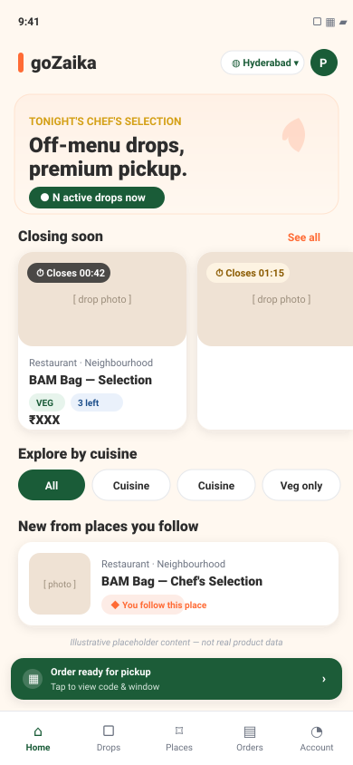
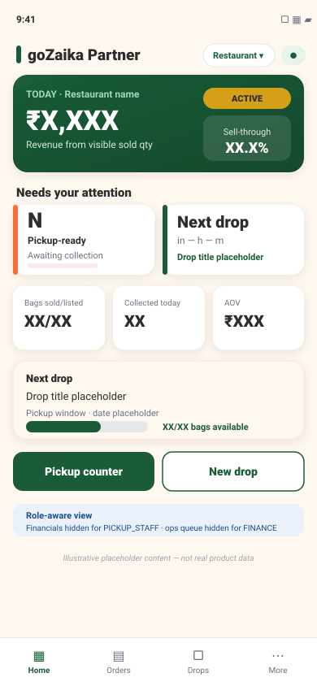

# goZaika Mobile — UI/UX Inspiration, Design Spec, Mockups & Feature‑Gap Analysis (v1)

**Status:** Source document for a detailed review + next‑steps planning exercise.
**Date:** 2026‑06‑25 · **Owner:** product/design review · **Author:** analysis pass (no code changed).
**Scope:** `apps/consumer-mobile` (goZaika) and `apps/restaurant-mobile` (goZaika Partner).

> **How to read this doc.** Tags: **`[OBSERVED]`** = fact read from repo/screenshots; **`[RECOMMENDED]`** = design proposal. External app patterns are general industry knowledge (see References). Mockups in §B are **illustrative placeholders only** — no fabricated restaurant names, prices, QR/OTP, order states, or metrics.

**Companion files**
- `docs/product/mockups/customer-home-mockup.svg` — proposed Customer Home (rendered in §B).
- `docs/product/mockups/partner-dashboard-mockup.svg` — proposed Partner Dashboard (rendered in §B).

---

## Table of contents
- [Executive Summary](#executive-summary)
- [Part 0 — Current State Baseline (Observed)](#part-0--current-state-baseline-repo-observed-facts)
- [Part A — Inspiration & UI/UX Specification](#part-a--inspiration-apps--uiux-specification)
  - [A1 Inspiration apps + motifs](#a1-inspiration-apps--reusable-motifs)
  - [A2 Gap comparison](#a2-gozaika-vs-those-patterns--gap-comparison)
  - [A3 Customer app spec](#a3-customer-app-uiux-specification--gozaika)
  - [A4 Restaurant app spec](#a4-restaurant-app-uiux-specification--gozaika-partner)
  - [A5 Implementation plan (slices)](#a5-implementation-plan--safe-agent-executable-slices)
- [Part B — Mockups (deliverable b)](#part-b--mockups-customer-home--partner-dashboard)
- [Part C — OWNER Capture Checklist (deliverable c)](#part-c--owner-capture-checklist)
- [Part D — Feature Gap Analysis](#part-d--feature-gap-analysis)
- [Recommended Next Decisions](#recommended-next-decisions-for-the-owner)
- [Data‑truth caveats](#data-truth-caveats-flagged-not-done)
- [References](#references)

---

## Executive Summary

**What exists today `[OBSERVED]`.** Both apps are architecturally healthy and honest: a shared `@gozaika/mobile-ui` token package (saffron/forest/cream palette, 6‑step type scale, 48dp touch floor), accessible primitives (`Button`, `Card`, `Badge`, `EmptyState`, `ErrorState`, `Skeleton`, `OfflineBanner`, `StatusAnnounce`), React‑Query data, role‑gated BFF, and disciplined empty/loading/error/offline states. Data is server‑authoritative and brand language is policed (CI bans "leftover/stale/cheap/clearance"). Customer app = 5 tabs (Home, Drops, Restaurants, Orders, Account); Partner app = 4 tabs (Home, Orders, Drops, More).

**The gap.** The apps are **correct and clean, but "scaffold‑grade," not "award‑grade."** The customer Home screen is a left‑aligned text block + buttons (`app/(tabs)/index.tsx:11‑33`); `Card` is a flat 1px‑border white box with **no elevation, no imagery composition, no gradient, no motion** (`packages/mobile-ui/src/components/Card.tsx`); `Button` is a solid rounded rectangle with no press animation. There is no hero, no countdown urgency, no map, no animated confirmation, and loyalty is a text link. The partner Dashboard is four bordered metric boxes (`app/(tabs)/index.tsx:13‑27`). Nothing is *wrong* — it's *undistinguished*, and reads like a competent internal tool rather than the premium brand‑safe value‑discovery product goZaika is positioned to be.

**The opportunity.** Close the polish gap **without touching payment/pickup/notification/finance behavior** — the lane prior polish passes respected. Customer app gains energy, urgency, and delight (hero discovery, drop countdowns, animated claim→pickup, a tactile loyalty Passport). Partner app gains operational density and confidence (a real "today" command center, a fast KDS‑style queue, a focused verify flow). They become **siblings via shared tokens/components, differentiated via density, accent, and tone.**

**Biggest constraint `[OBSERVED]`.** Store/marketing work is blocked on real captures and product‑truth approvals (Expo dev overlay on customer shots; missing partner authenticated captures; OTP/order‑ID/finance wording needs approval — `.codex-artifacts/gozaika-polish-v2/CURRENT_STATE.md`, `.codex-artifacts/gozaika-store-launch/screenshots/raw/INDEX.md`). Part C is the checklist to clear those gaps.

---

## Part 0 — Current State Baseline (Repo‑Observed Facts)

| Area | Observed | File |
|---|---|---|
| Palette | saffron `#FF6B35`, forest `#1A5C38`, gold `#D4A017`, cream `#FFF8F0`, charcoal `#2D2D2D`; status tones ship bg+fg pairs (never color‑only) | `packages/mobile-ui/src/tokens/colors.ts` |
| Type scale | display 28 / title 22 / heading 17 / body 15 / label 13 / caption 11; weights 400–800 | `packages/mobile-ui/src/tokens/layout.ts` |
| Spacing/radii | spacing 4–32; radii 6/10/16/pill; **`MIN_TOUCH_TARGET = 48`** | `tokens/layout.ts` |
| Card | white, `borderWidth:1`, radius 10, **no shadow/elevation** | `components/Card.tsx` |
| Button | solid/secondary/ghost, min‑height 48, **no press feedback/scale** | `components/Button.tsx` |
| Customer Home | text + 4 link rows + 1 button; "N active drops"; no imagery | `app/(tabs)/index.tsx` |
| Drop card | media + restaurant + name + dietary/allergen/qty badges + price | `src/ui/DropCard.tsx` |
| Drop detail | media, allergens card, price + pickup window, claim CTA | `app/(tabs)/drops/[dropPk].tsx` |
| Checkout | gated simulator vs Razorpay stub; success = green block + "code on its way" | `app/checkout/[holdPk].tsx` |
| Partner Dashboard | status badge + 4 financial metrics + 3 ops metrics + next drop + 2 CTAs | `app/(tabs)/index.tsx` |
| Partner Counter | grouped order cards; tablet master‑detail at ≥900px | `app/(tabs)/orders/index.tsx` |
| States | `EmptyState`/`ErrorState`/`Skeleton`/`OfflineBanner`/`StatusAnnounce` exist and are used consistently | multiple |
| Nav | Customer 5 tabs; Partner 4 tabs + "More" hub of 7 links | `(tabs)/_layout.tsx`, `(tabs)/more.tsx` |

**Net:** strong bones (tokens, a11y, states, honest data, role gating). **Missing:** elevation/depth, hero/editorial composition, urgency/countdown, motion/haptics, map discovery, loyalty visualization, dashboard density, polished confirmation moments.

---

## Part A — Inspiration Apps & UI/UX Specification

### A1. Inspiration apps + reusable motifs

#### Consumer‑side benchmarks

| App | Why notable | Reusable motifs for goZaika customer |
|---|---|---|
| **Too Good To Go** | Closest analog: pickup food, "Surprise Bag," reserve‑then‑collect, map‑first discovery; sustainability‑app awards. | Bag‑available/reserve urgency; pickup‑window time chips; map+list toggle; lifetime impact counter; favorite‑store follow → notify. **Adapt tone:** goZaika is premium "Chef's Selection," not rescue. |
| **Zomato** | India benchmark for energetic, playful microcopy and delightful empty/loading states. | Playful‑but‑tasteful loaders/empty states; rich restaurant headers; dish photography treatment; "order again." |
| **Swiggy** | India benchmark for dense‑but‑clean discovery, filters, live tracking, loyalty. | Sticky filter/cuisine chip rail; "closing soon" rails; live status timeline; bottom‑sheet flows. |
| **Uber Eats / DoorDash / Deliveroo** | Best‑in‑class checkout clarity, status timelines, persistent active‑order bar, accessibility. | Linear status timeline (Claimed→Paid→Ready→Collected); large legible price/CTA; persistent "active order" peek bar; refined sheet checkout. |
| **Blinkit / Zepto** | Speed‑first, countdown urgency, sticky cart, snappy motion. | Countdown timers; sticky claim bar; instant skeleton→content transitions; crisp micro‑motion. |
| **Starbucks / loyalty apps** | Best loyalty visualization: tactile rewards, tier progress. | Passport as a tactile card/progress ring; tier progress; stamp/collection metaphor for cuisine diversity. |
| **Apple Design Award design tier (Flighty, Things)** | Restraint + motion + haptics + typographic hierarchy. | Spring press states; subtle hero parallax; haptic confirmation; one bold focal element per screen. |

#### Operator‑side benchmarks (partner app)

| App | Why notable | Reusable motifs for goZaika partner |
|---|---|---|
| **Square / Toast / Lightspeed (POS/KDS)** | Operational clarity under pressure: big targets, status color‑coding, fast queues. | KDS queue with status filters; oversized verify targets; sound/haptic on new order; shift/day summary header. |
| **Shopify (merchant app)** | Best merchant dashboard: "today" snapshot, trend sparklines, action cards, calm density. | Dashboard "today" hero number + trend; insight/action cards; clean tabular reports; share/export. |
| **Stripe Dashboard** | Trustworthy financial presentation; precise number formatting; no hype. | Formal finance presentation; payout/settlement clarity; restrained color; auditable line items. |
| **Uber Driver / Rappi Partner** | Operator focus mode, accept/serve loop, earnings clarity. | "Focus mode" for active pickup; earnings/recovery summary; honest sell‑through nudges. |
| **Linear / Things** | Speed, gesture efficiency, calm professional aesthetic. | Snappy lists; swipe actions; consistent empty/loading discipline (already strong here). |

**Cross‑cutting award patterns to adopt:** depth via soft shadows/elevation tiers; one focal element per screen; spring/haptic feedback on primary actions; reduced‑motion honoring; expressive‑but‑accessible empty states; skeletons matched to final layout; typography‑led hierarchy over boxes.

### A2. goZaika vs. those patterns — gap comparison

| Pattern | Best‑in‑class | goZaika today `[OBSERVED]` | Gap |
|---|---|---|---|
| Depth/elevation | Layered shadows, focal hero | Flat 1px‑border cards | **High** |
| Discovery IA | Map+list, sticky filters, rails | List + skeletons; filters on web not native | **High** |
| Urgency | Countdown, "closing soon," low‑stock pulse | Static "X left" badge | **High** |
| Motion/haptics | Spring press, animated success, haptics | None on primitives | **High** |
| Loyalty viz | Tactile cards, progress rings | Text links ("Passport →") | **High** |
| Checkout/confirm | Status timeline, celebratory confirm | Green block + text | **Medium** |
| Restaurant header | Editorial photography, follow | Public profile (functional) | **Medium** |
| Partner dashboard | "Today" hero + trends + actions | 4 bordered metric boxes | **Medium‑High** |
| Verify flow | Oversized, focus mode, sound/haptic | Functional QR/OTP panel | **Medium** |
| Reports/finance | Tabular + sparkline + export | Read‑only counts + share | **Medium** |
| States discipline | Consistent, expressive | **Already strong** | **Low (keep)** |
| Accessibility floor | 48dp, labels, announce | **Already strong** | **Low (keep)** |

### A3. Customer App UI/UX Specification — "goZaika"

**Design principles**
1. **Appetite‑forward.** Food photography and the BAM flame mark lead; chrome recedes. One bold focal element per screen.
2. **Energetic, tasteful urgency.** Drops are time‑boxed — countdowns, "closing soon," low‑stock cues. Urgency without anxiety; never sale‑tag/clearance styling.
3. **Premium value, not cheap.** Approved lexicon only: BAM Bags, Limited Drops, Chef's Selection, off‑menu discovery, premium access, pickup window.
4. **One‑handed & fast.** Bottom‑sheet flows, sticky primary CTA, thumb‑reachable actions.
5. **Honest delight.** Motion/celebration tied to server‑confirmed states only — never fabricated metrics, codes, or counts.
6. **Accessible by default.** Keep 48dp floor, status text companions, screen‑reader announcements; add reduced‑motion + Dynamic Type.

**Navigation model `[RECOMMENDED]`** — keep 5 tabs, refine roles:
- **Home / Discover** — hero, "drops near you," closing‑soon rail, cuisine chips, follow‑based "new from places you love."
- **Drops** — full filterable/searchable list **+ map toggle**.
- **Restaurants** — directory + editorial profiles + follow.
- **Orders** — active order pinned with status timeline; history below.
- **Account** — Passport (visualized), Flavour Diversity, consent, referral, Swaad Club.
- **Add:** a global **"active order" peek bar** above the tab bar when an order is claimed/ready.

**Screen‑by‑screen direction**
- **Home/Discover** `[OBSERVED: text+buttons]` → Hero band (use `packages/ui/assets/brand/hero-bam-bag.webp`), confident "N active drops" stat chip, horizontal **Closing soon** rail with countdown chips, cuisine chips, "New from places you follow." Empty → warm "No drops live right now — follow places to get notified."
- **Drops list** → keep `FlatList` + skeletons; add sticky filter/sort header, cuisine/dietary/veg chips, "closing soon" sort, **Map toggle** (map renders only public coordinates; when absent, "list view is the source of truth").
- **Drop detail** → Larger media, **live countdown to pickup‑window close**, low‑stock pulse on the qty badge, allergen card **kept above the CTA** (current order is correct — keep), sticky bottom **Claim** bar.
- **Checkout** → Bottom‑sheet summary; keep gated‑simulator vs Razorpay‑stub logic untouched; on confirm, **animated success** (reduced‑motion‑safe) → pickup card. **Do not render a fake QR/OTP** — keep "code on its way" until real pickup‑proof exists.
- **Orders** → Active order with **horizontal status timeline** (Claimed→Paid→Ready→Collected); history below; "order again" / "follow this place."
- **Account → Passport** `[OBSERVED: text link]` → **Tactile loyalty card** with cuisine‑diversity progress ring/stamps, tier state, referral code as a copyable chip. Values from existing `buildPassportPayload`/`buildDiscoveryProfile` — **no fabricated counts.**
- **Auth/Onboarding** → Branded OTP screen using hero asset; phone‑OTP primary, Google OAuth secondary.

**Component system `[RECOMMENDED]` (extend `@gozaika/mobile-ui`, don't fork)**
- **Elevation tokens** (`shadow.sm/md/lg`) added to `tokens/layout.ts`; optional `elevated` prop on `Card`.
- `Pressable` press‑state (scale 0.98 + opacity) + optional haptic on `Button` primary.
- New: `HeroBanner`, `CountdownChip`, `FilterChipRow`, `SegmentedToggle` (List/Map), `StatusTimeline`, `LoyaltyCard`, `ProgressRing`, `StickyActionBar`, `PeekBar`, `RatingStars`.
- **Reuse** `ProductMedia`/`RestaurantAvatar`/fallbacks (handle null/failed media).

**Typography / color / motion / image**
- **Type:** keep scale; branded display face for hero numerals only (confirm marketing type). Support Dynamic Type.
- **Color:** saffron = energy/primary CTA; forest = trust/secondary; gold = premium/loyalty accents; cream surfaces. Keep status bg+fg pairs.
- **Motion:** spring presses (200–250ms), shared‑element drop‑card→detail media, skeleton→content cross‑fade, success animation. **All gated by reduced‑motion.**
- **Image:** food‑forward; BAM flame mark as recurring discovery cue per brand rules; never clearance/neon treatments.

**Empty/loading/error/offline `[OBSERVED — keep + elevate]`** — keep components; elevate copy to brand voice; match skeletons to new hero/rail layouts; map/offline degrade to list.

**Accessibility** — maintain 48dp targets, `accessibilityRole/Label/State`, status‑text companions, `StatusAnnounce`. **Add:** reduced‑motion paths, Dynamic Type, ≥4.5:1 contrast re‑audit of any new overlay text (helper exists: `tokens/contrast.ts`).

**Data‑truth requirements** — no fabricated restaurants, prices, drop states, QR/OTP, order numbers, ratings, user counts, or impact metrics. Countdown derives from real `pickupEndAt`; loyalty from real payload; impact counters only if a real backing field exists — **else omit.**

**Screenshots/assets needed** — production‑build recaptures (no Expo overlay) for Home, Drops, Drop detail, Orders list, Account/Passport, Order‑confirmed. New: hero composition, countdown chip states, Passport card, map view. **Blocked:** pickup‑proof card until real QR/OTP alternative approved.

**Acceptance criteria (samples)**
- Home renders hero + ≥1 live rail; "N active drops" equals `useDrops()` ACTIVE count; states present; CI `mobile-ci.mjs` stays 7/7.
- Drop detail countdown computed from `pickupEndAt`; allergen card precedes CTA; sticky Claim bar; sold‑out disables CTA.
- Checkout success animation only on server‑confirmed `orderPk`; reduced‑motion shows static success; no fabricated code shown.
- New interactive elements ≥48dp, labeled, contrast ≥4.5:1; reduced‑motion honored.

### A4. Restaurant App UI/UX Specification — "goZaika Partner"

**Design principles**
1. **Operationally clear under pressure.** Big targets, status color‑coding, glanceable numbers.
2. **Formal & trustworthy.** Forest/cream, precise number formatting, restrained motion (Stripe/Shopify tone).
3. **Fast.** Queue‑first; swipe actions; minimal taps to verify.
4. **Sibling, not clone.** Shares tokens/components; differs by forest accent, higher density, formal copy.
5. **Honest operations.** Role‑gated truth only (financials hidden for PICKUP_STAFF, ops hidden for FINANCE — already enforced).

**Navigation model `[OBSERVED + RECOMMENDED]`** — keep 4 tabs:
- **Home = "Today" command center** (hero day‑number + trend + action cards).
- **Orders = Pickup Counter** (queue + focus‑mode verify).
- **Drops = manage/create** (status filters, sell‑through).
- **More** = Templates, Reports/ROI, Finance, Onboarding, Compliance, Profile, Reviews. Promote **role‑based visibility** in‑app (today it's a text disclaimer in `more.tsx`).
- Keep/extend tablet master‑detail (already at ≥900px in counter) to dashboard/reports.

**Screen‑by‑screen direction**
- **Dashboard/Today** `[OBSERVED: 4 boxes]` → Hero "today revenue/bags" with **honest trend vs. prior comparable only if a real field exists, else omit**, action cards ("3 pickup‑ready," "Next drop in 2h," "Publishing paused"), keep activation/publishing‑paused notices, sell‑through gauge.
- **Pickup Counter** → KDS‑style: status‑grouped/filterable queue, oversized order cards, **focus‑mode verify** (full‑screen QR / big‑target OTP), sound + haptic on new pickup‑ready order, incident badges. Keep tablet split. Verify logic/security unchanged (Slice 7 sign‑off).
- **Drops manage/create** → list with sell‑through bars + status filters; create wizard with template reuse; pause/cancel/activate (Slice 13 remainder) as **swipe/confirm actions**.
- **Reports/ROI & Finance** → formal tables + sparkline trend; payout/settlement clarity; **partner‑safe Share keeps counts‑only** (Slice 15 rule). Numbers via `formatPaise`.
- **Profile/Compliance/Onboarding** → resumable onboarding wizard (Slice 12 remainder) with progress; compliance doc status chips; public‑profile preview.
- **More** → role‑aware list (hide forbidden destinations), restaurant switcher, partner support.

**Component system `[RECOMMENDED]`** — reuse shared primitives; add partner‑density variants: `MetricHero`, `ActionCard`, `QueueCard` (status‑colored), `FocusVerifyScreen`, `SellThroughBar`, `Sparkline`, `DataTable`, `SwipeActionRow`, `RestaurantSwitcher`. Shared elevation tokens.

**Type/color/motion/image** — forest‑led; gold sparingly for positive deltas; status tones for queue; tabular‑figure numerals for finance; minimal/functional motion; imagery limited to identity + drop media (formal, not editorial).

**States / a11y / data truth** — keep state discipline + offline banner (critical at counter); maintain role gating; big in‑hand targets; **no fabricated orders/metrics/payouts/QR/OTP/sell‑through** — all from `useDashboard`, `useCounterOrders`, `loadRoiReport`.

**Screenshots/assets needed `[OBSERVED gaps]`** — authenticated native captures missing for Dashboard, Drops create/manage, Profile/Compliance, Reports/ROI, Finance, tablet. Capture as OWNER on a production build; finance/ROI wording needs product approval.

**Acceptance criteria (samples)**
- Dashboard hero from `useDashboard`; financial block hidden when `data.financials` absent (role); ops block hidden when `data.operations` absent.
- Counter new‑order arrival triggers haptic + optional sound; verify focus‑mode targets ≥48dp; offline banner on `NETWORK` error; tablet master‑detail preserved.
- Reports Share emits counts‑only payload (no per‑customer/financial leakage); CI 7/7.

### A5. Implementation Plan — safe, agent‑executable slices

Each slice respects no‑drift rules: shared‑lib reuse, `scripts/mobile-ci.mjs` stays 7/7, BFF contracts in `packages/types/src/mobile/*`, no payment/pickup/notification/finance behavior change, review‑gated items untouched. **Visual QA = dev/preview screenshot during each slice, with production‑build screenshots at milestone gates and before store/demo asset use.** ADB + Maestro are available for device proof; remote Supabase test phone auth is configured for the seeded demo login numbers.

| Slice | Scope | Files likely touched | Acceptance | Smoke / Visual QA |
|---|---|---|---|---|
| **U1 — Design‑system depth** | Elevation tokens; visual press‑state on `Button`; `elevated` `Card`; reduced‑motion util | `packages/mobile-ui/src/tokens/layout.ts`, `components/{Button,Card}.tsx`, new `motion.ts` | Tokens exported; screens unchanged except elevation/press feedback; a11y intact | CI 7/7; before/after screenshots |
| **U2C — Customer primitives** | Customer-facing primitives: `HeroBanner`, `CountdownChip`, `FilterChipRow`, `SegmentedToggle`, `StickyActionBar`, `PeekBar`, `LoyaltyCard`, `ProgressRing` | `packages/mobile-ui/src/components/*`, `index.ts`, customer fixtures/tests | Components are only added as consuming screens need them; a11y-labeled; reduced-motion-safe | Component gallery + consuming-screen proof |
| **U2R — Partner primitives** | Partner/operator primitives: `MetricHero`, `ActionCard`, `QueueCard`, `SellThroughBar`, `DataTable`, `Sparkline`, `RoleAwareSection`, `RestaurantSwitcher` | `packages/mobile-ui/src/components/*`, `index.ts`, partner fixtures/tests | Components are dense, role-safe, and reusable across dashboard/reports/counter; no client-side exposure of server-omitted sections | Component gallery + consuming-screen proof |
| **F1 — Favorites/follows foundation** | Productize restaurant follow/favorite across customer web, customer mobile, and restaurant web visibility | `supabase/*`, `packages/types/src/mobile/*`, `consumer-web`, `consumer-mobile`, `restaurant-mgmt-web`, mobile/web APIs | Reuse/audit `consumer_saved_restaurant`; follow/unfollow works; Home can render followed-restaurant rail; restaurant web shows aggregate counts only | API tests; mobile/web screenshots; privacy review |
| **C1 — Customer Home/Discover** | Hero + closing‑soon rail + cuisine chips + followed-restaurant rail + active-order details wording | `consumer-mobile/app/(tabs)/index.tsx`, `src/ui/*` | Live count matches `useDrops`; followed rail uses F1 data; active order copy says "pickup details" unless real code display is approved; states present | Home recapture |
| **C2 — Drops list + native map toggle** | Sticky filters, sort, Map/List segmented; native map using safe public coordinates | `app/(tabs)/drops/index.tsx`, new map view, native map dependency/config if approved | Filters work; map renders only public `latitude`/`longitude`; list fallback when coords/provider unavailable; no private address/compliance data | Drops + map shots; dependency/build proof |
| **C3 — Drop detail + checkout polish** | Countdown, low‑stock pulse, sticky claim, animated success | `drops/[dropPk].tsx`, `checkout/[holdPk].tsx` | Countdown from `pickupEndAt`; success only on server confirm; no fake code | Detail + confirm (light + reduced‑motion) |
| **C4 — Orders timeline + peek bar** | Status timeline; active‑order peek above tabs | `(tabs)/orders/*`, `(tabs)/_layout.tsx` | Timeline reflects real states; peek when active | Orders shots |
| **C5 — Passport/loyalty viz** | LoyaltyCard + ProgressRing from real payload | `(tabs)/account/{passport,discovery,index}.tsx` | Values from real libs; no fabricated counts | `slice11` smoke; Passport shots |
| **R1 — Partner role-shaped Today dashboard** | MetricHero + action cards composed from `DashboardData.variant` | `restaurant-mobile/app/(tabs)/index.tsx` | `FULL` may show finance+ops; `QUEUE_ONLY` leads with pickup queue and never shows financials; `SUMMARY` leads with finance and never shows ops; no trend delta until backend exposes previous-period fields | Dashboard recapture for OWNER, PICKUP_STAFF, FINANCE |
| **R2 — Counter focus‑mode** | KDS queue filters, focus verify, optional haptic/sound on new order | `(tabs)/orders/index.tsx`, `counter/*` | Verify security unchanged (Slice 7); haptic/sound scoped to counter flow only; offline banner; tablet split intact | Counter + verify |
| **R3a — Drops visual polish** | Sell‑through bars, status filters, next-action hierarchy | `(tabs)/drops/*` | Read-only polish; no lifecycle mutation change | Drops screenshots |
| **R3b — Drop lifecycle actions** | Swipe/confirm pause/cancel/activate using canonical RPCs | `(tabs)/drops/*`, API wrappers as needed | Canonical server guardrails respected; destructive actions confirmed | Slice 13 smoke; role shots |
| **R3c — Reports/finance polish** | Table + sparkline reports, finance readability, share/export presentation | `reports.tsx`, `finance.tsx` | Share stays counts‑only (Slice 15); finance/ROI wording approved before external use | `slice15` smoke; reports/finance shots |
| **R4 — More role‑aware + switcher** | Hide role‑forbidden destinations; restaurant switcher | `(tabs)/more.tsx` | Matches server role matrix | Role‑variant shots |
| **X1 — A11y/motion/perf pass** | Reduced‑motion, Dynamic Type, contrast re‑audit on overlays | shared + screens | Slice 17 gate criteria met | Contrast tests; a11y sweep |
| **D1 — Demo/presales readiness** | Populate seeded demo scenarios and graphics so Maestro flows are visually complete for sales, presales, and investor walkthroughs | seed scripts, demo assets, Maestro flows, app screens as needed | Demo truth is rich and attractive without fake claims; customer and partner flows are complete; images are licensed/generated/approved; no fake QR/OTP/order states | Maestro runs + screenshot/video-ready capture manifest |

**Resilience for future sessions:** source docs named inline; reuse rules per `docs/mobile/CONTINUE-HERE.md`. **Blocked states** (untouched by the UI slices unless explicitly approved): pickup‑proof display (C5 store gap), real Razorpay (owner keys), in‑app erasure automation, finance/ROI store wording. **Native dependency rule:** maps, haptics, audio, SVG rendering, and animation libraries must be added only in the slice that consumes them, with an Expo/Android build proof before moving on.

---

## Part B — Mockups (Customer Home + Partner Dashboard)

> **Deliverable (b).** Two proposed‑UX mockups rendered as SVG. **All content is illustrative placeholder** (e.g., `₹XXX`, `N active drops`, "Restaurant · Neighbourhood", "Closes 00:42") — deliberately *not* real restaurant names, prices, QR/OTP, order numbers, or metrics, per the data‑truth rule. Source files: `docs/product/mockups/customer-home-mockup.svg`, `docs/product/mockups/partner-dashboard-mockup.svg`.

### B1. Customer Home / Discover (proposed)



**Annotated layout (top→bottom)**
```
┌───────────────────────────────────────────────┐
│ ▌goZaika              [◍ Hyderabad ▾]  (P)     │  header: brand bar + location + avatar
├───────────────────────────────────────────────┤
│  TONIGHT'S CHEF'S SELECTION                     │  HERO band (cream→saffron tint,
│  Off-menu drops, premium pickup.               │  BAM flame motif), confident
│  [ ● N active drops now ]                       │  forest stat chip (live count)
├───────────────────────────────────────────────┤
│ Closing soon                          See all   │  RAIL of drop cards w/ elevation
│ ┌───────────┐ ┌───────────┐                     │  + COUNTDOWN chip ("⏱ Closes 00:42")
│ │[photo]     │ │[photo]     │                    │  + dietary/qty badges + ₹XXX
│ │⏱00:42 VEG │ │⏱01:15      │                    │
│ └───────────┘ └───────────┘                     │
├───────────────────────────────────────────────┤
│ Explore by cuisine                              │  filter CHIP ROW (All active)
│ (All)(Cuisine)(Cuisine)(Veg only)               │
├───────────────────────────────────────────────┤
│ New from places you follow                      │  FOLLOW rail (re-engagement)
│ [photo]  Restaurant · BAM Bag  ◆ You follow      │
├───────────────────────────────────────────────┤
│ ▌Order ready for pickup            ›            │  ACTIVE-ORDER peek bar (forest)
├───────────────────────────────────────────────┤
│  ⌂Home   ▢Drops  ⌑Places  ▤Orders  ◔Account    │  5-tab bar (Home active)
└───────────────────────────────────────────────┘
```
**What changes vs. today:** replaces the text‑only home (`index.tsx`) with a hero + live rails + urgency + follow + active‑order peek. Saffron leads (energy). Elevation/shadow on cards. Every datum maps to a real source (`useDrops`, order state) or is omitted.

### B2. Partner Dashboard / "Today" (proposed)



**Annotated layout (top→bottom)**
```
┌───────────────────────────────────────────────┐
│ ▌goZaika Partner     [Restaurant ▾]  (●)        │  header: brand bar + switcher + status
├───────────────────────────────────────────────┤
│  TODAY · Restaurant name        [ ACTIVE ]      │  FOREST HERO: big revenue numeral
│  ₹X,XXX                          ┌───────────┐  │  + sell-through panel
│  Revenue from visible sold qty   │Sell-through│ │
│                                   │  XX.X%     │ │
├───────────────────────────────────────────────┤
│ Needs your attention                            │  ACTION cards (accent edge)
│ ┌── N Pickup-ready ──┐ ┌── Next drop in — ──┐   │
├───────────────────────────────────────────────┤
│ [Bags XX/XX] [Collected XX] [AOV ₹XXX]          │  METRIC row (role-gated)
├───────────────────────────────────────────────┤
│ Next drop · title · window · ▰▰▱ XX/XX bags     │  next-drop card w/ progress
├───────────────────────────────────────────────┤
│ [ Pickup counter ]     [ New drop ]             │  primary + secondary CTA
│ ℹ Role-aware: financials hidden for PICKUP_STAFF │  role transparency
├───────────────────────────────────────────────┤
│  ▦Home   ▤Orders   ▢Drops   ⋯More              │  4-tab bar (Home active)
└───────────────────────────────────────────────┘
```
**What changes vs. today:** replaces four equal bordered boxes (`index.tsx`) with a confident "Today" hero + attention/action cards + role transparency, while preserving the exact role‑gating (`data.financials` / `data.operations`). Forest leads (trust/formality). Trend deltas shown **only if** a real backing field exists.

**Sibling relationship (how they differ on purpose):** same tokens, elevation, type scale, state discipline. Customer = saffron accent, editorial hero, playful urgency, lower density. Partner = forest accent, numeric hero, formal copy, higher density, role transparency.

---

## Part C — OWNER Capture Checklist

> **Deliverable (c).** A capture pass to clear the store‑asset gaps in `.codex-artifacts/gozaika-store-launch/screenshots/raw/INDEX.md` and the blockers in `CURRENT_STATE.md`. Goal: clean, native, production‑build screenshots with **no Expo dev‑client gear overlay** and **no fabricated product truth**.

### C0. Pre‑flight (do once)
- [ ] **Build a production/preview build** of each app (NOT the Expo dev client) so no gear overlay appears. Caveat **C1** in `CAVEATS.md`: customer dev‑client shots show the gear overlay and must be recaptured from a production/preview build.
- [ ] Install on the capture device: customer = `in.gozaika.customer`, partner = `in.gozaika.restaurant` (`adb install -r`).
- [ ] Confirm seeded demo state matches the marketing capture package (`scripts/demo/seed-marketing-video-data.ts`), so screens have realistic but seeded content.
- [ ] **Unlock the phone before capture** (prior unattended attempts produced black lockscreen captures — see `CURRENT_STATE.md` QA notes).
- [ ] Capture at device native res, then plan to **crop/pad 1080×2400 → 1080×1920** before Play upload (caveat **C2**: 1080×2400 exceeds Play's 2:1 max).
- [ ] Use `scripts/store-launch/capture-store-screenshots.mjs` (adb `screencap`, ingests manual navigation); re‑run `scripts/store-launch/validate-store-assets.mjs` afterward (target: 0 hard fails).

### C1. Customer app — `goZaika` (demo identity: consumer Priya `+919876510001` / OTP `100001`; remote Supabase test phone auth configured)
| # | Screen | Action to reach it | Status target | Notes / truth guard |
|---|---|---|---|---|
| 1 | Home / Discover | Launch app | ☑ recapture (clean) | Existing shot has C1 overlay + dead space; capture the improved layout once C1 ships |
| 2 | Drops list | Tab → Drops | ☑ recapture (clean) | Ensure ≥3 active drops visible |
| 3 | Drop detail | Open a drop | ☑ recapture (clean) | Show identity, pickup window, allergens |
| 4 | Claim / checkout | Drop → Claim → checkout | ☐ **standalone gap** | Use **simulated** checkout (demo); show "Demo · simulated payment" badge; no real money wording |
| 5 | Order confirmed | Confirm simulated payment | ☑ recapture (clean) | Show "code on its way" — **do NOT stage a fake QR/OTP** (blocker C5) |
| 6 | Orders list | Tab → Orders | ☐ **gap** | Recapture from Orders tab |
| 7 | Passport | Account → Zayka Passport | ☑ recapture (clean) | Confirm naming "Zayka Passport" is final (open question) before store use |
| 8 | Account / consent | Tab → Account | ☐ optional | Capture if polished |

**Customer blockers to resolve before store use:** OTP login must transition to an authenticated state during capture (prior attempt stalled on OTP screen); pickup‑proof (C5) needs a real QR/OTP alternative + product/compliance approval; confirm whether visible deterministic demo OTPs/order IDs are acceptable or require clean recaptures.

### C2. Partner app — `goZaika Partner` (demo identity: OWNER Meera `+919876520001` / OTP `200001`; role staff `+9198765300xx` for staff‑view variants; remote Supabase test phone auth configured)
| # | Screen | Action to reach it | Status target | Notes / truth guard |
|---|---|---|---|---|
| 1 | Dashboard (Today) | Sign in as OWNER → Home | ☐ **gap — capture as OWNER** | Needs authenticated capture; finance numbers require wording approval |
| 2 | Pickup counter | Tab → Orders | ☑ exists (clean) | Grouped orders |
| 3 | Verify pickup (QR/OTP) | Counter → open order | ☑ exists (clean) | |
| 3b | Verify — OTP entered | Enter OTP | ☑ exists (clean) | |
| 4 | Drops create/manage | Tab → Drops | ☐ **gap — OWNER** | Show sell‑through + status |
| 5 | Profile / compliance | More → Profile/Compliance | ☐ **gap — OWNER** | Private docs must not be exposed in shot |
| 6 | Reports / ROI | More → Reports | ☐ **gap — OWNER (native)** | ROI/revenue wording needs product/compliance approval |
| 7 | Finance | More → Finance | ☐ **gap — OWNER** | Finance/settlement wording approval required |
| 8 | Tablet dashboard/report | Tablet device | ☐ tablet pass pending | Confirm whether iPad/tablet assets are in scope (open question) |
| — | Collected success | Verify → collected | ☑ exists (bonus) | |

**Partner blockers:** native captures for dashboard/drops/profile/reports/finance/tablet do not yet exist; web‑portal fallback captures (`_web-fallback/`, labeled "ZAYKA PRO", landscape) are reference/tablet candidates only — **do not submit as phone screenshots**; partner authenticated capture blocked until sign‑in succeeds and a restaurant is selected.

### C3. Approvals to unblock (owner/product/compliance — gate store use, not capture)
- [ ] Confirm store‑facing copy: `BAM Bag`, `Chef's Selection`, `Limited Drop`, `Zayka Passport`.
- [ ] Confirm beta payment wording; which assets may mention paid orders / checkout / GMV / ROI / finance / revenue.
- [ ] Confirm whether visible deterministic demo OTPs / order IDs are acceptable in final assets, or require clean recaptures.
- [ ] Confirm final marketing typography and final app‑icon variants.
- [ ] Confirm whether partner tablet/iPad assets are planned.

### C4. Done‑definition for the capture pass
- [ ] All ☐ gaps above captured natively, clean (no dev overlay), phone‑unlocked.
- [ ] All shots cropped/padded to a Play‑legal ratio (≤2:1).
- [ ] `validate-store-assets.mjs` reports 0 hard fails (warnings documented in `CAVEATS.md`).
- [ ] Raw set + updated caveats handed to the marketing/Codex lane for polished composition (per the store‑launch lane split).

---

## Part D — Feature Gap Analysis

Ranked. **App:** customer (C) / restaurant (R) / admin (A) / web (W) / shared (S). Effort: S/M/L. Risk: L/M/H. *(No implementation specs — owner chooses direction.)*

| # | Feature | Description | User value | App | Priority | Effort | Arch deviation | Risk | Dependencies | Sensitive areas |
|---|---|---|---|---|---|---|---|---|---|---|
| 1 | **Favorite/follow restaurants + follower visibility** | Follow places across customer web/mobile; restaurant web sees aggregate follower activity | Re‑engagement, retention, partner confidence | C+R+W+S | P0 | M | Existing `consumer_saved_restaurant` likely reusable; needs APIs/UX/aggregates | M | Push later; privacy rules now | Notifications later, privacy |
| 2 | **Map discovery** | Native map+list toggle on public coords, aligned with web discovery | Pickup is location‑bound, especially for India launch behavior | C | P0 | M | Native map lib/config; safe‑coord rule exists | M | Public coords, map provider/build proof | None if public-coordinate only |
| 3 | **Drop countdown / closing‑soon** | Live urgency from `pickupEndAt` | Conversion, fewer expired holds | C | P0 | S | None (UI) | L | — | None |
| 4 | **Active‑order live status** | Timeline Claimed→Ready→Collected + peek bar | Reduces "where's my order" | C | P0 | M | Status read exists | L | Order states | None |
| 5 | **Counter focus‑mode + sound/haptic** | KDS‑grade verify under pressure | Faster, fewer errors | R | P0 | M | UI over Slice 7 verify | M | Verify (unchanged) | Restaurant ops |
| 6 | **Partner "Today" dashboard + trends** | Hero number + action cards + honest trend | Daily decisions | R | P0 | M | Needs trend field or omit | M | Dashboard loader | None |
| 7 | **Loyalty visualization (Passport)** | Tactile card, cuisine‑diversity progress, tier | Habit, brand love | C | P1 | M | Uses existing payload | L | Passport lib | None |
| 8 | **Native search + filters** | Search/filter/sort drops natively | Findability at scale | C | P1 | M | Query params | L | Discovery API | None |
| 9 | **Ratings/reviews (customer‑side)** | Submit + view post‑pickup reviews | Trust, quality signal | C+R+S | P1 | M | Reviews partly built (Slice 10/14) | M | Order completion | Privacy (moderation) |
| 10 | **Referral rewards (real)** | Functional referral beyond code display | Acquisition | C+W+S | P1 | L | New rewards ledger | M | Identity | Payments?(credit), privacy |
| 11 | **Saved/favorite drops & dietary prefs** | Personalized discovery beyond restaurant follows | Relevance | C | P1 | M | Prefs store | L | Profile | Privacy |
| 12 | **Swiped drop management (pause/cancel/activate)** | Fast lifecycle ops | Operator speed | R | P1 | S | Slice 13 remainder | L | Canonical RPC | Restaurant ops |
| 13 | **Reports trends + invoice export** | Sparklines + downloadable invoice | Finance clarity | R+W | P1 | M | Slice 15 remainder | M | ROI loader | Finance, store wording approval |
| 14 | **Resumable onboarding wizard + location pin** | Lower partner activation friction | Supply growth | R | P1 | L | Slice 12 remainder | M | Compliance docs | Restaurant ops, privacy |
| 15 | **In‑app notification center** | History of alerts/order events | Don't miss drops | C+R+S | P2 | M | Notif store | M | Push | Notifications |
| 16 | **Impact/value summary (honest)** | "Bags collected" lifetime — only if real field | Mission affinity | C | P2 | S | Needs backing data | M | Order history | Data‑truth (omit if none) |
| 17 | **Order‑again / re‑claim** | Quick re‑claim from a followed place | Convenience | C | P2 | S | Discovery reuse | L | Order history | None |
| 18 | **Waitlist / notify‑when‑restocked** | Join waitlist on sold‑out drop | Capture lost demand | C+S | P2 | M | New waitlist table | M | Push | Notifications |
| 19 | **Multi‑restaurant switcher + per‑role home** | Fast context switch for chains | Multi‑outlet operators | R | P2 | M | Membership exists | L | Role matrix | Restaurant ops |
| 20 | **Real Razorpay RN checkout** | Replace simulator (owner keys) | Real transactions | C | P0‑blocked | M | Stubbed behind flag | H | **Owner India keys (~1mo)** | **Payments**, store policy |
| 21 | **In‑app data‑erasure automation** | DPDP automated erasure | Compliance | C+W+S | Blocked | L | Currently link‑out | H | **Legal review** | **Privacy/security** |
| 22 | **Live pickup‑proof (QR/OTP) surface** | Real code display for store/marketing | Store readiness | C | P1‑blocked | M | Needs real proof + approval | M | Capture approval | Store policy, security |
| 23 | **Admin in‑app moderation** | Moderate docs/reviews in‑app | Ops efficiency | A | P3 | L | Web‑only by design | M | Admin web | Privacy, restaurant ops |
| 24 | **Tablet/iPad partner layouts** | First‑class large‑screen ops | Counter ergonomics | R | P2 | M | Master‑detail exists | L | — | None |
| 25 | **Demo/presales scenario completeness** | Seeded demo data, imagery, and Maestro flows ready for sales/presales/investor walkthroughs | Credible showcase | C+R+W+S | P0 | M | Mostly seed/assets/test-flow work | M | Demo seeds, approved assets, ADB/Maestro | Data truth, image licensing |

**Highest‑leverage wins:** #1 favorites/follows, #2 map discovery, #3 countdown, #4 status timeline, #6 role-shaped dashboard, #7 Passport viz, #25 demo/presales completeness. #3/#4/#6/#7 are mostly UI-safe; #1/#2/#25 are strategic P0s with controlled schema/API/native/dependency work.

---

## Recommended Next Decisions (for the owner)

1. **Approve the depth/motion foundation (U1 + U2C/U2R).** Additive design-system work; unblocks every later polish slice. Keep haptics/sound scoped to flows, not global buttons. *Recommended: yes.*
2. **Ship the customer first impression around real follow/map behavior.** Sequence F1 → U2C → C1 → C2 → C3 → C4 → C5, then R1/R2. This preserves the must-have favorites rail and map interface without placeholder UI.
3. **Confirm marketing/display typography + final naming** ("Zayka Passport," "BAM Bag," "Chef's Selection," "Limited Drop") — gates hero/Passport polish *and* store assets.
4. **Confirm native map package/config.** Web already has map behavior and public coordinates; C2 should implement native maps, but with explicit Expo/Android build proof before later slices.
5. **Approve follower aggregate privacy rules.** Restaurant web should show counts/new-favorites windows (7/30/365 days) and trend/visibility, not customer identities unless explicitly approved.
6. **Greenlight the Part C OWNER capture pass** to clear partner native gaps + Expo‑overlay customer recaptures (independent of code).
7. **Rule on blocked items:** real Razorpay, erasure automation, pickup‑proof display wording — keep out of UI slices until decided.
8. **Approve finance/ROI store wording** before R3c reports polish reaches any externally shared/exported surface.
9. **Treat D1 as a first-class deliverable.** Maestro scenarios must be visually complete and demo-truth-backed before returning to the video creation loop.

---

## Data‑truth caveats (flagged, not done)
- A celebratory **pickup‑proof/QR/OTP** mock was **not produced**; kept as "code on its way" until real capture exists (blocker C5).
- **Trend deltas / impact counters** require real backing fields; spec says **omit if absent**, never invent. For `DashboardData`, current safe fields are `todayRevenuePaise`, `soldBags`, `listedBags`, `sellThroughBps`, `aovPaise`, `activeDrops`, `scheduledDrops`, `availableBags`, `pickupReadyCount`, `collectedTodayCount`, and `nextDrop`.
- **Partner dashboard must be role-shaped from the server payload:** `FULL` may show financials and operations; `QUEUE_ONLY` must lead with operations and never show financials; `SUMMARY` must lead with financials and never show operations.
- **Favorites/follows are P0 but privacy-scoped:** customer follow state may personalize discovery; restaurant-facing views should begin with aggregates only.
- **Remote Supabase test phone auth is configured for seed demo numbers** for mobile app testing; keep local `test_otp` docs as implementation context, not as the only working demo path.
- **Authenticated partner store screenshots** don't exist yet — flagged as capture requests (Part C), not mocked.
- Mockups in §B use **obvious placeholder tokens** (`₹XXX`, `N`, `XX.X%`, "Restaurant · Neighbourhood") and carry an on‑canvas "illustrative" caption.

## References
External benchmarks are named, verifiable public products cited at the *pattern* level (no metric claimed from them):
- Too Good To Go — surplus pickup / Surprise Bag mechanics: https://www.toogoodtogo.com
- Apple Design Awards (motion/restraint/haptics tier): https://developer.apple.com/design/awards/
- Zomato / Swiggy / Blinkit / Zepto — India discovery & urgency patterns (public apps)
- Uber Eats / DoorDash / Deliveroo — checkout & order‑status timeline patterns (public apps)
- Square / Toast / Lightspeed — restaurant POS/KDS operational patterns (public apps)
- Shopify merchant app / Stripe Dashboard — merchant dashboard & financial‑presentation patterns (public apps)
- Starbucks — loyalty visualization patterns (public app)

**Repo sources cited inline above:** `docs/mobile/CONTINUE-HERE.md`; `packages/mobile-ui/src/{tokens,components}/*`; `apps/{consumer,restaurant}-mobile/app/**`; `docs/product/{brand-assets,premium-ux-transformation,ux-audit-production-polish}.md`; `.codex-artifacts/gozaika-polish-v2/CURRENT_STATE.md`; `.codex-artifacts/gozaika-store-launch/screenshots/raw/INDEX.md`.

## Uplift Implementation Record

### U1 - Design-system depth (Complete, 2026-06-25)

- Branch: `codex/mobile-ux-uplift/u1-depth`.
- Files changed: `packages/mobile-ui/src/tokens/layout.ts`, `packages/mobile-ui/src/motion.ts`, `packages/mobile-ui/src/motion.test.ts`, `packages/mobile-ui/src/components/Button.tsx`, `packages/mobile-ui/src/components/Card.tsx`, `packages/mobile-ui/src/index.ts`; plan docs updated in this file and `project docs/gozaika_mobile_implementation_plan_v1.md`.
- Public surface: exported `elevation`/`ElevationLevel`, `motion`, `getPressFeedbackStyle`, and `useReducedMotion`; `Card` now accepts optional `elevated?: boolean | ElevationLevel`; `Button` now has visual press feedback only.
- Compatibility: existing Card default remains flat (`elevated=false`); existing Button props/routes/data behavior unchanged; no haptics, native dependencies, product data, API contracts, or app behavior changes.
- Verification: `npm.cmd --workspace @gozaika/mobile-ui run typecheck` passed; `npm.cmd --workspace @gozaika/mobile-ui test` passed after moving the native reduced-motion API behind a hook-time dynamic import so pure motion token tests do not load React Native into Vitest; full `node scripts/mobile-ci.mjs` is green 7/7 after clearing active Orbitwell owner drift from app configs and removing a server-secret identifier from a Maestro comment.
- Visual QA: before/after screenshots were not captured in this slice because no consuming screens were changed and Card elevation is opt-in for later slices; Button press feedback should be verified on-device during the first consuming-screen polish slice.
- Rollback: revert the files listed above; no database, server, or native config rollback required.

### U2C - Customer primitives (Complete, 2026-06-25)

- Branch: `codex/mobile-ux-uplift/u2c-customer-primitives`.
- Files changed: `packages/mobile-ui/src/components/CustomerPrimitives.tsx`, `packages/mobile-ui/src/components/customerPrimitivesModel.ts`, `packages/mobile-ui/src/components/customerPrimitivesModel.test.ts`, `packages/mobile-ui/src/index.ts`; plan docs updated in this file and `project docs/gozaika_mobile_implementation_plan_v1.md`.
- Public surface: exported `HeroBanner`, `CountdownChip`, `FilterChipRow`, `SegmentedToggle`, `StickyActionBar`, `PeekBar`, `ProgressRing`, `LoyaltyCard`, and pure helper functions for countdown/progress formatting.
- Compatibility: no consumer app routes, data fetching, claims, checkout, pickup proof, order states, restaurants, prices, metrics, ratings, or loyalty counts were fabricated or changed. Primitives render only caller-provided real values.
- Verification: `npm.cmd --workspace @gozaika/mobile-ui run typecheck` passed; `npm.cmd --workspace @gozaika/mobile-ui test` passed; full `node scripts/mobile-ci.mjs` result recorded with the slice commit.
- Visual QA: deferred to C1 Home/Discover because U2C adds reusable primitives but does not compose a customer screen.
- Rollback: revert the U2C files listed above; no database, server, native config, or app behavior rollback required.

### U2R - Partner primitives (Complete, 2026-06-25)

- Branch: `codex/mobile-ux-uplift/u2r-partner-primitives`.
- Files changed: `packages/mobile-ui/src/components/PartnerPrimitives.tsx`, `packages/mobile-ui/src/components/partnerPrimitivesModel.ts`, `packages/mobile-ui/src/components/partnerPrimitivesModel.test.ts`, `packages/mobile-ui/src/index.ts`; plan docs updated in this file and `project docs/gozaika_mobile_implementation_plan_v1.md`.
- Public surface: exported `MetricHero`, `ActionCard`, `QueueCard`, `SellThroughBar`, `Sparkline`, `DataTable`, `RoleAwareSection`, `RestaurantSwitcher`, and pure helper functions for sell-through/progress/trend normalization.
- Compatibility: no restaurant routes, data fetching, role matrix, pickup verification, finance/ROI formulas, order states, metrics, payouts, QR/OTP, or claims were fabricated or changed. Primitives render only caller-provided server values.
- Verification: `npm.cmd --workspace @gozaika/mobile-ui run typecheck` passed; `npm.cmd --workspace @gozaika/mobile-ui test` passed; full `node scripts/mobile-ci.mjs` result recorded with the slice commit.
- Visual QA: deferred to R1/R2 because U2R adds reusable primitives but does not compose a partner screen.
- Rollback: revert the U2R files listed above; no database, server, native config, or app behavior rollback required.

### C1 - Customer Home/Discover composition (Complete, 2026-06-25)

- Branch: `codex/mobile-ux-uplift/c1-home-discover`.
- Files changed: `apps/consumer-mobile/app/(tabs)/index.tsx`; plan docs updated in this file and `project docs/gozaika_mobile_implementation_plan_v1.md`.
- Screen surface: Home now renders a U2C hero, real active-drop stat, closing-soon horizontal rail, live dietary/neighborhood chips, loading skeletons, error retry, no-live-drop empty state, and account/passport/consent link card.
- Data truth: every visible restaurant/drop/price/window/quantity/tag comes from `useDrops()` and `MobilePublicDropCard`; favorite/follow rail is omitted until F1 creates real follow data.
- Compatibility: no API/schema/auth/payment/pickup/notification behavior changed; no fake restaurants, prices, metrics, ratings, QR/OTP, order states, or claims introduced.
- Verification: `npm.cmd --workspace @gozaika/consumer-mobile run typecheck` passed; full `node scripts/mobile-ci.mjs` result recorded with the slice commit.
- Visual QA: raw device screenshot should be captured when the connected Android device is unlocked and available; not store-ready creative.
- Rollback: revert `apps/consumer-mobile/app/(tabs)/index.tsx` and the C1 doc records; no database, server, native config, or API rollback required.

### C2 - Drops list + map toggle (Complete, 2026-06-25)

- Branch: `codex/mobile-ux-uplift/c2-drops-map`.
- Files changed: `apps/consumer-mobile/app/(tabs)/drops/index.tsx`; plan docs updated in this file and `project docs/gozaika_mobile_implementation_plan_v1.md`.
- Screen surface: Drops now has a discovery header, List/Map segmented toggle, dietary filters, closing-soon/availability sorting, refreshed list view, and a native coordinate-pin map view.
- Data truth: map pins render only drops with public `latitude`/`longitude`; no private address, fake coordinate, restaurant, price, rating, QR/OTP, order state, or unsupported claim was introduced. List view remains the fallback/source of truth.
- Dependency decision: no new map SDK dependency in this slice; full provider tiles can be introduced later with explicit Expo/Android build proof.
- Verification: `npm.cmd --workspace @gozaika/consumer-mobile run typecheck` passed; full `node scripts/mobile-ci.mjs` passed 7/7 before commit.
- Visual QA: ADB install/load was attempted. Debug install opened the Expo development launcher, release install was blocked by a native CMake path issue in generated Android build output, and dev-client loading was blocked by Metro/external-access errors; failure screenshots are in `.codex-artifacts/mobile-ux-uplift/c2/`.
- Rollback: revert `apps/consumer-mobile/app/(tabs)/drops/index.tsx` and C2 doc records; no database, server, native config, or API rollback required.

### R1 - Partner role-shaped Today dashboard (Complete, 2026-06-25)

- Branch: `codex/mobile-ux-uplift/r1-partner-dashboard`.
- Files changed: `apps/restaurant-mobile/app/(tabs)/index.tsx`; plan docs updated in this file, `docs/mobile/CONTINUE-HERE.md`, and `project docs/gozaika_mobile_implementation_plan_v1.md`.
- Screen surface: Partner Home/Today now composes `MetricHero`, role/status badges, status and publishing notices, finance sell-through summary, operations action cards, next-drop context, and the gated new-drop action from the existing dashboard payload.
- Role/data truth: `QUEUE_ONLY` leads with pickup queue and never shows financials; `SUMMARY` leads with finance and never shows operational queue actions; `FULL` can show both only when both sections are present. No previous-period trend delta, fabricated metric, restaurant claim, QR/OTP, order state, rating, or user-count claim was introduced.
- Verification: `npm.cmd --workspace @gozaika/restaurant-mobile run typecheck` passed; full `node scripts/mobile-ci.mjs` result recorded with the slice commit.
- Visual QA: Android preview-device screenshot capture is deferred to the separate preview-build path/tooling fix; this slice has no native/config dependency.
- Rollback: revert `apps/restaurant-mobile/app/(tabs)/index.tsx` and R1 doc records; no database, server, native config, or API rollback required.

### C3 - Drop detail + checkout polish (Complete, 2026-06-25)

- Branch: `codex/mobile-ux-uplift/c3-detail-checkout`.
- Files changed: `apps/consumer-mobile/app/(tabs)/drops/[dropPk].tsx`, `apps/consumer-mobile/app/checkout/[holdPk].tsx`; plan docs updated in this file, `docs/mobile/CONTINUE-HERE.md`, and `project docs/gozaika_mobile_implementation_plan_v1.md`.
- Screen surface: Drop detail now has a pickup-end countdown, availability/low-stock card, price/allergen/pickup guidance cards, and sticky claim bar; checkout now has clearer simulator/demo copy, failure/retry controls, server-confirmation wait state, and confirmed-order success presentation.
- Data truth: countdown derives from `pickupEndAt`; stock copy derives from `quantityAvailable`/`quantityTotal`; success renders only after `/checkout/status` returns `orderPk` and `orderStatusCode`. No fake pickup code, QR/OTP, order state, price, metric, rating, user-count, or unsupported payment claim was introduced.
- Verification: `npm.cmd --workspace @gozaika/consumer-mobile run typecheck` passed; full `node scripts/mobile-ci.mjs` result recorded with the slice commit.
- Visual QA: Android preview-device screenshot capture is deferred to the separate preview-build path/tooling fix; this slice has no native/config dependency.
- Rollback: revert `apps/consumer-mobile/app/(tabs)/drops/[dropPk].tsx`, `apps/consumer-mobile/app/checkout/[holdPk].tsx`, and C3 doc records; no database, server, native config, or API rollback required.

### R2 - Counter focus-mode (Complete, 2026-06-25)

- Branch: `codex/mobile-ux-uplift/r2-counter-focus`.
- Files changed: `apps/restaurant-mobile/app/(tabs)/orders/index.tsx`, `apps/restaurant-mobile/src/counter/OrderActionsPanel.tsx`; plan docs updated in this file, `docs/mobile/CONTINUE-HERE.md`, and `project docs/gozaika_mobile_implementation_plan_v1.md`.
- Screen surface: Counter now has focus-mode queue counts, Active/All/Collected/Issues filters, U2R `QueueCard` rows, retained offline banner, retained tablet master-detail split, and a focused verification panel with elevated verify/no-show/incident cards.
- Security/behavior truth: pickup verification still uses the existing server-authoritative hooks, stable idempotency keys, QR/OTP inputs, offline not-confirmed warning, no-show server rejection, and incident creation path. No fake order state, QR/OTP, pickup result, haptic/sound claim, metric, rating, or user-count claim was introduced.
- Dependency decision: no haptic/sound dependency in this slice; counter-only haptic/sound can be introduced later with explicit native/device verification.
- Verification: `npm.cmd --workspace @gozaika/restaurant-mobile run typecheck` passed; full `node scripts/mobile-ci.mjs` result recorded with the slice commit.
- Visual QA: Android preview-device screenshot capture is deferred to the separate preview-build path/tooling fix; this slice has no native/config dependency.
- Rollback: revert `apps/restaurant-mobile/app/(tabs)/orders/index.tsx`, `apps/restaurant-mobile/src/counter/OrderActionsPanel.tsx`, and R2 doc records; no database, server, native config, or API rollback required.

### C4 - Orders timeline + peek bar (Complete, 2026-06-25)

- Branch: `codex/mobile-ux-uplift/c4-orders-timeline`.
- Files changed: `apps/consumer-mobile/app/(tabs)/_layout.tsx`, `apps/consumer-mobile/app/(tabs)/orders/index.tsx`, `apps/consumer-mobile/app/(tabs)/orders/[orderPk].tsx`; plan docs updated in this file, `docs/mobile/CONTINUE-HERE.md`, and `project docs/gozaika_mobile_implementation_plan_v1.md`.
- Screen surface: Orders now has active pickup counts, elevated active-order cards, explicit native press targets, an active-order peek bar above tabs, and a detail timeline.
- Data truth: peek and timeline derive only from real `ConsumerOrderDto` fields (`orderStatusCode`, `paymentStatusCode`, `createdAt`, pickup window, `collectedAt`, restaurant/order labels). No pickup code, QR/OTP, fake payment claim, fabricated order state, metric, rating, or user-count claim was introduced.
- Verification: `npm.cmd --workspace @gozaika/consumer-mobile run typecheck` passed; full `node scripts/mobile-ci.mjs` result recorded with the slice commit.
- Visual QA: Android release install is now unblocked via short physical copy (`C:\tmp\gozaika-build`) and `scripts/android-preview-install.ps1`; signed-out Orders release screenshot captured at `.codex-artifacts/mobile-ux-uplift/android-preview-build/c4-orders-release.png`.
- Rollback: revert `apps/consumer-mobile/app/(tabs)/_layout.tsx`, `apps/consumer-mobile/app/(tabs)/orders/index.tsx`, `apps/consumer-mobile/app/(tabs)/orders/[orderPk].tsx`, and C4 doc records; no database, server, native config, or API rollback required.

### C5 - Passport/loyalty viz (Complete, 2026-06-25)

- Branch: `codex/mobile-ux-uplift/c5-passport-loyalty`.
- Files changed: `apps/consumer-mobile/app/(tabs)/account/index.tsx`, `apps/consumer-mobile/app/(tabs)/account/passport.tsx`, `apps/consumer-mobile/app/(tabs)/account/discovery.tsx`, `scripts/android-preview-install.ps1`; plan docs updated in this file, `docs/mobile/CONTINUE-HERE.md`, and `project docs/gozaika_mobile_implementation_plan_v1.md`.
- Screen surface: Account now includes an elevated signed-in card, real Passport preview, and explicit action cards; Passport uses `LoyaltyCard` tier/progress visualization with real stats and badge states; Flavour Diversity uses `ProgressRing`, stat tiles, and real live-new-cuisine nudges.
- Data truth: all visible tier/progress/stat/badge/cuisine/neighbourhood/personality values derive from Slice 11 `usePassport()` and `useDiscoveryProfile()` payloads. No fake rewards, referral mechanics, subscription entitlement, impact counter, restaurant, price, order state, pickup proof, QR, or OTP was introduced.
- Verification: `npm.cmd --workspace @gozaika/consumer-mobile run typecheck` passed; full `node scripts/mobile-ci.mjs` result recorded with the slice commit.
- Visual QA: Android release build/install/screenshot passed through `scripts/android-preview-install.ps1` using the short build tree. Raw evidence: `.codex-artifacts/mobile-ux-uplift/android-preview-build/consumer-mobile-release-launch.png` and `.codex-artifacts/mobile-ux-uplift/android-preview-build/consumer-mobile-c5-account-signed-out.png`. Signed-in Passport visual capture remains pending a live authenticated demo session.
- Rollback: revert the three account screen files and C5 doc records; no database, server, native config, API, or billing rollback required.

### R3a - Drops visual polish (Complete, 2026-06-26)

- Branch: `codex/mobile-ux-uplift/r3a-drops-visual-polish`.
- Files changed: `apps/restaurant-mobile/app/(tabs)/drops/index.tsx`, `apps/restaurant-mobile/app/(tabs)/drops/[dropPk].tsx`; plan docs updated in this file, `docs/mobile/CONTINUE-HERE.md`, and `project docs/gozaika_mobile_implementation_plan_v1.md`.
- Screen surface: Drops now has a command-center summary, status filters, next-action card, elevated rows with reserved bars, and a richer detail view with inventory table and read-only next-action guidance.
- Data truth: bars are labeled "Reserved" because the current mobile drops DTO exposes total, available, and held quantities but not a separate finalized-sold count. No lifecycle mutation, fake sell-through/revenue claim, order state, QR/OTP, rating, or customer data was added.
- Verification: `npm.cmd --workspace @gozaika/restaurant-mobile run typecheck` passed; full `node scripts/mobile-ci.mjs` passed 7/7; Android release Gradle build passed from the short build tree via `cmd.exe`.
- Visual QA: release APK installed and launched on device; raw unsigned launch evidence at `.codex-artifacts/mobile-ux-uplift/android-preview-build/restaurant-mobile-r3a-release-launch.png`. Authenticated partner Drops QA passed with seeded OWNER `+919876520001` / OTP `200001` on Bawarchi Biryani Palace; signed-in evidence captured at `.codex-artifacts/mobile-ux-uplift/android-preview-build/restaurant-mobile-r3a-drops-owner-list.png` and `.codex-artifacts/mobile-ux-uplift/android-preview-build/restaurant-mobile-r3a-drops-owner-detail.png`.
- Rollback: revert the two partner drops screen files and R3a doc records; no database, server, native config, API, or drop lifecycle rollback required.
